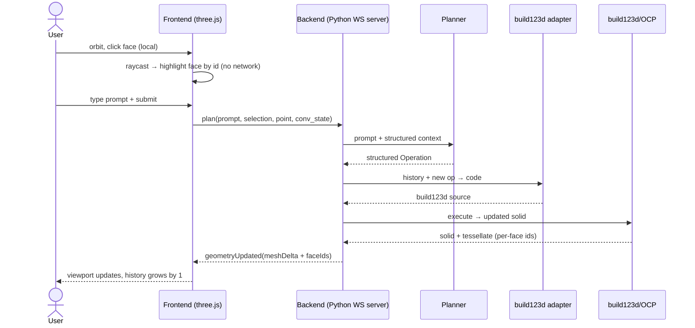
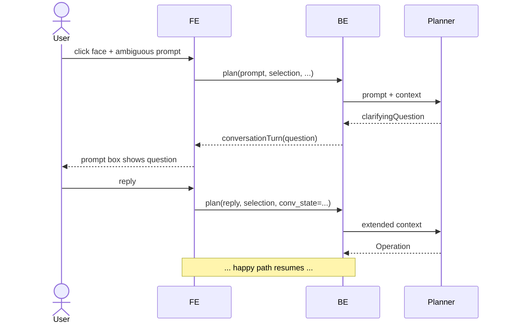
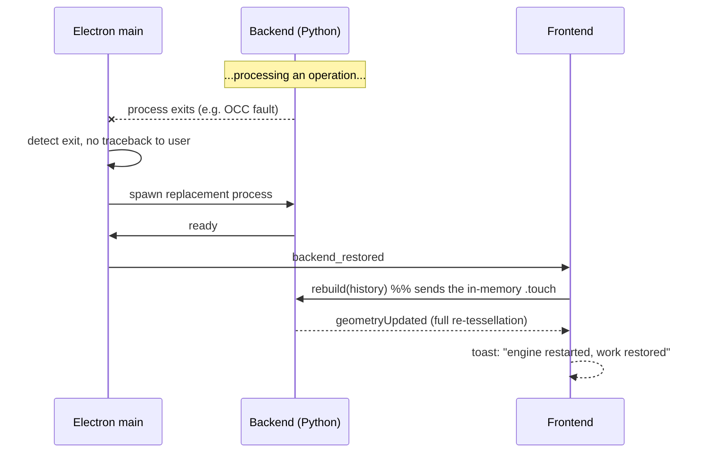

# 01 — Requirements

> *Re-baselined 2026-05-29 for **Touch** (the Maquette pivot). Maquette's
> prior F1–F14 / N1–N10 were CLI-shaped and are **superseded** by the
> table below — the rewrite is intentional, the old content is in git
> history. Update via `/pm-requirements`.*

This document covers **Touch v0** (the POC milestone — see
`00-vision.md` § Success criteria). v0.1+ requirements live in
`03-roadmap.md` and gain their own row only when their phase is being
shaped. Priority field uses `must` / `should` / `could`.

## Functional requirements

### A. Application & user interaction

| ID | Requirement | Acceptance criterion | Priority |
|----|-------------|----------------------|----------|
| F1 | Touch launches as a single **Windows desktop application**. | A friend downloads `Touch-vX.Y.Z-setup.exe` from a GitHub Release and runs it; the app's main window opens with no further setup. | must |
| F2 | The main window presents a **VS-Code-like layout**: 3D viewport (centre), file/project tree (left), a prompt panel anchored to the current selection (transient overlay), and a Settings panel reachable from the menu. | All four UI surfaces exist and are reachable. Layout is usable on a 1920×1080 display. | must |
| F3 | The 3D viewport uses **NX-style mouse camera controls**: middle-mouse rotate, shift+middle pan, scroll zoom. | Manual: orbiting/panning/zooming on a fresh model feels equivalent to NX defaults. | must |
| F4 | The viewport renders **hover highlights** on the face / edge / vertex under the cursor in real time. | Cursor-to-highlight latency is imperceptible (N1 bar); highlight follows the cursor across all model entities. | must |
| F5 | **Click selects** the face / edge / vertex under the cursor. Selection state lives in the frontend; **no backend round-trip is required** for selection. | A profiler / log shows zero network calls between hover/click and the rendered highlight. The selection persists until cleared or replaced. | must |
| F6 | Clicking opens a **prompt box anchored to the selection**, prefilled with no text; submitting it sends `{selection_id, point_xyz, prompt_text, conversation_state}` to the backend. | Submitting from the prompt box dispatches a single `plan` message to the backend with the expected payload shape. | must |
| F7 | If the backend returns a **clarifying question** (instead of an operation), the prompt box continues as a short **chat thread** in place, holding the selection context, until the conversation produces an operation or the user cancels. | At least one ambiguous prompt during the mini-PC flow triggers a clarifying question and is resolved through a follow-up. | must |
| F8 | A **successful operation appends** to the current document's operation history; the viewport updates to reflect the new geometry (mesh delta from backend). | After each accepted op, the document's history grows by exactly one entry and the viewport shows the new shape. | must |
| F9 | The user can **undo / redo** by stepping back / forward through the operation history. | Undo restores the prior model state; redo re-applies. Multiple levels supported within a session. | must |
| F10 | The user can **save** a part and **open** a `.touch` part (within the workspace, F32); a part's model is rebuilt by replaying its operation history. | Round-trip: model → save → refresh/close → open → identical model. The `.touch` file is human-readable JSON. | must |
| F11 | The user can **export STEP** for B-rep handoff to other CAD. | A produced STEP opens cleanly in FreeCAD and matches the on-screen model. | must |
| F12 | The user can **export STL / 3MF** for 3D-printing handoff. | A produced STL opens cleanly in a standard slicer (Cura/Prusa) and matches the on-screen shape (within tessellation tolerance). | should |
| F13 | The **Settings panel** lets the user choose between the two LLM provider modes (see F31): (a) Anthropic API — paste/edit their Claude API key, stored in the **OS keychain** (Windows Credential Manager via `keyring`), never plaintext on disk; (b) Claude Code — Touch detects the local Claude Code install + auth status and uses it (no credential stored by Touch). | The repo and on-disk app config contain no plaintext key after Settings save. In API mode, removing the key from the keychain breaks API calls. In Claude Code mode, logging out of Claude Code breaks subsequent calls. | must |
| F14 | A **session cost indicator** shows running USD cost for the current Touch session, sourced from the backend's `pricing` module. | A multi-prompt session ends with the displayed total equal to the sum of per-prompt costs reported by `pricing.price(...)`. | should |
| F15 | A **cold-start splash** is shown until the backend signals `ready`. | On first launch on a clean machine, the splash is visible while OCP imports; it dismisses on `ready`. | should |
| F16 | If the backend exits unexpectedly mid-session, Touch **restarts it, replays the current document's history**, and surfaces a single toast: "engine restarted, work restored." | Forcibly killing the backend process during a session results in restored model state and a single user-visible toast. | should |
| F17 | The user can **cancel** a long-running operation in progress (e.g. while the LLM is thinking). | A cancel button is visible during a `plan`/`apply` round-trip; cancelling stops the call, leaves the model unchanged, and clears the prompt box. | must |
| F18 | The **Explorer** mirrors the opened workspace folder **1:1** — a nested, collapsible file/folder tree (VS-Code/Cursor-style): open a part on click, create new parts, rename/delete in place, with the active part highlighted. | Manual: opening a folder shows its contents 1:1; create / open / rename a `.touch` part via the tree without leaving the app. | must |
| F32 | The user can **Open Folder** — pick a folder on their own machine as the workspace; `.touch` parts they create/edit persist **in that folder** (on the user's machine, not stored on any server), and reopening the folder restores them. | Open a folder → create + save a part → refresh/restart → reopen the folder → the part is present and identical. | must |
| F33 | A VS-Code-style **activity rail** (left): **Explorer** active; **Search / Source-Control / Extensions** present as inert stubs reserved for a future extensions story; **Settings** pinned at the bottom. | The rail shows the icons; Explorer toggles the tree; the stubbed icons are visibly inert (no broken/empty panels presented as working). | should |
| F34 | A top **menu bar** with dropdown menus (**File / Edit / View / Help**) exposing the real actions (Open Folder, New Part, Save, Undo/Redo, Export, Settings). | Each menu opens and its items invoke the same actions as their toolbar/keyboard equivalents. | should |
| F35 | The user can keep **multiple parts open and switch between them via editor tabs** (multi-document); selecting a tab shows that part in the viewport. | With ≥2 parts open, switching tabs swaps the viewport to the selected part; closing a tab leaves the others intact. | should |
| F37 | The user can select an **individual edge** (not only a face) and apply **edge-scoped operations** (chamfer, fillet) to exactly that edge. Edge hover/selection is frontend-side (F4, F5); the operation targets the selected edge alone, resolved deterministically (F36). | Manual + test: clicking a single edge of a box → chamfer → only that edge is chamfered, not the whole face's edge loop. Face selection still applies face-scoped behaviour. | must |

### B. Backend / engine

| ID | Requirement | Acceptance criterion | Priority |
|----|-------------|----------------------|----------|
| F19 | The backend runs as a **localhost WebSocket server** on a configurable port. The **same protocol** is consumed by the Electron renderer (prod) and a browser tab (dev). | Pointing a plain browser at `http://localhost:<port>/` and launching the wrapped `.exe` produce a functionally identical app, against the same backend. | must |
| F20 | The backend **tessellates** the current B-rep model with **per-face IDs and per-edge IDs encoded into the mesh data** (faces as a triangle→face-id mapping; edges as polyline segments tagged with an edge-id); the frontend uses those IDs for face **and edge** selection (F5, F37). | After any geometry update, the streamed mesh contains a triangle→face-id mapping **and** an edge-segment→edge-id mapping the frontend can use without further backend calls. | must |
| F21 | The backend accepts **structured operations** defined by the `Intent` operation schema. Unknown / malformed ops are rejected with a **structured error** (typed payload), never a raw Python traceback to the UI. | Sending an invalid op yields a structured error event; no traceback string appears in any frontend-visible message. | must |
| F22 | An **LLM Planner** converts `{prompt + selection context + conversation state}` into either a structured operation or a clarifying question. *(Revised 2026-06-04: the planner is now the **optional no-account fallback** brain for quick click-to-prompt; the primary brain is the user's own Claude Code over MCP — F42/F43.)* | Mocked-client tests assert both branches (op / question); the fallback path produces a recognized-template layer with no Claude Code login. | should |
| F23 | The current model is **rebuildable from the operation history alone**. Live in-memory state is a *derived cache*; the `.touch` history is the source of truth. | Killing the backend, restarting, and replaying the in-memory history reproduces the same model deterministically (F16, N8). | must |
| F24 | The **build123d adapter** is a pure function `operation history → build123d source code`; same input → byte-identical output. | Adapter snapshot tests: emit twice, diff empty (N10). | must |
| F31 | The **fallback planner** (F22) has a pluggable LLM-client abstraction; its v0 implementation is the **Anthropic API** (`anthropic.Anthropic`, key from the OS keychain). **Correction (2026-06-04):** the earlier "Claude Code mode via `claude-agent-sdk` under the subscription" is **dropped** — the Agent SDK now requires a paid API key (OAuth restricted to Claude Code + claude.ai, Feb 2026), so it is *not* a token-free path. **The token-free Claude Code path is MCP (F42), not the SDK.** | A `LLMClient` Protocol exists; the Anthropic-API fallback satisfies it and passes the contract test. The token-free agent path is delivered via the MCP server (F41/F42), not an in-process SDK client. | should |
| F36 | When an operation targets a **selected entity**, the backend resolves it to **exactly the entity the user clicked**, deterministically — using the frontend-captured face/entity identity (F20) as the within-session disambiguator, with the geometric **finder** (R2) as the durable, re-derivable description. Resolution must survive **edge/corner-adjacent clicks** (the picked point touches several faces) and **picks that land slightly off the B-rep surface** (mesh-vs-brep float gap), and must not fail on a click the frontend visibly highlighted as selectable. | A click that highlights a face — including one near an edge or corner — always resolves to that face when an op is applied: no "ambiguous: N faces contain point" or "no face contains point" on a normally-selectable click. A regression test exercises edge-adjacent and just-off-surface picks and asserts deterministic resolution. | must |

### C. Distribution & repository

| ID | Requirement | Acceptance criterion | Priority |
|----|-------------|----------------------|----------|
| F25 | The project is **open source under MIT** (continued from Maquette). | `LICENSE` file present at repo root; SPDX tag matches in README. | must |
| F26 | The repository is **hosted on GitHub** with **semver tags** for releases. | Tags follow `vX.Y.Z`; a CHANGELOG entry exists per tag. | must |
| F27 | Tagged versions trigger a **GitHub Actions** build that publishes a Windows `.exe` installer (plus a portable archive) as a **GitHub Release**. | Pushing a `v*` tag results in a Release page with the `.exe` artefact attached, within CI runtime budget. | should |
| F28 | An end-user installs by **downloading the `.exe` from a Release page and running it** — no separate Python/Node install, no command line. | A friend on a fresh Windows machine, following only the README install line, opens Touch within 5 minutes of starting. | must |

### D. Developer environment (nexus-ops standards)

| ID | Requirement | Acceptance criterion | Priority |
|----|-------------|----------------------|----------|
| F29 | The developer's Claude API key is stored **SOPS-encrypted in the repo** (`secrets.env.sops.yaml`) per the **nexus-ops `secrets.md`** standard; decrypted at dev time to a gitignored `.env` using the host's age key. The current plaintext `.env` (carried from Maquette) is migrated to SOPS as an explicit early-roadmap task. | No plaintext key in any committed file; `sops -d secrets.env.sops.yaml > .env` produces a working dev `.env` on the host; pre-commit hook (or CI guard) blocks any plaintext `.env` from being committed. | must |
| F30 | The dev-host backend's working directory (test runs, scratch `.touch` files, ad-hoc exports) lives under **`/srv/touch/`** per the **nexus-ops `storage.md`** standard. | The default backend `out_root` config on the dev host resolves to `/srv/touch/`; running locally writes there. | should |

### E. Agent integration & Layer Stack (pivot — 2026-06-04)

> Locked in `00-vision.md` + `notes/decisions.md` (2026-06-04). Touch becomes a
> CAD IDE the user drives with their **own Claude Code** over **MCP**; a part is
> a build123d **Layer Stack**. These build on the shipped v0 editor (T0–T5).

| ID | Requirement | Acceptance criterion | Priority |
|----|-------------|----------------------|----------|
| F38 | A part is a **Layer Stack** — an ordered list of **layers**, each a build123d code block that transforms the previous solid (`solid_N = f_N(solid_{N-1})`). The stack rebuilds by deterministic ordered re-execution from clean state, with per-layer content-addressed caching. **Append-only in v0** (add / delete-last / undo; no re-edit of earlier layers). | Building a part records one layer per edit; re-running the stack reproduces it deterministically; an unchanged layer prefix is served from cache (no re-exec). | must |
| F39 | **Layers are clickable** — Touch computes which layer created/last-modified each face & edge (provenance, baked into the F20 ids). Clicking a face highlights its owning layer; hovering a layer highlights its faces. | Click a face → its layer is highlighted in the Layer Stack panel; hover a layer → its faces highlight in the viewport. Holds after a chamfer/boolean that splits or merges faces. | must |
| F40 | **Recognized templates** — layers matching a known op pattern (box, cylinder, sphere, chamfer — the v0 vocabulary) render as **editable parametric cards**; every other layer renders as a **code card** (view/edit build123d). | A chamfer layer shows an editable length param; a freeform gearbox layer shows as a code card. Recognition matches only known templates (no general code decompilation). | should |
| F41 | An **MCP server** exposes Touch's geometry as tools: query model/state, get current selection, render-to-image, add/edit/reorder/delete layer. Every mutating tool returns `{ok|error, render thumbnail, validity check, downstream delta + finder-rebind warnings}`. | An MCP client lists the tools and drives a full build (add layer → render → query) against the live document; mutating-tool results carry the structured envelope. | must |
| F42 | The user drives Touch with their **own Claude Code over MCP** — on their **subscription, with zero Anthropic API tokens billed** (see N14). Touch never proxies or embeds anyone else's Claude account. | Point a Claude Code (subscription/OAuth, no API key) at Touch's MCP and build a part; no API-token usage is incurred (network/billing inspection). | must |
| F43 | **One brain, two surfaces.** A persistent **side-panel main thread** (the project's brain of record) handles whole-part intent; **positional click-to-prompt** spawns an **ephemeral subagent from the main thread** carrying spatial context, which does the local edit and **summarizes one line back**. The built-in planner (F22) is demoted to an **optional no-account fallback**. | Macro instructions run in the side panel; a face-click opens a positional prompt whose result lands as a one-line summary in the main thread; the main thread retains project context across both. | must |
| F44 | The backend holds **one shared live document** that the viewport and the agent both act on; the layer stack is **versioned**, and every mutation is **compare-and-swap** against its expected revision (reject → re-plan) so the two surfaces can't corrupt each other on stale state. | A scripted concurrent edit from two clients on a stale revision is rejected (not silently applied); the viewport reflects agent edits live and vice-versa. | must |
| F45 | A selected entity is expressed as a **finder reference** (re-derivable geometric predicate + captured id), **never a raw positional index**. Touch injects a **positional context packet** (selection + owning layer + finder ref + picked point/normal + 1-ring + touchable params) on a click, and a **macro context packet** (param table + compact layer outline + bbox + units) for whole-part work. | Generated layer code references geometry via finder helpers (lint flags raw `.faces()[i]`); the injected packet differs by surface; a click resolves to one entity, re-resolved at apply. | must |
| F46 | The geometry **executor is workspace-confined** — runs cwd=workspace, no secrets in env, network off by default, the existing timeout, and a soft import-lint warning on `os`/`socket`/`subprocess`. It is a **single chokepoint** so a real OS sandbox can replace it later, gated on opening untrusted parts. | The executor cannot write outside the workspace or reach the network in normal runs; the sandbox level is one swappable component. (In-process Python restriction is a nudge, not a security boundary — documented.) | must |
| F47 | **Claude Code embedded in the app** (milestone 2): launch + login from Touch, a right-side **agent panel** (custom chat with geometry-aware tool-call cards + inline renders) over the same MCP, with the two-way selection bridge. | On a packaged build, sign in to Claude inside Touch and run the agent-path benchmark in the in-app panel (no external terminal). | should |

## Non-functional requirements

| ID | NFR | Target | Verification |
|----|-----|--------|--------------|
| N1 | **Interactivity** — hover/select/orbit/pan/zoom is rendered entirely in the frontend with no backend call. | Cursor-to-highlight latency < 50 ms on a model of ≤ 50 k triangles, p95. | Manual + a frame-timing test on a reference model. |
| N2 | **Prompt-submit latency** — geometry update after submit. | Median round-trip < 10 s (LLM-bound) on the v0 mini-PC ops; UI shows a thinking indicator for the full round-trip. | Stopwatch + log on each mini-PC step. |
| N3 | **LLM cost per prompt.** | Average < $0.05 USD per accepted prompt on the v0 op set, measured via `pricing.py`. | Cost indicator (F14) over the mini-PC session. |
| N4 | **Single-file install.** The released `.exe` installs Touch with all runtimes bundled — no separate Python, Node, or other prereq. | A friend on a fresh Windows machine installs and launches with zero additional installs. |
| N5 | **Dual run modes.** The same web frontend code runs as (a) the Electron renderer in the `.exe` and (b) a plain browser tab against a localhost backend, with no code divergence. | A single FE build artefact is served in both modes; behavioural parity test on a couple of key flows. |
| N6 | **Headless dev.** Touch develops cleanly on a headless Linux dev box, frontend opened in a browser. | The author's daily dev loop is the browser-tab mode on nexus; the wrapped `.exe` is only built for releases. |
| N7 | **Document portability & versioning.** `.touch` files are JSON, carry `schema_version`, are diff-friendly in git, and remain readable across compatible minor versions. | Round-trip test on a corpus of `.touch` files across versions; a `git diff` on a small edit is human-readable. |
| N8 | **Crash resilience.** A backend crash does not lose the user's in-progress work; the operation history is the safety net. | Chaos test: kill the backend mid-session; assert F16 path produces an identical model. |
| N9 | **Secret hygiene.** End-user keys are stored in the OS keychain (no plaintext on disk); dev secrets in the repo are SOPS-encrypted (per nexus-ops `secrets.md`). | Filesystem scan + git-history scan find no plaintext key strings. Removing the keychain entry breaks API calls. |
| N10 | **Adapter determinism.** Same operation history → byte-identical build123d source. | Snapshot tests in CI. |
| N11 | **Open source.** Source is MIT-licensed; release artefacts are public. | `LICENSE` + public repo + public Releases. |
| N12 | **No accidental cloud dependency.** Touch runs entirely from the user's machine + the Claude API; no Touch-operated server is required for end users. | Network inspection: end-user traffic goes to `api.anthropic.com` and nowhere else. |
| N13 | **Workspace file access across run modes.** Open-Folder (F32) works in browser-dev (Chromium, over HTTPS) and the Electron desktop build; workspace files stay on the user's machine (reinforces N12 — no server upload), with the local backend rebuilding geometry from streamed op-history. Non-supporting browsers degrade gracefully. | Open a folder → create/save a part → refresh → reopen → identical, exercised in a Chromium browser and the Electron build. |
| N14 | **Zero-API-token agent path.** When driven by the user's own Claude Code over MCP (F42), Touch incurs **no Anthropic API token cost** — usage is against the user's subscription only. | Drive Touch from a subscription/OAuth Claude Code (no API key in env) and complete the agent-path benchmark; billing/network inspection shows no API-token usage. |
| N15 | **Context efficiency / no memory-stack bloat.** The agent's working context references model state **by id** (compact layer manifest), pulls full layer source/renders **on demand**, uses **render thumbnails** (not auto-attached every turn), and keeps a byte-stable system-prompt + tool-list prefix (prompt-cache friendly). Conversation does not grow unbounded over a long session. | On a ≥20-edit session, per-turn input tokens stay roughly flat (not O(layers)); prompt-cache read-hits are non-zero; renders are sent only on demand. |
| N16 | **Live-document consistency.** Concurrent edits from the viewport and the agent never corrupt the layer stack; compare-and-swap on a versioned stack (F44) rejects stale-revision mutations. | A race test issuing two edits against the same stale revision results in one applied + one rejected-and-replanned, never a corrupted stack. |

## User stories

- **US1** — As an engineer-friend on Windows, I want to install a single
  `.exe` and use it with my own Claude key, so I can try AI-driven CAD
  without setting up developer tooling.
- **US2** — As a Touch user, I want to orbit my model, click a face, and
  describe the change in words, so I can model parts by *pointing* rather
  than navigating feature-tree menus.
- **US3** — As a Touch user, when my prompt is ambiguous, I want the
  system to *ask* me what it needs rather than guessing wrong, so the
  model evolves correctly.
- **US4** — As a Touch user, I want to save and re-open my work in a
  clean file format I can read and version-control, so my parts aren't
  locked into a black-box format.
- **US5** — As a Touch user, I want to export STEP for FreeCAD/NX (and
  STL/3MF for printing), so Touch fits into my existing workflow.
- **US6** — As the developer on a headless Linux dev box, I want to run
  Touch as a browser tab against a localhost backend, so I can iterate
  without a desktop.
- **US7** — As the developer, I want my dev Claude key SOPS-encrypted in
  the repo, so I follow the nexus-ops policy and never carry plaintext
  credentials.

## User flows

### Happy path — a single click+prompt step

### Clarification path

### Backend crash & recovery

## Constraints & assumptions

### Constraints (cannot change)

- **Python ≥ 3.12** (build123d, OCP, anthropic SDK all target it).
- **OpenCascade B-rep kernel** via the OCP Python wrapper (re-used from
  Maquette).
- **Frontend tech is web** (HTML/CSS/JS + three.js for the viewport).
- **Two intelligence paths** *(revised 2026-06-04)*: (a) the **primary
  brain** is the user's **own Claude Code, over MCP** (F41/F42) — their
  subscription, no API tokens; the MCP port is agent-neutral, so any
  MCP-capable agent works. (b) a **fallback planner** (F22) calls the
  **Anthropic API** with the user's key (F31), abstracted behind a Protocol.
  *(The earlier `claude-agent-sdk` subscription path is dropped — it now
  needs a paid API key; see F31.)*
- **Windows is the v0 distribution target** for the `.exe`. macOS / Linux
  desktop builds are later milestones.
- **`.touch` is JSON**, schema-versioned, the source-of-truth document
  format.
- **No NXOpen imports** anywhere in `src/` (continued from Maquette's
  hygiene rule, even though NX adapter is not active scope — kept as a
  cheap CI guard).
- **Dev side adopts nexus-ops standards:** `secrets.md` (SOPS) and
  `storage.md` (`/srv/touch/`).

### Assumptions (chosen, may revise)

- **LLM consistency.** Claude reliably emits valid structured operations
  for v0 (similar to Maquette's planner reliability, with selection
  context as an added grounding signal).
- **MCP + Claude Code subscription path holds** *(revised 2026-06-04)*. A
  local **MCP server** driven by the user's own Claude Code works on the
  subscription with no API tokens, streams parseable events for a custom
  panel, and returns images the agent can see — **spike-verified 2026-06-04**
  (claude 2.1.132, FastMCP stdio). Risk that Anthropic changes policy / MCP
  surface is tracked as R14; the built-in API planner (F22) is the fallback.
  *(The prior `claude-agent-sdk` subscription assumption is retired — it now
  requires a paid API key.)*
- **Native bulk tessellation** via OCP / `ocp_tessellate` is performant
  enough for interactive use (research-supported; not yet benchmarked at
  Touch's interactive cadence).
- **Electron + Python sidecar packages cleanly** into a Windows `.exe`
  (the explicit open spike from the 2026-05-29 architecture research —
  flagged in the vision; should be the first thing the roadmap proves).
- **Append-only history is sufficient for v0.** Re-editing earlier
  operations (parametric history) is *not* a v0 feature; it is the
  topological-naming problem and is explicitly deferred.
- **Per-face IDs from the tessellator are stable within a session** for
  the click→prompt flow (sufficient for append-only; not the full
  cross-edit persistent-naming story).
- **FreeCAD 1.x opens STEP cleanly** (required for the v0 success
  criterion, identical to Maquette's assumption).

## Risk register

| ID | Risk | Likelihood | Impact | Mitigation |
|----|------|-----------|--------|------------|
| R1 | **Packaging** — Electron + Python + OCP into a reliable Windows `.exe` for non-technical friends turns out painful (the unverified architecture spike). | high | high | The first roadmap phase is an **explicit packaging + round-trip + picked-face spike**: prove the scary part end-to-end before building features. Falls back to a portable archive or a different shell (Tauri/Wails) if Electron+Python proves intractable. |
| R2 | **Picking robustness** — face IDs don't survive subtle model changes; clicks select the wrong feature. | med | high | Kernel-owned IDs (Onshape pattern) carried per-face in the mesh **plus** geometric "finders" (replicad pattern) so the LLM operation references re-derivable geometry rather than brittle indices. Append-only v0 sidesteps the worst of it. **T5 hardening (F36):** the point-only finder proved brittle on edge/corner-adjacent and off-surface clicks ("ambiguous" / "no face"); the FE-captured face identity now disambiguates the finder within a session, while the finder stays the durable re-derivable description — reconciling determinism with cross-edit durability. |
| R3 | **Silent semantic failure** — the LLM emits a structured op that build123d crashes on, or builds the wrong geometry (Maquette's R7 carries over). | high | med | Structured errors back to the UI (F21); user can undo (F9); ad-hoc cost is bounded (N3). The proper fix is the v0.1 evaluator (the Maquette idea, re-purposed for interactive use). |
| R4 | **Cold-start latency** — OCP import takes seconds on first launch; a friend may think the app is broken. | med | med | Splash screen (F15) with clear status text; backend signals `ready` to dismiss it. |
| R5 | **LLM cost balloons** per session beyond friend tolerance. | low | med | Cost indicator (F14, N3); cost-cap behaviour deferred to v0.1 if it surfaces. |
| R6 | **Conversational UX** is confusing — users don't know when the system is asking vs guessing. | med | low | UI distinguishes a clarification (question) from an applied op visually; can always cancel/restart. Iterate. |
| R7 | **Geometry transport jank** — mesh deltas large enough to feel slow on a complex model. | low (v0 parts are small) | med | Binary WS frames, deltas only, tessellation tolerance tuning. |
| R8 | **OS keychain unavailable** on a locked-down corporate Windows. | low | low | Fallback to a clearly-warned plaintext config file; document as a known limitation if it surfaces. |
| R9 | **`.touch` schema evolution** breaks older files. | low | med | `schema_version` field (F10, N7); migration helpers per minor bump. |
| R10 | **GitHub Releases pipeline** for Windows builds is fiddly to set up. | low | low | Standard CI pattern; many Electron+Python apps document this. Manual builds as a fallback for the first release. |
| R11 | **Operation kind not supported** by build123d/OCP for a prompt a friend tries. | med | med | Extras/escape-hatch carries over from Maquette (raw build123d as a relief valve, marked best-effort). |
| R12 | **Claude Code mode friction** — `claude-agent-sdk` churns mid-v0, or non-technical friends can't install/login to Claude Code → the subscription path is broken or unused. | med | low | *(Superseded 2026-06-04 by the MCP pivot — the SDK path is dropped; see F31 correction + R14.)* Anthropic-API mode remains the no-extra-install fallback (F22/F31). |
| R13 | **Agent-authored code is the executable document** — the agent writes build123d that Touch runs; it can be non-manifold / wrong-face (reliability) or, for an untrusted `.touch` from someone else, hostile (RCE). | high | high | Per-layer render-and-validate feedback (F41 envelope: manifold check + thumbnail); recognized-template / finder-reference model (F40/F45); **workspace-confined executor** (F46) with a real OS sandbox before opening untrusted parts. Append-only v0 limits blast radius. |
| R14 | **Dependence on Claude Code / MCP + subscription limits** — Anthropic changes policy, the MCP surface shifts, or subscription usage caps bite an agentic CAD loop. | med | med | Built-in planner (F22) is a no-account fallback; the engine stays provider-neutral (MCP is a standard port, any MCP agent works); context-efficiency (N15) keeps tokens-per-edit low. Feasibility already spike-verified (2026-06-04). |
| R15 | **Context bloat ("memory stacks")** — feeding every click + render + tool result into one conversation degrades the agent. | med | high | Main thread + ephemeral positional subagents that summarize back (F43); backend-canonical, id-referenced context, thumbnails-on-demand (N15). |
| R16 | **Topological naming on re-edit/reorder** — editing or reordering an earlier layer breaks higher layers' references. | med | high (when attempted) | **Deferred:** v0 is append-only (F38), which sidesteps it. Re-edit/reorder is a later phase needing a reference-re-resolution subsystem (finder re-evaluation + break detection + disambiguation). |
