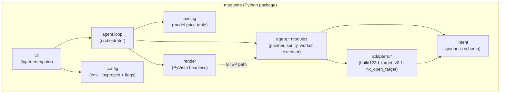

# 02 — Architecture

> *Synthesized from `notes/inbox.md` (migrated vault: 01-architecture.md,
> 03-agent-loop.md, 04-adapters.md) + `00-vision.md` + `01-requirements.md`
> on 2026-05-16. Update via `/pm-architecture`.*

Maquette is a single Python package with a CLI entry point. Filesystem-is-
state: no server, no database, no message broker. Every generation is a
self-contained folder under `output/`. v0 produces STEP + 3 renders from a
build123d backend; v0.1 adds the NX Open adapter, vision Evaluator, and
refinement loop.

## C4 — Level 1 (System Context)

```mermaid
flowchart LR
    User((User<br/>CLI))
    subgraph Local["Local machine"]
        Maq[Maquette<br/>Python CLI]
        FS[(output/<br/>filesystem-as-state)]
        BC[build123d<br/>+ OCP kernel]
        PV[PyVista<br/>headless render]
    end
    subgraph Cloud["Cloud"]
        LLM[Anthropic API<br/>Claude Opus 4.7]
    end
    subgraph Optional["User-side, optional"]
        FreeCAD[FreeCAD<br/>opens part.step]
        NX[Siemens NX<br/>+ NX Open<br/>v0.1+]
    end

    User -- prompt --> Maq
    Maq -- structured planner call --> LLM
    Maq -- writes --> FS
    Maq -- executes --> BC
    BC -- STEP --> FS
    Maq -- renders --> PV
    PV -- PNGs --> FS
    FS -- part.step --> FreeCAD
    FS -. part_nx.py (v0.1) .-> NX
```

The system has one external dependency (Anthropic API), one optional
external integration (NX, user-side, v0.1), and one consumer-side
integration (FreeCAD, user opens STEP files manually).

## C4 — Level 2 (Container view)



Hard rule (CI-enforced): `intent` has zero outbound dependencies on
`agent.*`, `adapters.*`, or `render`. Everything depends on `intent`;
`intent` depends on nothing. See [02-classes.md § Dependency rules].

## C4 — Level 3 (Component view, inside `agent`)

```mermaid
flowchart TB
    subgraph Agent["maquette.agent"]
        Loop["loop<br/>(state machine, trace.jsonl writer)"]
        Planner["planner<br/>(prompt → Intent via LLM)"]
        Sanity["sanity<br/>(F6 dimension check)"]
        Worker["worker<br/>(Intent → code via adapter)"]
        Executor["executor<br/>(subprocess + STEP capture)"]
        Evaluator["evaluator (v0.1)<br/>(vision critique)"]
    end

    Loop --> Planner
    Planner --> Sanity
    Sanity --> Loop
    Loop --> Worker
    Loop --> Executor
    Executor -. ExecutionResult .-> Loop
    Loop -. v0.1 .-> Evaluator
    Evaluator -. Critique .-> Loop
```

The v0 path is `Loop → Planner → Sanity → Worker → Executor`. v0.1 adds
the Evaluator and a `Loop → Planner refinement` loopback driven by
critique. SanityCheck is a v0 addition (per requirement F6) sitting
between Planner output and Worker input — it inspects the Intent against
the original prompt and logs warnings (does not block).

## Layered responsibilities

| Layer | Owns | Does NOT do |
|---|---|---|
| `intent` | Pydantic schema (pure types), cross-reference validation via `@model_validator`, JSON (de)serialisation | Per-kind contract checks (those live in `intent_validation`), LLM calls, code emission, geometry, I/O |
| `intent_validation` | Per-kind parameter contract checks (`validate_kind_contracts(intent)`) | Type definitions (those live in `intent`), anything outside the schema spec |
| `agent.planner` | Prompt → `Intent` via structured-output LLM call; one retry on schema fail | Code generation, evaluation, sanity check |
| `agent.sanity` | Regex extraction of dimensions from prompt + comparison to Intent params; produces `SanityResult { ok, warnings[] }` | LLM calls, code emission, geometry |
| `agent.worker` | `Intent` → backend code via adapter delegation | LLM calls, execution, geometry |
| `agent.executor` | Subprocess management (spawn, timeout, kill), STEP capture, error.json on crash | LLM calls, schema decisions, code generation |
| `agent.evaluator` (v0.1) | Vision-LLM critique of renders vs prompt + Intent | Code emission, geometry |
| `agent.loop` | Orchestration: planner → sanity → worker → executor → (v0.1: evaluator → refine). State machine. `trace.jsonl` writer. `status.json` writer | Domain logic, code emission |
| `adapters` (package) | Defines the `Adapter` Protocol (`emit(intent: Intent) → str`) that all concrete adapters conform to. Type-checker catches signature drift between adapters | Adapter implementations live in submodules |
| `adapters.build123d_target` | `Intent` → build123d Python source. Pure function conforming to the `Adapter` Protocol. Deterministic | I/O, execution, rendering |
| `adapters.nx_open_target` (v0.1) | `Intent` → NX Open Python journal. Pure function conforming to the `Adapter` Protocol. Emits-only, never imports `NXOpen` | Anything that imports `NXOpen` |
| `render` | Headless PyVista render of a STEP file into PNGs | LLM, code emission |
| `cli` | Typer commands, argument parsing, glue between user and `agent.loop` | Domain logic |
| `pricing` | Hardcoded model → per-token price table; computes `cost_usd_estimate` from token counts | I/O, LLM calls |
| `config` | Env + .env + pyproject + CLI flag precedence; produces a `Config` dataclass | Anything else |

## Tech stack

| Concern | Choice | Why |
|---|---|---|
| Language | Python 3.11+ | build123d, PyVista, anthropic SDK all native here |
| CAD kernel (default) | build123d (OCP / OpenCascade) | Free, headless, scriptable, real B-rep, STEP export native |
| CAD kernel (v0.1 target) | Siemens NX via NX Open | Emit-only; repo never imports NXOpen |
| Schema / validation | pydantic v2 | Strict structured outputs from LLM, first-class JSON |
| LLM client | `anthropic` Python SDK | Claude is the default; strong at constrained code gen and structured outputs |
| Prompt caching | Anthropic prompt caching (system prompt + few-shots) | Required to hit N2 (< $0.10 per generation) — see ADR-0003 |
| Rendering | PyVista (headless / off-screen) | Mature wrapper over VTK; loads STEP via OCP; off-screen on Linux |
| CLI | Typer | Minimal boilerplate, type-hint driven |
| Packaging | `pyproject.toml`, uv or pip | Standard modern Python packaging |
| Tests | pytest | Standard |
| Linting / formatting | ruff + ruff format | Single tool, fast |
| Config files | python-dotenv for `.env`; stdlib `tomllib` for pyproject | No extra deps |

## Repo layout

```
maquette/
├── README.md
├── ARCHITECTURE.md            # one-line pointer to docs/02-architecture.md
├── CLAUDE.md                  # project guide (already exists)
├── pyproject.toml
├── .env.example               # ANTHROPIC_API_KEY
├── .gitignore                 # output/, .env, __pycache__, .venv
├── src/maquette/
│   ├── __init__.py
│   ├── intent.py              # pydantic schema — pure types (see 02-data-model.md)
│   ├── intent_validation.py   # per-kind contract checks (split from intent.py per decision B3)
│   ├── pricing.py             # model → per-token price table (4 token classes; see ADR 0003)
│   ├── config.py              # env / pyproject / CLI flag precedence
│   ├── cli.py                 # typer entrypoint
│   ├── agent/
│   │   ├── __init__.py
│   │   ├── loop.py            # orchestrator + state machine
│   │   ├── planner.py         # LLM call, Intent extraction
│   │   ├── sanity.py          # F6 dimension sanity check
│   │   ├── worker.py          # adapter delegation
│   │   ├── executor.py        # subprocess + STEP capture
│   │   └── evaluator.py       # v0.1: stub in v0
│   ├── adapters/
│   │   ├── __init__.py
│   │   ├── build123d_target.py
│   │   └── nx_open_target.py  # v0.1: stub in v0 (or absent)
│   └── render/
│       ├── __init__.py
│       └── orthographic.py
├── prompts/                   # versioned system prompts + few-shots
│   ├── planner.system.md
│   ├── sanity.md              # if sanity check needs reference patterns
│   └── evaluator.system.md    # v0.1
├── examples/                  # known-good sessions, regression cases
├── output/                    # generated artifacts (gitignored)
└── tests/
    ├── test_intent.py
    ├── test_sanity.py
    ├── test_planner.py        # mocked LLM
    ├── test_adapters_build123d.py   # snapshots + round-trip
    ├── test_executor.py       # subprocess timeout, error capture
    ├── test_render.py         # fixture STEP → PNG
    ├── test_cli.py            # typer test client
    └── test_loop_smoke.py     # the 3 v0 reference prompts end-to-end
```

The `prompts/` directory is versioned with the repo; the active prompt
version is captured into `status.json` per run (see ADR-0003 follow-up
and open question Q3 in the PM record).

## Non-functional requirements — design satisfaction

| NFR | Met by |
|---|---|
| N1 (latency < 20 s p95 v0) | One LLM call (Planner only — Evaluator is v0.1); cached system prompt; deterministic adapter (microseconds); build123d subprocess and 3 renders are the remaining budget |
| N2 (cost < $0.10) | **Anthropic prompt caching** on system prompt + few-shots (ADR-0003); tight Intent schema keeps output tokens small |
| N3 (adapter determinism, fixture per kind) | Pure functions; sorted/normalised emission; no clock/random/env reads in adapters; snapshot test per kind in `tests/test_adapters_build123d.py` |
| N4 (no NX imports in `src/`, all milestones) | CI grep guard in pre-commit + CI; `nx_open_target` is text-emission only |
| N5 (headless) | PyVista off-screen mode; build123d/OCP already headless; smoke test on nexus |
| N6 (graceful failure) | `Loop` catches all exceptions; writes `error.json` with stderr before propagating an exit code; no Python traceback to user stdout |
| N7 (reproducibility) | Adapter purity + pinned build123d version = byte-identical `code.py` from saved `intent.json`. v0 verifies via re-emit; v0.1 ships `maquette replay` |
| N8 (secret hygiene) | `ANTHROPIC_API_KEY` loaded only at startup via `config`; never logged; `.env` in `.gitignore`; pre-commit hook scans diffs |
| N9 (subprocess timeout) | `subprocess.run(timeout=30)` + explicit SIGKILL handling in `Executor.execute()` |
| N10 (self-contained run folder) | `Loop` is the only writer to `output/`; no log files elsewhere |

## Cross-cutting concerns

- **Configuration.** `config.Config` dataclass produced by merging (in
  precedence order): CLI flags → env vars (`MAQUETTE_*`) → `pyproject.toml`
  `[tool.maquette]` → built-in defaults. `.env` loaded via `python-dotenv`
  at startup. **Never read secrets from anywhere except env / `.env`.**
- **Logging.** Structured JSON to stderr; one human-readable line per
  state transition (colour if TTY). `-v` adds per-LLM-call summaries.
  `-q` suppresses everything except the final run path. The run folder
  gets `trace.jsonl` (machine-readable, one event per line, including
  per-LLM-call token breakdown).
- **State.** Filesystem-as-state. No DB. Each `output/<run-id>/` folder
  is the complete record of a run and can be re-played or diffed.
- **Sandboxing / security.** v0: subprocess + 30 s wall-clock timeout
  (N9). v0 trusts the LLM not to emit destructive code (per requirements
  Assumptions). Hardening (import guards, container execution) is v0.1+
  work.
- **Secrets.** `ANTHROPIC_API_KEY` is the only required secret. Loaded
  from env / `.env` at startup. Never logged. Never committed (CI guard).
- **Reproducibility.** `intent.json` + the maquette commit hash + the
  prompts directory hash = enough to reproduce a run. The hash of the
  `prompts/` directory at run time is stamped into `status.json` so a
  replay can detect prompt drift. Renders may differ by 1-pixel
  anti-aliasing artefacts; acceptable.

## Decisions deferred

These are decisions that should be revisited as v0 progresses; outcomes
become ADRs.

1. **Provider abstraction.** Single-provider (Claude) for v0. The
   `Planner` constructor takes an Anthropic client instance, so a future
   swap is cheap. Do not build a generic provider layer until there's a
   second provider in scope. (Tracked in vision § Non-goals; no separate
   ADR yet.)
2. **Conversational refinement vs one-shot.** v0 is one-shot. v0.2 adds
   a multi-turn refinement mode — open whether it's a REPL, a transcript
   file, or a watched prompt file.
3. **NX adapter feature coverage.** Start with the same primitives the
   build123d adapter supports. Expanding the NX surface beyond the Intent
   schema is explicitly a non-goal — the schema is the bottleneck, not
   the adapter.
4. **Sandboxing strategy.** Subprocess + resource limits for v0.
   Containerised execution (Docker) is on the v0.1+ list if anything
   ever goes wrong here. Will be an ADR if it does.
5. **Prompt versioning approach.** Hash the `prompts/` directory contents
   at run time and stamp into `status.json`. Open: separate hashes per
   file (so a planner-only edit doesn't invalidate evaluator caches)
   vs single rolled-up hash. **Tracked as Gap G3 in PM record.**
6. **SanityCheck tolerance.** Open: exact match vs ±X% vs ±X mm when
   comparing extracted dimensions to Intent params. **Tracked as Gap G1
   in PM record.** Default proposal: ±1% or ±0.5 mm, whichever is larger.

See:
- [ADR 0001 — Intent as the pivot](./adr/0001-intent-as-pivot.md) — Accepted
- [ADR 0002 — Dimension sanity check](./adr/0002-dimension-sanity-check.md) — Accepted
- [ADR 0003 — Prompt caching for cost target](./adr/0003-prompt-caching-for-cost.md) — Accepted
