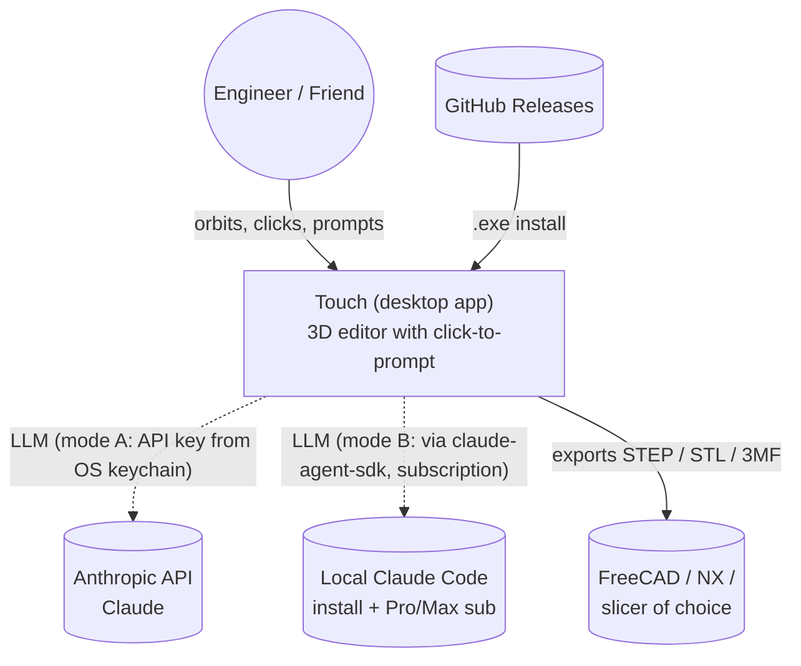
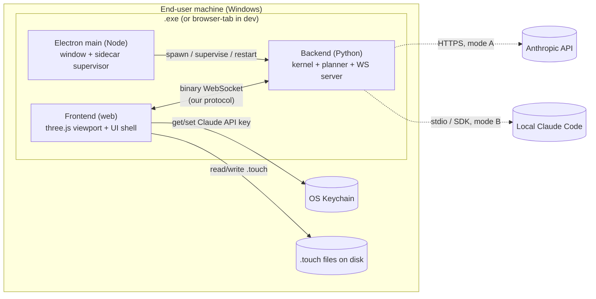
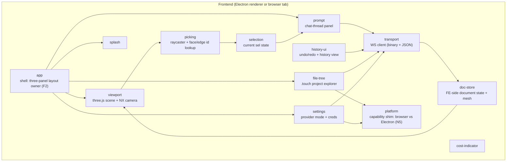
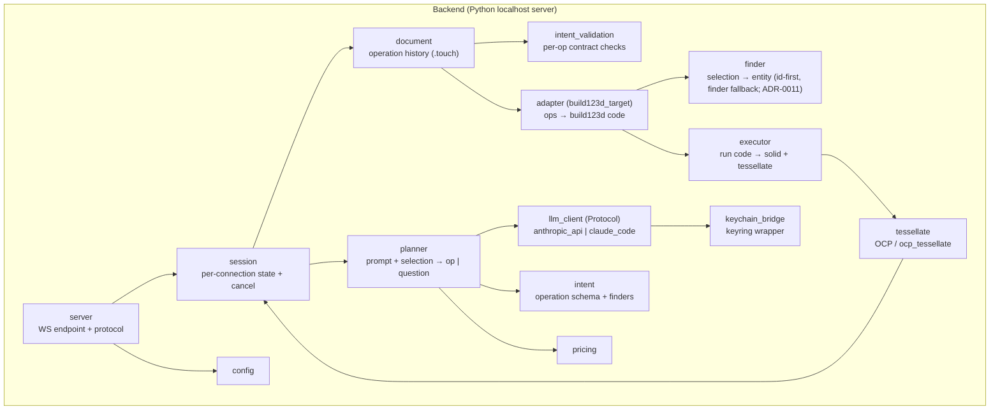

# 02 — Architecture

> *Re-baselined 2026-05-29 for **Touch** (the Maquette pivot). Maquette's
> prior 02-* docs are superseded — kept in git history for reference.
> Update via `/pm-architecture`.*

Touch is an interactive AI-native 3D CAD editor. The architecture is
shaped by three load-bearing constraints from the requirements:

- **Dual run modes (N5/N6):** the same web frontend code runs as the
  Electron renderer in the packaged `.exe` *and* as a plain browser tab
  during headless-Linux dev.
- **Single-file install (N4):** a friend gets one `.exe`, no separate
  Python or Node install.
- **Instant interactivity (N1):** hover / select / orbit must be 100 %
  frontend with no backend round-trip — only prompt submission goes over
  the wire to the engine.

These three force a **local client-server** topology (not in-process IPC),
with the kernel as a Python sidecar and the frontend as a thin web app
talking to it over a single localhost WebSocket. The full rationale lives
in [ADR-0005](./adr/0005-localhost-websocket-coupling.md).

## C4 — Level 1 (System context)



One external dependency at runtime (the LLM — *one of* the two paths),
two consumer-side handoffs (STEP for CAD, STL/3MF for printing), and
GitHub Releases as the distribution channel. End-user network traffic
goes to Anthropic and nowhere else (N12).

## C4 — Level 2 (Container view)



In dev (headless Linux), the Sidecar runs standalone (no Electron main),
and the Renderer is opened in a browser tab pointed at `ws://localhost:<port>`.
The Renderer code is bit-identical between the two modes (N5).

## C4 — Level 3 (Component view)

### Inside the Frontend (web)



The `app` module owns the panel composition (F2); every UI surface mounts
inside its layout. `platform` is the thin capability shim (N5): the only
module that touches Electron-preload / `window.electron`, exposing native
surfaces (file dialogs, OS-keychain access) with a browser-tab fallback so
the renderer code is bit-identical across both run modes.

### Inside the Backend (Python sidecar)



The Frontend is event-driven (user input + WS events); the Backend is
async (a single asyncio loop runs the WS server + the planner calls +
executor work). One op at a time per session (queue + cancel token).

## Layered responsibilities

| Layer / Module | Owns | Does NOT do |
|---|---|---|
| `app` (FE) | the shell: three-panel layout composition + menu, mounts every UI surface (F2); app-level wiring (transport lifecycle, splash gating) | panel internals, geometry, transport message semantics |
| `platform` (FE) | capability shim (N5): runtime detection (browser tab vs Electron renderer) + native-surface adapters (file dialogs, OS-keychain) with browser fallbacks; sole owner of `window.electron`/preload access | UI rendering, WS messaging, business logic |
| `viewport` (FE) | three.js scene, render loop, camera, NX-style controls (F3) | picking math, selection state |
| `picking` (FE) | raycast → triangle → face/edge id lookup (F4, F5, N1) | selection state, prompt UX |
| `selection` (FE) | current selection (face/edge/vertex + face_id + point_xyz) | dispatching to backend |
| `prompt` (FE) | the prompt panel, chat-thread continuation for clarifications (F6, F7) | model state, viewport |
| `history-ui` (FE) | undo / redo controls, history list (F9) | history mutation (server-side) |
| `file-tree` (FE) | `.touch` project navigation, save/open/new (F10, F18) | document content / serialization |
| `settings` (FE) | provider-mode picker (F13, F31); credential capture; OS-keychain UX | the keychain itself (BE bridge) |
| `cost-indicator` (FE) | session cost display (F14) | cost computation (BE pricing) |
| `splash` (FE) | cold-start splash until backend `ready` (F15) | backend lifecycle |
| `transport` (FE) | WS client, binary + JSON, reconnect on backend restart (F16) | message semantics |
| `doc-store` (FE) | FE-side document state (history mirror, current mesh, conv state, dirty flag) | persistence (backend owns it) |
| `app` (Electron main) | window lifecycle, menu, native dialogs | rendering (renderer), engine work |
| `sidecar` (Electron main) | spawn / supervise / restart the Python sidecar (F16); detect ready | renderer code |
| `server` (BE) | WS endpoint, protocol dispatch, binary geometry framing (F19) | domain logic |
| `session` (BE) | per-connection state: active document, conv state, cancel token, queue | persistence semantics |
| `document` (BE) | the `.touch` operation history; load/save; replay-from-history (F10, F23, N8) | LLM, geometry execution |
| `planner` (BE) | turn `(prompt, selection, conv_state)` into structured op OR clarifying question (F22, F7) | execution, persistence |
| `llm_client` (BE, Protocol + impls) | the swappable LLM call surface (F31): `AnthropicAPIClient` / `ClaudeCodeClient` | planner logic |
| `intent` (BE) | operation schema (pydantic) + selection-finder types | per-op contract checks |
| `intent_validation` (BE) | per-op required-param contracts | type definitions |
| `finder` (BE) | resolve a `Selection` → topological entity deterministically (captured-id first, geometric-finder fallback, else clarify); face + edge resolvers (F36, F37, ADR-0011) | authoring finders (planner/capture), op semantics |
| `adapter (build123d_target)` (BE) | `operation history → build123d source code`, pure + deterministic (F24, N10) | execution |
| `executor` (BE) | run the emitted build123d code, capture the in-memory solid | code generation |
| `tessellate` (BE) | tessellate OCP solid → mesh + per-face / per-edge IDs (F20) | execution, rendering |
| `pricing` (BE) | cost lookup from token usage (F14, N3) | LLM calls |
| `config` (BE) | env / file / overrides; resolves `out_root` (default `/srv/touch/` on nexus, sane fallback elsewhere) | secrets |
| `keychain_bridge` (BE) | `keyring`-based read/write of the user's Claude API key (F13, N9) | LLM calls (consumed by `llm_client`) |

## Pivot additions — Layer Stack + MCP (2026-06-04)

> Formalises the Claude-Code/MCP pivot (ADRs 0012–0016). These components extend
> the existing engine (`tessellate`, `finder`, `executor`, `mesh_cache`, WS
> `server`, FE `viewport`/`picking`) — they do not replace it. The "brain"
> changes: from an in-process planner to the **user's own Claude Code over MCP**,
> with the structured planner kept only as an optional fallback.

| Component | Container | Responsibility | Delivers |
|---|---|---|---|
| `layer_stack` (BE) | backend | The active part as an ordered list of **layers** (build123d code blocks); deterministic ordered re-execution (fold) + per-layer content cache (via `mesh_cache`); **versioned** with compare-and-swap; append-only v0 | F38, F44, N16 |
| `provenance` (BE) | backend | Per-layer face/edge **attribution** by geometric diff (`created_by` / `last_modified_by` sets), baked into the F20 mesh ids → clickable layers | F39 |
| `templates` (BE) | backend | Recognise known op patterns (box/cylinder/sphere/chamfer) → editable parametric cards; else code card. Exact-match only (no decompilation) | F40 |
| `mcp_server` (BE, separate stdio proc) | backend edge | Claude-Code-spawned MCP server; forwards to the running backend over the WS protocol; tools (query/select/render-to-image/list/get/add/edit/reorder/delete layer); mutating tools return `{ok|error, thumbnail, validity, downstream-delta}`; agent-neutral port | F41, F42, N14 |
| `context_packets` (BE) | backend | Build the **positional** vs **macro** context packets (selection + finder ref + picked point + 1-ring + params / param-table + layer outline) injected for the agent | F45, N15 |
| `executor` (BE, hardened) | backend | Run a layer's build123d **workspace-confined** (cwd=workspace, no secrets, network off, soft import-lint); single chokepoint for a future OS sandbox | F46 |
| fallback `planner` (BE) | backend | Optional no-account brain for quick click-to-prompt (Anthropic-API); emits recognized-template layers | F22, F31 |
| `web/agent-panel` (FE) | frontend | Right-side custom chat over MCP: streaming, geometry-aware tool-call cards, inline renders; spawns positional subagents on click; selection bridge | F43, F47 |
| `web/layer-stack` (FE) | frontend | The Layer Stack panel (feature tree): parametric cards (recognized) / code cards; click-layer ↔ highlight faces | F39, F40 |

**Two surfaces, one brain (ADR-0015):** the agent panel's **main thread** is the
project brain of record; a **positional click** spawns an ephemeral subagent
*from* the main thread (carrying a positional packet) that does the local edit
and summarizes back. Both surfaces act on the one shared `layer_stack` (ADR-0013)
via the `mcp_server`.

## Tech stack

| Concern | Choice | Why |
|---|---|---|
| Backend language | Python 3.12+ | Continuity from Maquette; OCP/build123d/anthropic/claude-agent-sdk native here; future FEA/multibody/control all live in Python |
| CAD kernel | OpenCascade via OCP, scripted with build123d | Salvaged from Maquette; battle-tested for the v0 op set; native tessellation via `ocp_tessellate` |
| LLM client | Anthropic Python SDK (`anthropic`) **and** Claude Agent SDK (`claude-agent-sdk`) behind a Protocol | F31 — two end-user paths (API key vs Pro/Max subscription) without coupling the planner to either |
| WS server | `websockets` (Python, asyncio) | Smallest, focused; binary frames + text; no HTTP overhead we don't need |
| Frontend language | TypeScript | Static typing across the protocol; large ecosystem |
| Frontend UI | React + TypeScript + Vite | Largest ecosystem for VS-Code-like layouts (panels, splits, trees); Vite for fast dev rebuilds in browser-tab mode |
| 3D viewport | three.js (vanilla, not wrapped) | Direct control over camera, picking, BufferGeometry, materials — the precision a CAD viewport needs; ocp-vscode uses three.js too |
| Camera controls | three.js `OrbitControls` rebound to NX-style (middle-mouse rotate, shift+middle pan, scroll zoom) | F3 |
| Workspace / folder access | **Backend-owned** folder over the WS (the sidecar lists/reads/writes the tree); the FE folder *picker* lives in `web/platform` (Electron native dialog → the local sidecar; browser-dev picks a folder on the sidecar host) | One source of truth, reuses the T4 backend; Electron = a real local folder so files never leave the machine (ADR-0010, F32, N12/N13). Browser FSA laptop-folder = deferred nicety |
| File explorer UI | **Hand-rolled** recursive tree (~200 lines: rows, keyboard, lazy expand) + Codicons (MIT icon font); our own dark theme | VS-Code/Cursor-style folder tree (F18/F33) built in-stack — no heavy tree dependency (critic panel: part-folders are shallow) and not a fork of VS Code |
| Desktop shell | Electron + Python sidecar | F1, N4 — see [ADR-0009](./adr/0009-desktop-shell-electron-sidecar.md) |
| Sidecar supervision | `child_process.spawn` (Electron main) + ready/exit signalling over stdout | Standard pattern; restart on exit drives F16 |
| Packaging | `electron-builder` (Electron) + `PyInstaller` for the Python sidecar, both bundled into the installer | Standard pattern; the **packaging spike** is the v0 phase-0 unknown |
| Secret storage (end-user) | `keyring` (Python) → Windows Credential Manager | N9; cross-platform abstraction so macOS/Linux later is free |
| Secret storage (dev) | SOPS (age key, host-wide) per nexus-ops `secrets.md` | N9, F29 |
| Document format | `.touch` (JSON, schema-versioned) — see [ADR-0006](./adr/0006-touch-document-format.md) | N7; the operation history *is* the document |
| Geometry transport | Custom binary frames (vertices + normals + indices + per-triangle face_id buffer) over WS, framed with a small JSON envelope | Avoids glTF's per-vertex constraint for face-id encoding; minimal, purpose-built |
| Operation export (CAD handoff) | STEP via OCP | F11; lossless B-rep |
| Operation export (printing) | STL / 3MF via OCP | F12 |
| Frontend test | Vitest (unit) + Playwright (E2E, headless browser) | E2E in browser-tab mode runs in CI |
| Backend test | pytest + `pytest-asyncio` | Continuity from Maquette |
| Protocol contract | A single JSON Schema (source of truth); TS types generated for FE, pydantic models for BE | Keeps both ends honest |
| CI | GitHub Actions (lint, test, build on tag → Release) | F27 |
| License | MIT (continued from Maquette) | F25, N11 |

## Repo layout (proposed)

```
touch/                           # repo root (will be renamed from `maquette/`)
├── pyproject.toml               # Python package: maquette → renamed to touch
├── package.json                 # JS/TS workspace root
├── electron-builder.yml         # packaging config
├── LICENSE                      # MIT
├── README.md
├── .sops.yaml                   # SOPS recipients (age pubkey)
├── secrets.env.sops.yaml        # encrypted dev .env (committed; nexus-ops secrets.md)
├── .env                         # gitignored; produced by `sops -d`
├── docs/                        # PM-framework docs (vision/req/arch/roadmap/...)
├── protocol/                    # ← single source of truth for the wire protocol
│   ├── schema.json              # JSON Schema for all WS messages
│   ├── generated/
│   │   └── ts/                  # generated TS types for the frontend
│   └── README.md
│   # NB: generated pydantic models live in src/touch_backend/_generated/
│   #     (importable as a package), NOT under protocol/ (decided T1b).
├── src/touch_backend/           # Python sidecar (was src/maquette/)
│   ├── _generated/              # generated pydantic protocol models (make codegen; do not edit)
│   ├── server.py
│   ├── session.py
│   ├── document.py
│   ├── planner.py
│   ├── llm_client/
│   │   ├── __init__.py          # the Protocol
│   │   ├── anthropic_api.py
│   │   └── claude_code.py
│   ├── intent.py                # operation schema (extends Maquette's Intent)
│   ├── intent_validation.py
│   ├── adapters/
│   │   ├── __init__.py          # Adapter Protocol + AdapterRefusal
│   │   └── build123d_target.py
│   ├── executor.py
│   ├── tessellate.py
│   ├── pricing.py
│   ├── config.py
│   ├── keychain_bridge.py
│   └── __main__.py              # `python -m touch_backend` for dev / sidecar
├── web/                         # TS frontend (Vite project)
│   ├── package.json
│   ├── vite.config.ts
│   ├── tsconfig.json
│   ├── index.html
│   ├── src/
│   │   ├── main.tsx             # entry: bootstraps app
│   │   ├── app/                 # shell: three-panel layout owner (F2)
│   │   ├── platform/            # capability shim: browser vs Electron + folder access (N5, ADR-0010)
│   │   ├── workspace/           # opened folder handle + tree + active part (ADR-0010)
│   │   ├── viewport/
│   │   ├── picking/
│   │   ├── selection/
│   │   ├── prompt/
│   │   ├── history-ui/
│   │   ├── file-tree/
│   │   ├── settings/
│   │   ├── cost-indicator/
│   │   ├── splash/
│   │   ├── transport/
│   │   ├── protocol-types/      # re-export of protocol/generated/ts (path alias)
│   │   └── doc-store/
│   └── tests/
├── shell/                       # Electron main + packaging glue
│   ├── package.json
│   ├── main.ts                  # window + sidecar supervisor
│   ├── preload.ts
│   └── sidecar.ts               # spawn/supervise/restart the Python sidecar
├── tests/                       # Python tests
├── .github/workflows/
│   ├── ci.yml                   # lint, test, contract
│   └── release.yml              # build .exe on tag, upload to Release
└── CLAUDE.md
```

Three top-level source trees (`src/touch_backend`, `web`, `shell`) and a
shared `protocol/`. Renaming the package from `maquette` to `touch_backend`
is the implementation chore tracked in the rename cascade.

## Non-functional requirements — design satisfaction

| ID | NFR | Met by |
|----|-----|--------|
| N1 | Interactive selection feels native (< 50 ms hover→highlight) | Picking is 100 % frontend (`picking` + `viewport`); face/edge IDs are baked into the streamed mesh by `tessellate`, looked up locally. Zero WS calls on hover/click. |
| N2 | Prompt-submit round-trip target | Async session in `server` + `session` with cancel; backend stages (`planner` → `adapter` → `executor` → `tessellate`) profiled per phase; `prompt` shows a thinking indicator across the full RTT. |
| N3 | LLM cost per prompt | `pricing` tracks tokens × per-Mtok; `cost-indicator` surfaces session total; both `llm_client` implementations report token usage. |
| N4 | Single-file install | `electron-builder` bundle: Python runtime + OCP native libs (via PyInstaller'd sidecar) + Electron + FE assets, packaged to one Windows installer. |
| N5 | Dual run modes | Renderer code is identical across Electron and browser; `transport` only needs a WS URL (`ws://localhost:<port>`); the sidecar accepts both clients without distinction. The `platform` shim is the single seam where native surfaces (file dialogs, keychain) diverge — Electron-preload in prod, browser fallback in dev — so no other module is mode-aware. |
| N6 | Headless dev | The Vite dev server runs on the dev box, opened from the user's laptop browser pointing at the dev box; the Python sidecar runs standalone (`python -m touch_backend`); no Electron needed for dev. |
| N7 | `.touch` portability + versioning | `document` writes JSON with `schema_version`; the format is specified in `02-data-model.md` + [ADR-0006](./adr/0006-touch-document-format.md). |
| N8 | Crash resilience | `sidecar` (Electron main) detects child exit and restarts; FE replays `document` history via the `rebuild(history)` message; *because* the document is the operation history (not a derived snapshot), recovery is free. |
| N9 | Secret hygiene | End-user: `keychain_bridge` → OS keychain. Dev: SOPS for `secrets.env.sops.yaml` (CI guard rejects plaintext `.env` commits). |
| N10 | Adapter determinism | `adapter` is a pure function `history → code`; snapshot tests in CI per op kind. |
| N11 | Open source / MIT | `LICENSE` + GitHub-hosted code + public Releases. |
| N12 | No accidental cloud | Only outgoing traffic is to `api.anthropic.com` (mode A) or to the local Claude Code process (mode B); no Touch-operated server in the loop for end users. |
| N13 | Workspace file access across run modes | Backend owns the workspace filesystem (lists/reads/writes the folder tree over the WS); `web/platform` provides the folder *picker* — Electron native dialog → the *local* sidecar (files never leave the machine, N12); browser-dev opens a folder on the sidecar host. Laptop-folder-inside-the-browser (FSA) is a deferred nicety (ADR-0010). |
| N14 | Zero-API-token agent path | The agent is the user's **own Claude Code over MCP** (`mcp_server`, ADR-0014) — subscription auth, no API key in the loop; the only Anthropic traffic is Claude Code's own (not Touch's). The fallback planner (mode A) is the only token-billing path and is optional. |
| N15 | Context efficiency / no memory-stack bloat | Backend (`layer_stack`) is canonical; the agent gets a compact manifest + references layers by id (`list_layers` returns ids+summary+thumbnail, not code); `render_view` thumbnails are on-demand; positional clicks run as ephemeral subagents that summarize back (ADR-0015). Byte-stable system-prompt + tool list → prompt-cache hits. |
| N16 | Live-document consistency | One shared active document (ADR-0013); the `layer_stack` is versioned and every mutation is compare-and-swap'd against its expected revision (reject → re-plan). A single backend executor is the only writer. |

## Cross-cutting concerns

- **Configuration.** `config.py` merges (in precedence) CLI flags → env
  → `~/.config/touch/config.toml` (end-user) or repo `pyproject.toml`
  `[tool.touch]` (dev) → built-in defaults. `.env` loaded via
  `python-dotenv` at startup (dev); the SOPS-decrypted file is the source.
- **Logging.** Backend logs structured JSON to stdout (Electron main
  forwards / surfaces in dev console). Per-WS-message log line. No PII /
  no API keys ever logged.
- **State.** Filesystem-as-state, like Maquette: a **workspace** is a
  folder of `.touch` parts owned by the backend (ADR-0010); no DB. In-memory
  state is a derived cache, rebuildable from the on-disk history. A
  **content-addressed rebuild cache** (hash of the op-history prefix → STEP/mesh)
  keeps open / undo / redo / tab-switch O(1) instead of O(history). Sessions
  hold documents keyed by id (one active today; multi-doc-ready for editor tabs).
- **Secrets.** See N9 / `keychain_bridge` / SOPS. The CI guard greps for
  obvious plaintext credentials in any commit diff.
- **Sandboxing.** v0 trusts the LLM-emitted build123d code (Maquette's
  v0 stance). Phase-7a sandboxing (import guards) is later work.
- **Reproducibility.** `.touch` history + Touch version + adapter
  determinism = byte-identical build123d source emission. STEP exports
  are reproducible modulo OCP version.
- **Process lifecycle.** Electron main owns the Python sidecar's
  lifecycle: spawn at app start, wait for `ready` (splash hides), restart
  on unexpected exit (F16). In dev, the user owns it (`python -m
  touch_backend`).
- **Crash recovery.** A backend crash is recoverable because the document
  is the operation history; `sidecar` restart + `rebuild(history)` is a
  10 s recovery and the user keeps working.
- **Cancellation.** Each session holds a cancel token; the LLM and
  executor stages check it cooperatively. Cancel from the FE sends a
  `cancel` message; the BE aborts the in-flight op cleanly.
- **The packaging spike.** Bundling Python + OCP native deps inside an
  Electron installer that runs on a clean Windows box for a non-tech
  friend is the single highest-risk unknown; it is the **first phase of
  the v0 roadmap** (round-trip + picked-face + `.exe` on a clean box).

## Decisions deferred

These will become ADRs when forced; recorded here so they don't get lost.

1. **Frontend UI framework** — defaulted to React + TypeScript + Vite.
   Could be Svelte/Solid if the FE engineer wants something lighter.
   Promote to ADR if the call gets contested.
2. **Custom binary mesh frame** vs glTF/GLB — defaulted to custom binary
   (typed-array buffers + a small JSON envelope) for face-id encoding
   simplicity. If we ever need third-party tooling on the wire, promote
   to ADR.
3. **WS authentication.** v0 binds to `127.0.0.1` only; no auth on the
   socket. If we ever expose the backend on the LAN (e.g. cloud / multi-
   client), this becomes an ADR.
4. **Operation-history granularity.** Today: one op per click+prompt.
   Could later cluster small ops into "transactions" for cleaner undo;
   defer until the UX demands it.
5. **Multi-doc sessions** vs one-doc-at-a-time. v0 picks one-doc per
   session to keep `session` simple; if the file tree begs for multi-doc
   open, revisit.
6. **Sidecar process model on dev (Linux)** — `systemd --user` unit vs
   manual launch. Defer; the manual launch is fine for a solo dev.
