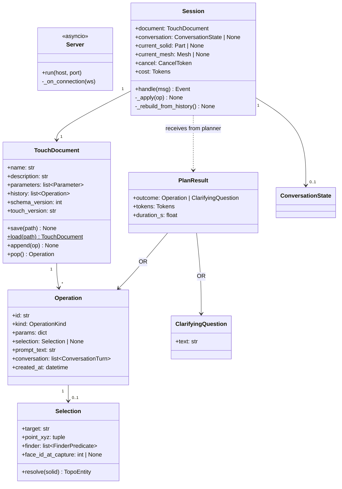
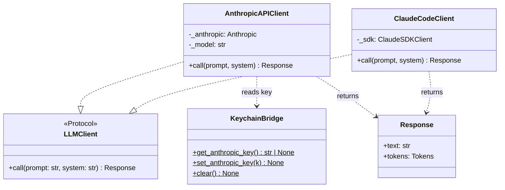
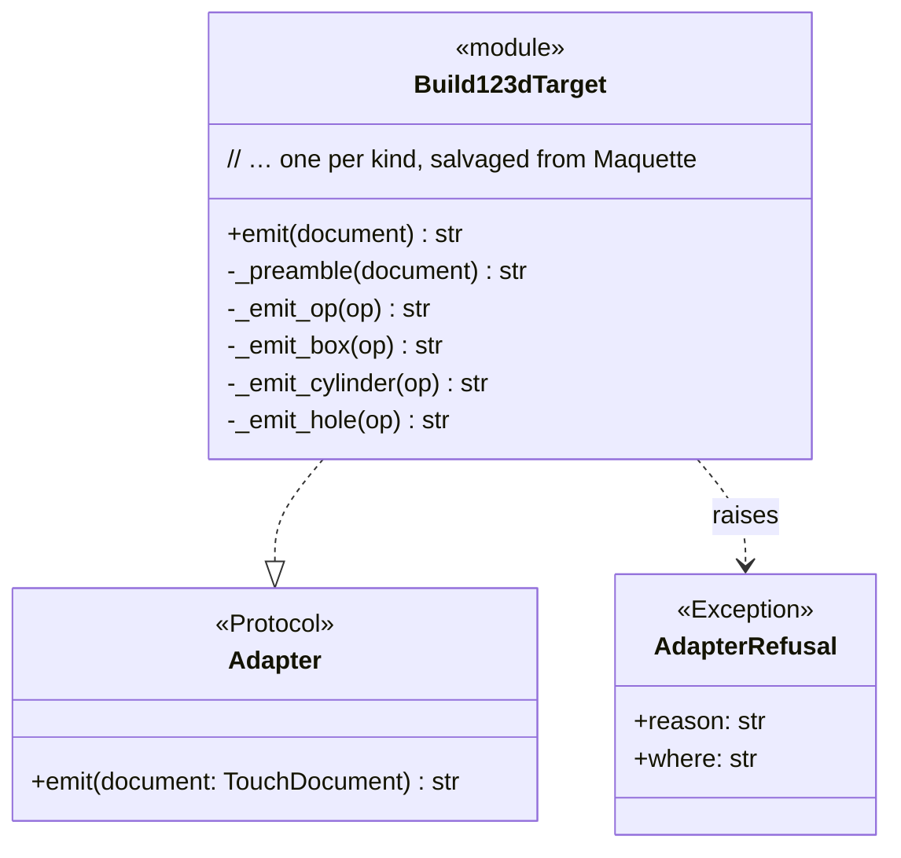
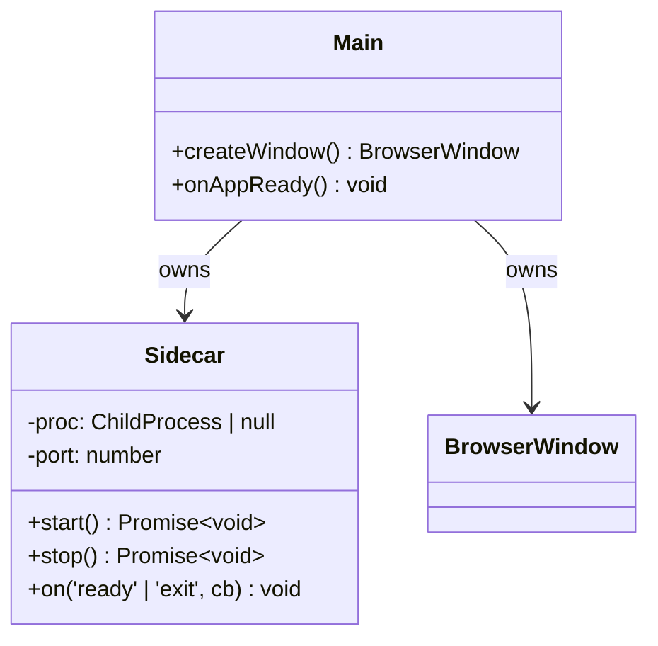

# 02 — Classes & modules

> *Re-baselined 2026-05-29 for **Touch**. Update via `/pm-architecture`.
> Maquette's prior 02-classes.md is superseded — in git history.*

Touch is a multi-language project. This doc lists every module the
requirements imply, grouped by bounded context, with class shapes and
dependency rules.

## Module map

### Backend (Python — `src/touch_backend/`)

| Module | Responsibility | Public surface | Depends on (in) | Depends on (out) |
|--------|----------------|----------------|-----------------|------------------|
| `touch_backend.server` | WS server endpoint, message dispatch, binary geometry framing | `Server` class, `run()` entry | (process root) | websockets, asyncio, session |
| `touch_backend.session` | Per-WS-connection state: document, conv state, cancel token, queue | `Session` class | server | document, planner, executor, tessellate |
| `touch_backend.document` | `.touch` operation history; load/save; rebuild from history | `TouchDocument`, `Operation`, `load(path)`, `save(path)` | session, planner | intent, intent_validation, json, pathlib |
| `touch_backend.planner` | Prompt + selection + conv-state → structured op OR clarifying question | `plan(client, prompt, selection, conv, prompts) -> PlanResult` | session | llm_client, intent, intent_validation, pricing |
| `touch_backend.llm_client` (package) | Pluggable LLM Protocol + impls | `LLMClient` Protocol, `AnthropicAPIClient`, `ClaudeCodeClient`, `make_client(mode, …)` | planner | anthropic, claude-agent-sdk, keychain_bridge |
| `touch_backend.intent` | Operation schema (pydantic) + Selection / FinderPredicate types | `Operation`, `Selection`, `FinderPredicate`, `Parameter`, `OperationKind` | document, planner, adapters, intent_validation | pydantic |
| `touch_backend.intent_validation` | Per-op contract checks (required params per kind) | `validate_kind_contracts(op)`, `ContractViolation` | document, planner | intent |
| `touch_backend.adapters` (package) | Adapter `Protocol` + `AdapterRefusal` | `Adapter`, `AdapterRefusal` | adapters.build123d_target | intent |
| `touch_backend.adapters.build123d_target` | Operation history → build123d source code (pure, deterministic) | `emit(document) -> str` | executor | intent, adapters, textwrap |
| `touch_backend.executor` | Run emitted build123d code → in-memory `build123d.Part` | `Executor.execute(code) -> ExecutionResult` | session | subprocess (or in-process), build123d |
| `touch_backend.tessellate` | OCP solid → mesh + per-face / per-edge IDs | `tessellate(solid) -> Mesh` | session | OCP, ocp_tessellate, numpy |
| `touch_backend.pricing` | Token → USD cost lookup | `price(model, tokens) -> float`, `Tokens`, `ModelPrice` | planner, session, llm_client | stdlib |
| `touch_backend.config` | env / config-file / overrides merge | `Config`, `load(...)` | server, session | python-dotenv, tomllib |
| `touch_backend.keychain_bridge` | `keyring` wrapper for OS-keychain read/write of the Claude API key | `get_anthropic_key()`, `set_anthropic_key(k)`, `clear()` | llm_client.anthropic_api | keyring |

### Frontend (TypeScript — `web/src/`)

| Module | Responsibility | Public surface | Depends on (in) | Depends on (out) |
|--------|----------------|----------------|-----------------|------------------|
| `web/viewport` | three.js scene, render loop, NX camera (F3) | `Viewport` class, `mount(canvas)` | (root entry) | three, web/picking, web/doc-store |
| `web/picking` | raycast → triangle → face/edge id (F4, F5) | `Picker.pickAt(x, y) -> Selection \| null` | web/viewport, web/selection | three, web/doc-store |
| `web/selection` | Selection state store (current sel + history of recent) | `SelectionStore` | web/picking, web/prompt | (none) |
| `web/prompt` | Prompt panel anchored to selection; chat-thread for clarifications (F6, F7) | `PromptPanel` component | (root entry) | web/selection, web/transport |
| `web/history-ui` | Undo/redo + history list (F9) | `HistoryView` component | (root entry) | web/transport, web/doc-store |
| `web/file-tree` | VS-Code-like project tree (F10, F18) | `FileTree` component | (root entry) | web/transport |
| `web/settings` | Settings panel: provider mode + creds + Claude Code detection (F13, F31) | `SettingsPanel` component | (root entry) | web/transport |
| `web/cost-indicator` | Session cost display (F14) | `CostIndicator` component | (root entry) | web/transport |
| `web/splash` | Cold-start splash until backend `ready` (F15) | `Splash` component | (root entry) | web/transport |
| `web/transport` | WS client: binary frames + JSON envelopes; reconnect on backend restart (F16) | `Transport` class, `send(msg)`, `on(eventType, handler)` | (most) | (browser WebSocket) |
| `web/doc-store` | FE-side document state mirror: history, current mesh, conv state, dirty flag | `DocStore` | viewport, history-ui, transport | (none) |
| `web/protocol-types` | Generated TS types from `protocol/schema.json` | typed message classes | (all) | (generated) |

### Desktop shell (TypeScript / Node — `shell/`)

| Module | Responsibility | Public surface | Depends on (in) | Depends on (out) |
|--------|----------------|----------------|-----------------|------------------|
| `shell/main` | Electron main process: window, menus, native dialogs | (entry) | (Electron loads it) | electron, shell/sidecar |
| `shell/sidecar` | Spawn / supervise / restart the Python sidecar (F16); detect `ready` from stdout | `Sidecar` class, `start()`, `stop()`, `on('ready' \| 'exit', cb)` | shell/main | child_process |
| `shell/preload` | Bridge between renderer + main (when needed; v0 mostly direct WS) | preload script | (Electron renderer) | electron |

### Shared (`protocol/`)

| Module | Responsibility |
|--------|----------------|
| `protocol/schema.json` | Single source of truth for all WS message types + payloads (control + events + binary frame envelopes) |
| `protocol/generated/ts/` | TS types generated from `schema.json` for the frontend |
| `protocol/generated/py/` | pydantic models generated for the backend |

## Class diagrams

### Engine bounded context (Python backend)



### LLM Client bounded context



### Adapter bounded context



### Frontend bounded context (TypeScript)

```mermaid
classDiagram
    class Viewport {
        -scene: THREE.Scene
        -camera: THREE.OrthographicCamera | PerspectiveCamera
        -controls: OrbitControls (rebound NX-style)
        -meshObj: THREE.Mesh
        +mount(canvas) void
        +setMesh(mesh: Mesh) void
        +onHover(cb) void
        +onClick(cb) void
    }
    class Picker {
        -raycaster: THREE.Raycaster
        -meshAttribs: { faceIdPerTriangle, edgeIdPerSegment }
        +pickAt(x, y) Selection | null
    }
    class SelectionStore {
        -current: Selection | null
        +set(s: Selection)
        +clear()
        +get(): Selection | null
        +subscribe(cb)
    }
    class PromptPanel {
        -selection: Selection
        -thread: ConversationTurn[]
        +submit(text) Promise~void~
        +continueThread(reply: string) Promise~void~
    }
    class Transport {
        -ws: WebSocket
        +send(msg: Json) void
        +sendBinary(payload: ArrayBuffer) void
        +on(type, handler) void
        +reconnect() Promise
    }
    class DocStore {
        -history: Operation[]
        -mesh: Mesh
        -dirty: boolean
        +applyEvent(evt) void
        +rewindTo(opId) void
    }
    Viewport --> Picker
    Picker --> SelectionStore
    SelectionStore --> PromptPanel
    PromptPanel --> Transport
    Transport --> DocStore
    DocStore --> Viewport
```

### Desktop-shell bounded context (Electron main)



## DDD analysis

### Bounded contexts

| Context | Modules | Boundary |
|---|---|---|
| **Frontend Shell (UI / Renderer)** | `web/viewport`, `web/picking`, `web/selection`, `web/prompt`, `web/history-ui`, `web/file-tree`, `web/settings`, `web/cost-indicator`, `web/splash`, `web/doc-store` | The user's interactive surface. Owns selection, picking, prompt UX, viewport. No geometry / kernel / LLM logic. |
| **Coupling / Protocol** | `web/transport`, `web/protocol-types`, `touch_backend.server`, `protocol/schema.json` | The wire between FE and BE. Owns the message types and binary geometry framing. Both ends are clients of this contract. |
| **Engine (Kernel + Planner + History)** | `touch_backend.session`, `.document`, `.planner`, `.llm_client`, `.intent`, `.intent_validation`, `.adapters.*`, `.executor`, `.tessellate`, `.pricing`, `.config`, `.keychain_bridge` | The geometry truth + LLM interaction. Owns the `.touch` document semantics, build123d execution, tessellation, LLM client abstraction, pricing. |
| **Distribution / Lifecycle** | `shell/main`, `shell/sidecar`, `shell/preload`, `electron-builder.yml`, `package.json`, `pyproject.toml`, GH Actions | App process model + packaging. Owns the wrapper for the .exe, the sidecar lifecycle, the release pipeline. |

The four contexts communicate through narrow, named contracts:
- **FE-Shell ↔ Coupling:** the `Transport` class and `protocol-types`.
- **Engine ↔ Coupling:** `Server` + `Session` + `protocol/schema.json`.
- **Distribution ↔ FE-Shell/Engine:** spawns the sidecar; serves the
  renderer; otherwise hands off.

### Ubiquitous language (glossary)

Every term used in code, docs, conversation, and the planner system
prompt must be identical.

| Term | Definition |
|---|---|
| **Touch** | The product: an open-source, AI-native, interactive 3D CAD editor. |
| **Document** / `.touch` file | The user's saved part — an ordered, append-only operation history (JSON). The source of truth; geometry is derived. |
| **Operation** | One CAD action — typically one click+prompt. An entry in `Document.history`. Replayable. |
| **Operation kind** | One of the structured types (`box`, `cylinder`, `hole`, `shell`, …) the planner can emit and the adapter can compile. |
| **Selection** | The spatial context of an operation: target (face/edge/vertex) + point + a *finder*. |
| **Finder** | A list of geometric predicates (plane-normal, contains-point, surface-type, of-feature, …) that re-identify a selection target after history replay. Replicad-inspired. |
| **Solid** | The current in-memory B-rep (OCP `TopoDS_Shape`) built from `Document.history`. Derived, disposable. |
| **Mesh** | The tessellated geometry shipped over the WS to the FE for display + picking; carries per-face / per-edge IDs. |
| **Face ID / Edge ID** | Kernel-owned integers identifying topological entities on the current solid; carried in the Mesh payload; session-stable, **not** persistent across edits (that's the finder's job). |
| **Conversation** | The clarifying-question thread the planner can open when a prompt is ambiguous (F7). Preserved alongside the resulting operation. |
| **Session** | One open WS connection; holds one open document + the live derived state. |
| **Planner** | The component that turns prompt + selection + conv state into either an `Operation` or a `ClarifyingQuestion`. |
| **LLMClient** | The Protocol abstracting the LLM call surface; two v0 implementations (Anthropic API, Claude Code). |
| **Adapter** | A pure function `Document → build123d source code`. v0 only ships `build123d_target`. |
| **Executor** | Runs the adapter's emitted code, returns the in-memory solid. |
| **Tessellate** | OCP-native bulk tessellation with per-face ID tagging. |
| **Sidecar** | The Python backend process, supervised by Electron main in prod. |
| **Provider mode** | The user's choice of LLM path: API (key in OS keychain) or Claude Code (subscription). |
| **Browser-dev mode** | The frontend served via Vite to a browser tab pointed at a localhost sidecar — the developer's headless-Linux daily loop. |
| **Spike** | A time-boxed prove-it-can-work prototype. The packaging spike (Electron + Python + OCP → `.exe`) is v0's phase 0. |

### Aggregates, entities, value objects

| Name | Kind | Owns | Lifecycle |
|---|---|---|---|
| `TouchDocument` | Aggregate root | `Parameter[]`, `Operation[]` (the history) | Created on new-file or load; saved to disk; lives across sessions |
| `Operation` | Entity | `Selection` (one or none), `params` dict, `conversation` thread | Identified by `id`; appended to `Document.history`; never edited in v0 |
| `Selection` | Value object | `FinderPredicate[]`, `point_xyz`, `face_id_at_capture` | Immutable; equality by value |
| `FinderPredicate` | Value object | (per-variant fields) | Immutable |
| `Parameter` | Value object | — | Immutable |
| `Session` | Entity (transient) | the open `Document` + derived `Solid` + `Mesh` + `ConversationState?` | Created on WS connect; destroyed on disconnect; recreatable from disk |
| `ConversationState` | Entity (transient) | `Selection`, `ConversationTurn[]` | Created when planner asks; destroyed when op accepted or cancelled |
| `Mesh` | Value object (payload) | typed buffers + ID tags | Disposable; re-derived per geometry update |

### Services

| Service | Kind | Responsibility |
|---|---|---|
| `Server` | Infrastructure | WS endpoint, dispatch, binary framing |
| `Session` | Application orchestrator | Per-connection state machine + protocol handling |
| `Planner` | Application | Wraps the LLM call; returns op or question; cost-tracking |
| `LLMClient` (variants) | Infrastructure | The actual LLM call surface (API / Claude Code) |
| `Adapter` (build123d) | Domain | Pure history→code translation |
| `Executor` | Application | Subprocess (or in-process — TBD by packaging spike) lifecycle for the emitted code |
| `Tessellate` | Domain | OCP-native bulk mesh extraction with face/edge tagging |
| `Sidecar` (Electron main) | Infrastructure | Sidecar process supervision |
| `Pricing` | Infrastructure | Static price lookup |
| `Config` | Infrastructure | Settings merge + load |
| `KeychainBridge` | Infrastructure | OS-keychain access |

## Dependency rules

Hard constraints. Violations are CI errors (enforced via
`import-linter` on the Python side; `dependency-cruiser` or similar on
the TS side).

### Backend (Python)

| Rule | Enforced how |
|---|---|
| `touch_backend.intent` has zero outbound deps on other `touch_backend.*` modules (pure types) | `import-linter` forbidden contract |
| `touch_backend.intent_validation` depends only on `intent` (no other touch_backend modules) | `import-linter` rule |
| `touch_backend.adapters.*` depend only on `intent` + stdlib + textwrap (no I/O modules, no anthropic, no server) | `import-linter` rule |
| `touch_backend.pricing` is pure + stateless (no I/O) | `import-linter` rule |
| `touch_backend.llm_client.anthropic_api` may import `anthropic` and `keychain_bridge`; not `planner`/`server`/`session` | `import-linter` rule |
| `touch_backend.llm_client.claude_code` may import `claude-agent-sdk`; not `planner`/`server`/`session` | `import-linter` rule |
| `touch_backend.planner` may import `llm_client`, `intent`, `intent_validation`, `pricing` — not `server`/`session`/`document` (planner is callable from session, not the reverse) | `import-linter` rule |
| `touch_backend.document` may import `intent`, `intent_validation` — not anything LLM-related | `import-linter` rule |
| `touch_backend.server` is the only module that writes to client-bound sockets | code review |
| `src/` contains zero `import NXOpen` / `from NXOpen` (carried Maquette hygiene rule, even with NX adapter not active) | CI grep guard |
| `src/touch_backend/` has no plaintext API key strings | CI grep guard + pre-commit |

### Frontend (TypeScript)

| Rule | Enforced how |
|---|---|
| `web/viewport` may import three.js, `web/picking`, `web/doc-store`; not `web/transport` directly | `dependency-cruiser` |
| `web/picking` may import three.js + `web/doc-store`; not UI components or transport | `dependency-cruiser` |
| `web/transport` is the only module that opens a `WebSocket` | grep guard |
| `web/protocol-types` has no project-internal imports (auto-generated) | regen check in CI |
| UI components (`prompt`, `history-ui`, `file-tree`, `settings`, etc.) talk to the backend via `web/transport`, never directly to `web/viewport`'s internals | review + cruiser |

### Cross-language

- The protocol schema in `protocol/schema.json` is the single source of
  truth for messages. CI regenerates `protocol/generated/ts/` and
  `protocol/generated/py/` on every build and fails if the generated
  files would change vs the committed ones.

## Test strategy per class

| Module / class | Unit | Integration | Snapshot | Notes |
|---|---|---|---|---|
| `touch_backend.intent` | ✓ | — | — | Pydantic edge cases on new types (Selection / FinderPredicate variants) |
| `touch_backend.intent_validation` | ✓ | — | — | Per-kind contracts (carry from Maquette) |
| `touch_backend.adapters.build123d_target` | ✓ | ✓ (round-trip emit → execute → solid) | ✓ (one fixture per op kind) | Determinism: emit twice, diff empty (N10) |
| `touch_backend.document` | ✓ | ✓ (save → reload → identical model) | ✓ (golden .touch files) | Schema-version migration helpers (N7) |
| `touch_backend.planner` | ✓ (mocked LLM) | ✓ (live, gated by ANTHROPIC_API_KEY) | — | Op-vs-question branching; conv-state resumption |
| `touch_backend.llm_client.*` | ✓ (mocked SDKs) | ✓ (live, both clients) | — | Contract test: both impls satisfy the Protocol identically |
| `touch_backend.executor` | — | ✓ | — | Crash isolation; capturing the solid |
| `touch_backend.tessellate` | — | ✓ | — | Per-face/edge ID stability within a session; mesh integrity |
| `touch_backend.server` | — | ✓ (full WS round-trip with a fake client) | — | Protocol contract; cancel handling |
| `touch_backend.session` | — | ✓ (sequence of ops on a real document) | — | Rebuild-from-history equivalence |
| `touch_backend.pricing` | ✓ | — | — | Per-model calc |
| `touch_backend.config` | ✓ | — | — | Precedence + /srv/touch/ default on the dev host |
| `touch_backend.keychain_bridge` | ✓ (mocked keyring) | — | — | Key set/get/clear flow |
| `web/viewport` | — | ✓ (jsdom + headless three) | — | Camera bindings (NX vs default) |
| `web/picking` | ✓ | ✓ (fake mesh + raycast assertions) | — | Triangle→face-id lookup correctness |
| `web/selection` | ✓ | — | — | Store behaviour |
| `web/prompt` | ✓ | ✓ (Playwright: submit → assertion) | — | Chat-thread continuation; cancel |
| `web/transport` | ✓ | ✓ (against a stub WS server) | — | Reconnect / replay on restart |
| `web/file-tree`, `web/settings`, `web/history-ui`, `web/cost-indicator`, `web/splash` | ✓ | ✓ (Playwright E2E) | — | Standard component tests |
| `shell/main`, `shell/sidecar` | — | ✓ (Electron test runner: launch → spawn → ready → kill → restart) | — | The crash-recovery path (F16) |
| **Protocol contract** | — | ✓ | — | JSON-Schema validation in both languages on every CI run |
| **E2E** | — | ✓ | — | Playwright: mini-PC flow start to finish in browser-tab mode against a real sidecar (mocked LLM); a smaller `@live` variant against real Claude in nightly |
