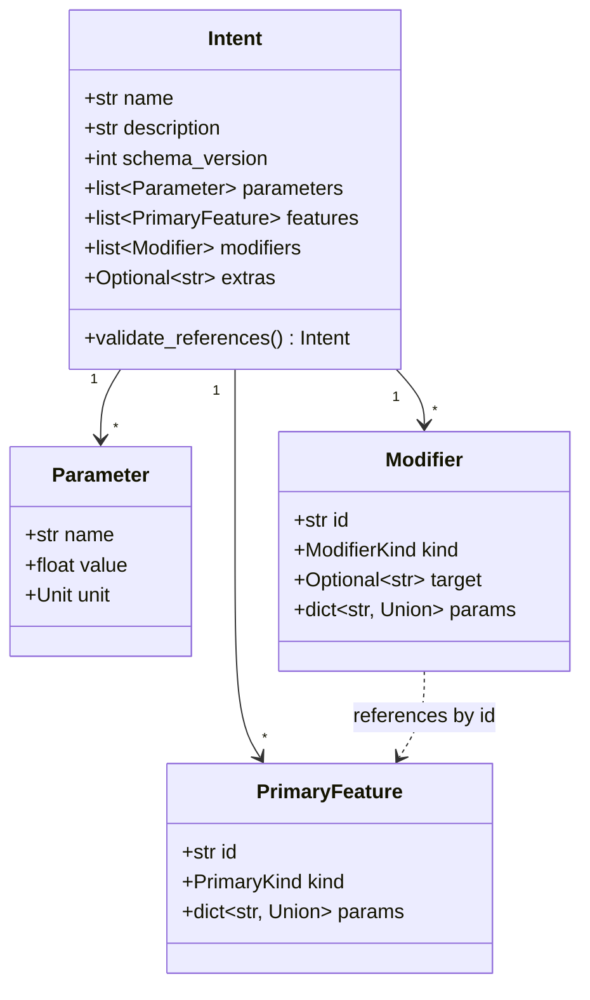
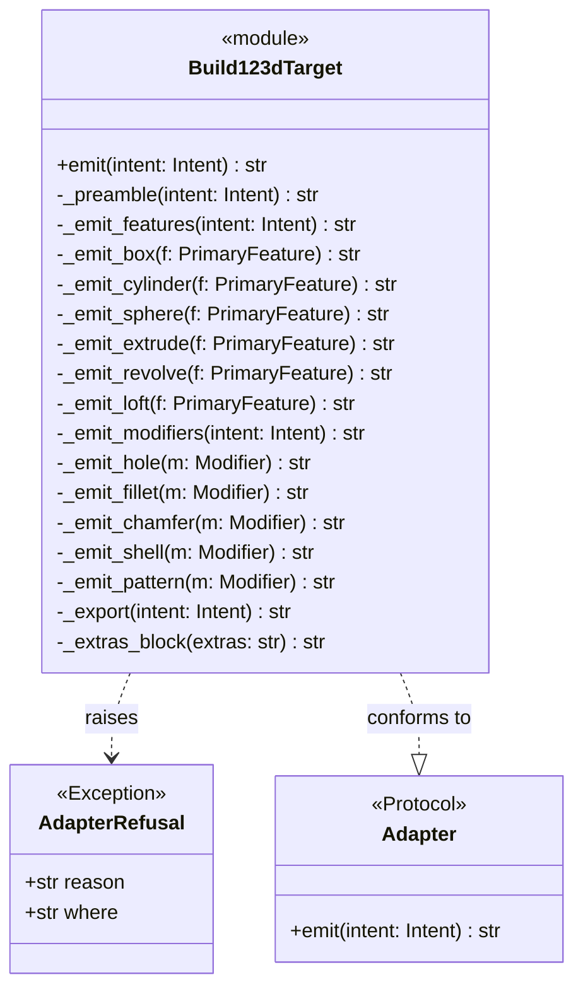
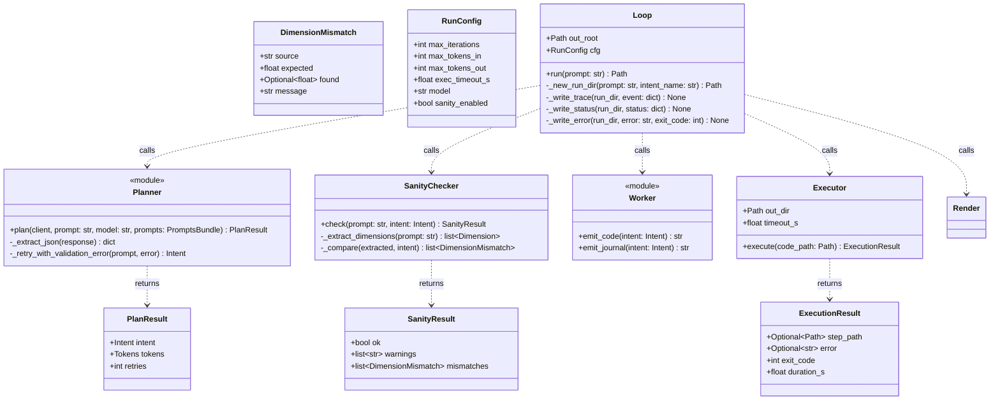
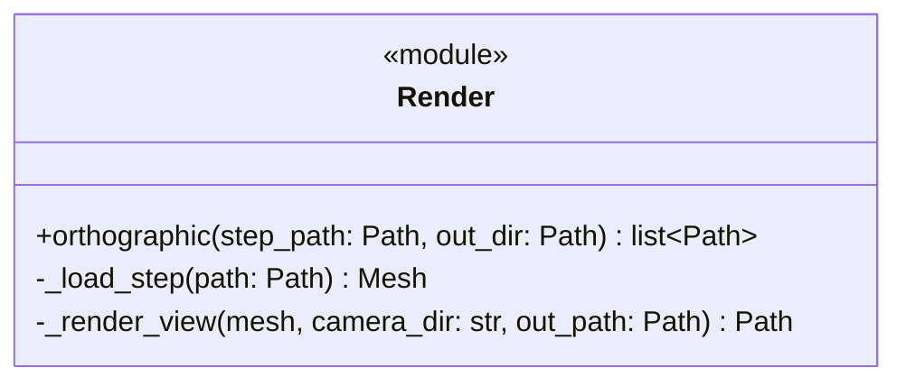
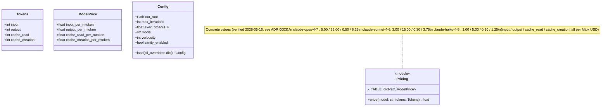

# 02 — Classes & modules

> *Synthesized from `notes/inbox.md` (migrated vault) + `02-architecture.md`
> + `02-data-model.md` + `01-requirements.md` on 2026-05-16. Update via
> `/pm-architecture`.*
>
> This is the layer historically skipped. Every class that will exist has
> a slot here, with public methods listed, before code is written.

## Module map

| Module | Responsibility | Public surface | Depends on (in) | Depends on (out) |
|--------|----------------|----------------|-----------------|------------------|
| `maquette.intent` | Pydantic schema + invariants (pure types) | `Intent`, `Parameter`, `PrimaryFeature`, `Modifier`, `Unit`, `PrimaryKind`, `ModifierKind` | adapters, agent.*, intent_validation | pydantic |
| `maquette.intent_validation` | Per-kind contract checks | `validate_kind_contracts(intent) → list[ContractViolation]`, `ContractViolation` | agent.loop, agent.planner | maquette.intent |
| `maquette.pricing` | Model → per-token price table (4 token classes; see ADR 0003 for values) | `price(model, tokens) → float`, `Tokens` dataclass, `ModelPrice` dataclass | agent.loop, agent.planner (for cost calc) | stdlib only |
| `maquette.config` | env / .env / pyproject / CLI flag precedence | `Config` dataclass, `load(cli_overrides=…)` | cli, agent.loop | python-dotenv, tomllib |
| `maquette.cli` | Typer entrypoint | command functions (`design`, …) | (entry point) | typer, agent.loop, config |
| `maquette.agent.loop` | Orchestrator + state machine + writers | `Loop.run(prompt, cfg) → Path`, `RunConfig` | cli | agent.*, intent, render, pricing |
| `maquette.agent.planner` | Prompt → Intent via Claude | `plan(client, prompt, model, prompts) → PlanResult` | agent.loop | anthropic, intent, prompts files |
| `maquette.agent.sanity` | F6 dimension extraction + comparison | `check(prompt, intent) → SanityResult` | agent.loop | intent, re |
| `maquette.agent.worker` | Adapter delegation | `emit_code(intent) → str`, `emit_journal(intent) → str` (v0.1) | agent.loop | intent, adapters |
| `maquette.agent.executor` | Subprocess execution + STEP capture + error.json | `Executor.execute(code_path, out_dir, timeout_s) → ExecutionResult` | agent.loop | subprocess, pathlib, json |
| `maquette.agent.evaluator` (v0.1) | Vision-LLM critique | `evaluate(client, prompt, intent, render_paths) → Critique` | agent.loop (v0.1) | anthropic, intent |
| `maquette.adapters.build123d_target` | Intent → build123d source | `emit(intent) → str`, `AdapterRefusal` | agent.worker | intent, textwrap |
| `maquette.adapters.nx_open_target` (v0.1) | Intent → NX Open journal | `emit(intent) → str` | agent.worker (v0.1) | intent, textwrap (never NXOpen) |
| `maquette.render` | Headless PyVista render | `orthographic(step_path, out_dir) → list[Path]` | agent.loop | pyvista, ocp |

## Class diagrams

### Intent module (the domain model)

### Adapter Protocol + concrete adapters

The adapter contract is defined as a `Protocol` in `maquette.adapters`
(per decision P2). Both concrete adapters declare conformance — the
type checker (mypy or pyright) catches signature drift.

The v0.1 `NxOpenTarget` module conforms to the same `Adapter` Protocol;
mypy/pyright check both implementations at type-check time.

### Agent module — pipeline classes

The `Loop` owns rendering: after the `Executor` returns an
`ExecutionResult` with a valid `step_path`, the `Loop` calls
`render.orthographic(step_path, run_dir)` as a separate, **non-fatal**
step (F7). The `Executor` is a pure subprocess manager (N6, N9) and does
not import `render` — keeping execution-safety and rendering as distinct
concerns (matches the C4 container view, where `Loop --> Render`).

### Render module

### Pricing + Config

## DDD analysis

### Bounded contexts

| Context | Modules | Boundary |
|---|---|---|
| **Domain** | `intent`, `intent_validation` | Pure data + invariants. `intent` holds declarative types; `intent_validation` holds per-kind contract checks. No I/O, no LLM, no geometry. |
| **Planning** | `agent.planner`, `agent.sanity` | Translates user intent (text) into structured Intent. Owns the LLM-facing prompts and the post-hoc semantic guard. |
| **Translation** | `agent.worker`, `adapters.*` | Intent → backend-specific code. Pure functions. |
| **Execution** | `agent.executor` | Subprocess management. Captures STEP + stderr. Times out. |
| **Rendering** | `render` | STEP → PNGs. Headless. |
| **Orchestration** | `agent.loop` | State machine, trace + status writes, error.json. The only writer to `output/`. |
| **Interface** | `cli` | User-facing typer commands. |
| **Infrastructure** | `pricing`, `config` | Configuration plumbing + price table. |

### Ubiquitous language (glossary)

Terms used in code, docs, conversation, and the planner system prompt
must be identical.

| Term | Definition |
|---|---|
| **Prompt** | Natural-language input from the user (one sentence usually). |
| **Intent** | Validated pydantic schema; the load-bearing intermediate between prompt and code. |
| **Parameter** | Named dimensioned scalar in an Intent (e.g. `size = 50 mm`). |
| **PrimaryFeature** | Top-level geometric primitive in an Intent (e.g. a `box`). |
| **Modifier** | Operation applied to a PrimaryFeature (e.g. a `hole`). |
| **Adapter** | Pure function `Intent → str` that emits backend code. Two adapters exist: `build123d_target` (v0) and `nx_open_target` (v0.1). |
| **AdapterRefusal** | Structured exception when an adapter cannot translate a given Intent. Carries a `where` field (e.g. `feature:loft`) for diagnostics. |
| **Extras** | The escape hatch on an Intent: raw backend code appended verbatim to the adapter output. |
| **Run** | A single invocation of `maquette design`. Identified by `run-id`. |
| **Run-id** | `<UTC-ISO timestamp>__<intent.name slugified>`. |
| **Trace** | `trace.jsonl` event log in the run folder. |
| **Critique** | Output of the Evaluator (v0.1+): pass/fail + structured issues. |
| **SanityWarning** | Output of the F6 dimension sanity check: a soft signal that an extracted dimension didn't match the Intent. Logged, never blocks. |
| **ContractViolation** | Output of `intent_validation.validate_kind_contracts()`: a structured report that a `PrimaryFeature` or `Modifier` has params not satisfying its per-kind contract (e.g. a `box` missing `height`). Raised before the worker is called. |
| **PromptsBundle** | In-memory representation of the `prompts/` directory loaded at runtime: a record carrying the planner system prompt, any sanity-check reference patterns, the evaluator system prompt (v0.1+), and the single rolled-up SHA-256 hash stamped into `status.json.prompts_hash` per ADR-0003. Passed into `agent.planner.plan(...)`; never mutated mid-run. |
| **Planner** | The application service that converts a `Prompt` into a validated `Intent` via a structured-output Anthropic call. Stateless. Owns retry-on-schema-fail and Anthropic prompt caching. Module: `maquette.agent.planner`. |
| **SanityChecker** | Domain service for the F6 dimension sanity check. Pure logic: regex-extract dimensions from a `Prompt`, compare against `Intent.parameters` + feature `params`, produce a `SanityResult`. Stateless. Module: `maquette.agent.sanity`. |
| **Worker** | The application service that delegates `Intent → backend code` to the appropriate `Adapter`. Thin shim; no domain logic. Module: `maquette.agent.worker`. |
| **Executor** | The application service that runs the worker's emitted code in a subprocess with a 30 s timeout (N9), captures STEP, writes `error.json` on crash, returns an `ExecutionResult`. Module: `maquette.agent.executor`. |
| **Loop** | The application orchestrator: state machine across Planner → SanityChecker → Worker → Executor (→ Evaluator → Refiner in v0.1). The only writer to `output/<run-id>/`. Owns `trace.jsonl` and `status.json` emission. Module: `maquette.agent.loop`. |
| **Renderer** | The application service that turns a STEP file into three orthographic PNGs via headless PyVista. Module: `maquette.render`. Sometimes referred to as `Render` (matching the module name) interchangeably. |
| **Evaluator** | (v0.1+) The application service that uses a vision LLM to critique the renders against the original `Prompt` + `Intent` and produces a `Critique`. Module: `maquette.agent.evaluator`. |
| **PlanResult** | Return value of `Planner.plan(...)`: carries the produced `Intent`, the `Tokens` consumed, and a retry count. Internal record. |
| **SanityResult** | Return value of `SanityChecker.check(...)`: `{ok: bool, warnings: list[str], mismatches: list[DimensionMismatch]}`. Internal record. |
| **Dimension** | Value object representing a numeric quantity extracted from a user prompt by `SanityChecker._extract_dimensions`: a tuple of `(value: float, unit: Unit, raw: str)` where `raw` is the source substring (e.g. `"50 mm"`). Internal to `agent.sanity`; compared against `Intent.parameters` + feature/modifier params to produce `DimensionMismatch` entries. Distinct from `DimensionMismatch` — `Dimension` is what the regex *finds*; `DimensionMismatch` is what the comparison *flags*. |
| **DimensionMismatch** | Value object inside a `SanityResult`: one mismatch between a regex-extracted prompt dimension and an `Intent` parameter (`source`, `expected`, `found`, `message`). |
| **ExecutionResult** | Return value of `Executor.execute(...)`: STEP path (optional), optional error message, exit code, duration. Internal record. Rendering is **not** part of execution — the `Loop` renders separately from the returned `step_path`. |
| **RunConfig** | Per-run configuration passed into `Loop.run(...)`: max iterations, token caps, exec timeout, model, sanity-enabled flag. **Distinct from `Config`**, which is the infrastructure-layer dataclass merged from CLI > env > pyproject > defaults at startup; `RunConfig` is the run-scoped subset the orchestrator needs. |
| **Tokens** | Frozen dataclass tracking per-call token counts across the four classes that `maquette.pricing` distinguishes: `input`, `output`, `cache_read`, `cache_creation`. Sourced from `response.usage` per ADR-0003. |
| **ModelPrice** | Frozen dataclass holding per-Mtok pricing for one model across the four `Tokens` classes. Looked up from `maquette.pricing._TABLE` by model id; values fixed by ADR-0003. |

### Aggregates, entities, value objects

| Name | Kind | Owns | Lifecycle |
|---|---|---|---|
| `Intent` | Aggregate root | `Parameter[]`, `PrimaryFeature[]`, `Modifier[]` | Created by Planner; immutable after construction (replacement, not mutation) |
| `Parameter` | Value object | — | Immutable; equality by value |
| `PrimaryFeature` | Entity | `params` dict | Identified by stable `id` (so modifiers can target by reference); replaced wholesale on Intent revision |
| `Modifier` | Entity | `params` dict | Identified by stable `id`; references PrimaryFeature by id |
| `Run` | Aggregate (filesystem-backed) | `output/<run-id>/` folder + all artefacts | Created by Loop; never deleted by maquette (user manages retention) |

### Services

| Service | Kind | Responsibility |
|---|---|---|
| `Planner` | Application | Wraps the Anthropic LLM call. Stateless. |
| `SanityChecker` | Domain | Pure logic: dimension extraction + comparison. Stateless. |
| `Adapter` (build123d) | Domain | Pure translation. Stateless. |
| `Worker` | Application | Adapter selection + delegation. Thin shim. |
| `Executor` | Application | Subprocess lifecycle, STEP capture, error.json. |
| `Render` | Application | PyVista pipeline. |
| `Loop` | Application orchestrator | State machine + filesystem writes. |
| `Pricing` | Infrastructure | Static price lookup. |
| `Config` | Infrastructure | Settings merge + load. |

## Dependency rules

Hard constraints. Violations are CI errors.

| Rule | Enforced how |
|---|---|
| `intent` has zero outbound deps on `agent.*`, `adapters.*`, `render`, or `intent_validation` | `pytest` test that imports `intent` in isolation and asserts no circular import; lint rule via `import-linter` |
| `intent_validation` depends only on `intent` (no other maquette modules) | `import-linter` rule: `intent_validation` may import only `maquette.intent` and stdlib |
| `src/` contains zero `import NXOpen` / `from NXOpen` (all milestones) | CI grep guard: `! grep -rE "^(import NXOpen\|from NXOpen)" src/` |
| `adapters/*` depend only on `intent` + stdlib + (their backend's emit-time targets — but emit-time means string templates, not imports) | `import-linter` rule: `adapters.*` may import only from `maquette.intent` and `textwrap` |
| `agent.loop` is the only module that writes to `output/` | Code review; runtime audit possible via decorator |
| `render`, `adapters`, and `intent` have no I/O side effects | Test by calling them with stubs; assert no file writes / network calls |
| `pricing` is stateless and pure | Lint: no I/O imports |
| `config` is the only module that reads `os.environ` or `.env` | Lint: grep guard on `os.environ` / `dotenv` outside `config.py` |

## Test strategy per class

| Class / module | Unit | Integration | Snapshot | Notes |
|---|---|---|---|---|
| `intent` | ✓ | — | — | Pydantic edge cases; `validate_references` model_validator failure modes |
| `intent_validation` | ✓ | — | — | Per-kind contract tests (one per of the 11 kinds); ContractViolation formatting |
| `agent.planner` | ✓ (mocked LLM) | ✓ (gated on `ANTHROPIC_API_KEY`) | — | Retry-on-schema-fail behaviour; JSON extraction edge cases |
| `agent.sanity` | ✓ | — | — | Regex extraction of dimensions; comparison logic; derived-dim false-positive cases (e.g. "centred" → no warning expected) |
| `agent.worker` | ✓ | — | — | Adapter selection; delegation |
| `agent.executor` | — | ✓ | — | Subprocess timeout; stderr capture; error.json formatting; SIGKILL behaviour |
| `agent.loop` | — | ✓ (smoke) | — | Full pipeline on each of the 3 v0 reference prompts; cost + latency assertions per N1/N2 |
| `adapters.build123d_target` | ✓ | ✓ (round-trip: emit → subprocess → STEP) | ✓ (one fixture per kind = 11) | Determinism: emit twice, diff empty |
| `adapters.nx_open_target` (v0.1) | — | — | ✓ | Snapshot only; never runtime-tested in CI (no NX) |
| `render` | — | ✓ | — | Load fixture STEP, render 3 views, assert PNGs > 0 bytes |
| `cli` | ✓ (typer test client) | — | — | Argument parsing; flag precedence; exit code mapping |
| `pricing` | ✓ | — | — | Per-model calculation; cache-token classes |
| `config` | ✓ | — | — | Precedence: CLI > env > pyproject > defaults |
