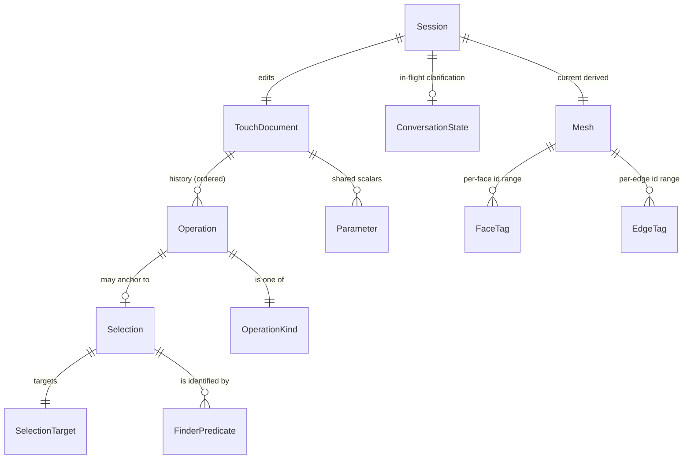

# 02 — Data model

> *Re-baselined 2026-05-29 for **Touch**. Update via `/pm-architecture`.
> Maquette's prior 02-data-model.md is superseded — in git history.*

The Touch data model has two main aggregates:

1. **The `TouchDocument`** — the user's saved-on-disk artefact (`.touch`
   JSON). The operation history *is* the document; the geometry is
   re-derived from it.
2. **The `Mesh` payload** — what flows over the WebSocket from the
   backend to the frontend after every geometry update; carries the IDs
   the frontend uses for selection.

Plus per-session transients (conversation state, cancel tokens) that are
not persisted but flow over the protocol.

## ERD



## Entities

### Workspace (backend-owned filesystem; ADR-0010)

**Purpose.** A folder, opened via File → Open Folder, that holds the user's
`.touch` **parts** (plus any other files), mirrored 1:1 in the Explorer. It is
**not a Touch-defined format** — just an OS directory. The **backend (sidecar)
owns the filesystem**: it lists/reads/writes the tree, opens a part (load its
history into the session) and saves. The **frontend owns the interaction**: the
folder *picker* (Electron native dialog → the local sidecar; browser-dev a host
folder) and the tree view, issuing file commands over the WS. A **Part** is one
`.touch` file = one `TouchDocument` (below). In the Electron desktop build the
folder is on the user's machine (files never leave it); in browser-dev it is on
the sidecar host.

### TouchDocument (aggregate root)

**Purpose.** The user's saved part — an ordered, append-only sequence of
operations that, when replayed, produces the current B-rep solid.

**Fields:**
- `schema_version: int` — bumped on additive changes; migration helpers
  per minor bump (N7).
- `name: str` — short, slugified for filenames.
- `description: str` — free-form.
- `parameters: list[Parameter]` — named scalars (mirrors Maquette's
  pattern; referenceable in `extras` if needed).
- `history: list[Operation]` — the feature tree. **Ordered, append-only
  in v0** (no editing earlier ops; see [ADR-0008](./adr/0008-picking-and-face-identity.md)).
- `created_at: datetime`, `modified_at: datetime`.
- `touch_version: str` — the Touch version that wrote it.

**Invariants:**
- Every `Operation` is replayable; the document is *the* truth (live
  in-memory state is a derived cache).
- `schema_version` is forward-only; readers tolerate newer minor versions
  that only add fields.
- `history` is append-only in v0. (Re-editing earlier ops is deferred —
  topological-naming problem.)

**Owned by.** `touch_backend.document` module on disk; serialized as
canonical JSON.

### Operation (entity)

**Purpose.** A single user-driven CAD action — typically one click +
prompt → one operation appended to the document.

**Fields:**
- `id: str` — UUID, stable across sessions (useful for undo / replay
  diagnostics).
- `kind: OperationKind` — one of the 11 kinds (extends Maquette: 6
  primary + 5 modifier) plus future additions.
- `params: dict[str, float | str | bool]` — the per-kind parameters
  (e.g. `{length: 50, width: 50, height: 50}` for a `box`).
- `selection: Selection | None` — the spatial context: which existing
  face/edge/vertex this operation acts on. `None` for ops that don't
  need one (e.g. the initial primary feature placed on a base plane).
- `prompt_text: str` — the natural-language prompt the user typed.
- `conversation: list[ConversationTurn]` — any clarification exchanged
  before the operation was finalized (turn entries below). Empty for
  prompts that needed no clarification.
- `created_at: datetime`.

**Invariants:**
- `id` is unique within the document.
- `params` satisfy the per-kind contract (see § Validation rules).
- If `kind` is a modifier (e.g. `hole`, `chamfer`), `selection` must be
  present and resolvable.
- The history slot's position is implicit in its array index; not stored
  in the operation itself.

### Selection (value object — the "finder")

**Purpose.** Identify a face / edge / vertex such that the identity
**survives re-execution** of the operation history. v0 picks the
replicad-style "finder" approach (re-derivable geometric predicates)
rather than persistent topological names. See [ADR-0008](./adr/0008-picking-and-face-identity.md).

**Fields:**
- `target: "face" | "edge" | "vertex"`.
- `point_xyz: (float, float, float)` — the world-space point the user
  clicked (anchor / disambiguation).
- `finder: list[FinderPredicate]` — the predicates that re-identify the
  target after replay. ANDed; the matching topological entity is the one
  satisfying all predicates. Examples:
  - `{kind: "plane_normal", axis: "+Z"}` — the face is planar with
    normal +Z.
  - `{kind: "contains_point", point_xyz: (30, 20, 5)}` — the face
    contains this point (within tolerance).
  - `{kind: "surface_type", value: "cylindrical"}`.
  - `{kind: "centroid_near", point_xyz: (..), tol: 0.5}`.
  - `{kind: "of_feature", op_id: "<uuid>"}` — created by this prior op.
- `entity_id_at_capture: int | None` — the kernel-owned face/edge ID the
  backend reported at the moment of click (typed by `target`; was
  `face_id_at_capture`). The **within-session primary resolver**
  (ADR-0011): per-entity ids are stable within a session, so the
  just-clicked entity resolves directly and deterministically. The
  `finder` is the durable fallback used on replay / cross-session / id
  miss.

**Resolution order (ADR-0011):** ① `entity_id_at_capture` against the
live solid (within-session, deterministic); ② the `finder` predicates
(durable, on replay or id miss) — must resolve to exactly one; ③ if both
fail (0 or >1), a structured error → clarification (F7).

**Invariants:**
- `point_xyz` lies on the resolved target's surface (within tolerance).
- `point_xyz` / `contains_point` alone is **not** a sufficient resolver
  for the live case (edge/corner-adjacent click → multiple faces;
  off-surface float gap → none); it is a durability predicate, not the
  within-session primary.
- On a freshly-replayed model the `finder` must resolve to **exactly
  one** target; residual ambiguity is an error the planner refines via
  clarification (F7).

### ConversationTurn (value object)

**Purpose.** A single exchange in a clarification thread for an
operation that started ambiguous.

**Fields:**
- `from: "user" | "assistant"`.
- `text: str`.
- `at: datetime`.

(Lives inside `Operation.conversation` after the operation is finalized;
during the in-flight clarification it lives in `Session.conversation`.)

### Parameter (value object)

**Purpose.** Carried over from Maquette — a named dimensioned scalar
referenceable in `extras` (the relief valve from Maquette).

**Fields:** `name: str`, `value: float`, `unit: "mm" | "cm" | "m" | "in"`.

**Invariants:** `name` is a valid Python identifier (so it can be
referenced in `extras` build123d code). `name` does not collide with
build123d builtins (the adapter's `_RESERVED_NAMES` skip-list from the
Maquette adapter fix).

### Session (transient)

**Purpose.** Per-WebSocket-connection state.

**Fields:**
- `document: TouchDocument` — the open document being edited.
- `conversation: ConversationState | None` — if a clarification is
  in-flight (between turns).
- `current_solid: B-rep handle (in memory, OCP)` — the derived live
  model; rebuildable from `document.history`.
- `current_mesh: Mesh` — the last tessellation streamed to the FE.
- `cancel_token: CancelToken` — cancels the in-flight LLM call or
  executor work.
- `cost_tokens: Tokens` — cumulative LLM cost for the session (cost
  indicator, F14).

**Invariants:** `current_solid` and `current_mesh` are pure functions of
`document.history`; if they're missing or corrupted, replay rebuilds
them.

### ConversationState (transient)

**Purpose.** Holds the in-flight clarification thread, including the
original selection + the turns so far, so the next user reply resumes the
planner with full context.

**Fields:**
- `selection: Selection` — the original click context.
- `turns: list[ConversationTurn]` — what's been said.
- `attempts: int` — guard against infinite loops; cap at 3 (configurable).

### Mesh (payload entity)

**Purpose.** The tessellated geometry shipped over the WebSocket, with
the per-triangle face IDs the frontend uses for picking (F20).

**Fields (binary frame payload):**
- `version: u8`.
- `vertices: float32[N×3]` — world-space.
- `normals: float32[N×3]`.
- `indices: u32[M×3]` — triangles (referencing `vertices`).
- `face_tag_per_triangle: u32[M]` — for each triangle, the OCP face ID
  it belongs to. (Allows three.js raycaster's `intersection.faceIndex`
  → face-id lookup in O(1).)
- `edge_tag_per_segment: u32[L]` — for each line segment in the rendered
  edge wireframe, its OCP edge ID.
- `face_id_to_finder_hint: map[u32 → Selection]` (sent as JSON envelope
  alongside the binary frame) — for the FE, lets the click→selection
  flow populate the finder for the picked face from the kernel.
- `face_provenance: map[u32 → ProvenanceEntry]` (TP1; **backend-side only, not
  yet on the wire**) — per-face layer attribution (`created_by` /
  `last_modified_by` layer-id **sets**), computed by `provenance` and baked into
  the `Mesh` after a layer-stack rebuild (F39). The FE channel that ships this
  for live click→layer highlight is **TP3**.

**Invariants:** `face_tag_per_triangle.length === indices.length / 3`.
All IDs reference faces/edges that exist in `Session.current_solid`.

### Layer (entity — pivot, ADR-0012)

**Purpose.** One edit in a part: a build123d code block that transforms the
previous solid into the next (`solid_N = f_N(solid_{N-1})`). The unit of
modularity — hoverable, clickable, individually undoable. Owned by `layer_stack`.

**Fields:**
- `id: str` — stable layer id.
- `source: str` — the build123d code for this layer (the canonical authoring
  medium; a *recognized template* is just source that matches a known pattern).
- `kind: "template" | "code"` — `template` ⇒ recognised (parametric card,
  params extractable); `code` ⇒ freeform (code card).
- `params: dict | None` — for a recognised template, the editable parameters.
- `selection: Selection | None` — for entity-targeted layers (the finder
  reference; never a raw index, ADR-0011/0015).
- `input_hash`, `output_hash: str` — content-addressed cache keys (the fold
  reuses `mesh_cache`).
- `provenance: { created_by: set[layer_id], last_modified_by: set[layer_id] }`
  **per face/edge** of the resulting solid — computed by geometric diff
  (`provenance` module), baked into the Mesh ids so clicks map to a layer (F39).

**Invariants:** a layer returns exactly one valid, non-empty solid (validated at
the `executor` boundary); selections resolve via finder references; provenance
is a **set** (booleans fuse faces → multi-owner).

### LayerStack (aggregate — pivot, ADR-0012/0013)

**Purpose.** The active part: an ordered list of `Layer`s plus the derived live
solid/mesh. Replaces "the document is an op history" for the pivot (the op
history survives *inside* `template` layers). One shared instance per active
part (ADR-0013).

**Fields:**
- `layers: list[Layer]` — ordered; append-only in v0 (add / delete-last / undo).
- `revision: int` — **monotonic version**; bumped on every accepted mutation.
- `solid` / `mesh` — derived cache of the stack at `revision` (rebuildable by
  the fold; per-layer cached).

**Invariants:** deterministic ordered re-execution from clean state (no hidden
state between layers); every mutation is **compare-and-swap** against the
caller's expected `revision` (stale → rejected, N16); a single backend executor
is the only writer.

### FinderPredicate (value object — union type)

**Variants** (extensible):
- `{kind: "plane_normal", axis: "+X" | "-X" | "+Y" | "-Y" | "+Z" | "-Z"}`
- `{kind: "contains_point", point_xyz: (x, y, z), tol_mm: float}`
- `{kind: "surface_type", value: "planar" | "cylindrical" | "spherical" | "conical" | "toroidal" | "freeform"}`
- `{kind: "centroid_near", point_xyz: (x, y, z), tol_mm: float}`
- `{kind: "of_feature", op_id: "<uuid>"}` — the entity was *created by*
  the named prior op.
- `{kind: "area_near", area_mm2: float, tol: float}`
- `{kind: "edges_count", count: int}` — wire/face count (for ambiguity
  breaking).

**Invariants:** at least one predicate is required; predicates AND
together; ambiguity (zero matches OR > 1 matches) raises a structured
error (F21) and triggers a clarification (F7).

### OperationKind (enum, extends Maquette)

```python
OperationKind = Literal[
    # primary features (carry from Maquette)
    "box", "cylinder", "sphere", "extrude", "revolve", "loft",
    # modifiers (carry from Maquette)
    "hole", "fillet", "chamfer", "shell", "pattern",
    # Touch additions (v0+):
    # — none initially; the click+prompt UX may motivate new kinds
    #   (e.g. "cut_with_box" for the shell-out flow, vs hole+shell
    #   chain). Add via schema_version bump.
]
```

## Validation rules (layered)

Validation happens in this order; each layer assumes the previous passed.

1. **Pydantic** — types, units, required fields, enum membership.
2. **Cross-reference** — every `Selection.of_feature` (if used) points
   to an op_id that exists earlier in the history; `face_id_at_capture`
   (if present) is a non-negative int.
3. **Per-kind contract** — required params per kind (e.g. `box` requires
   `length`, `width`, `height`). Implemented in `intent_validation.py`;
   called by the planner before the op is accepted and by `document` on
   load.
4. **Finder resolvability** — the `Selection.finder` predicates resolve
   to exactly one topological entity on the current solid. Resolved at
   apply-time by the kernel; failures → structured error → clarification
   prompt (F7, F21).
5. **Adapter feasibility** — the build123d adapter can compile this op
   on this solid; refusal is a structured `AdapterRefusal` (salvaged
   from Maquette), with `where=<kind>:<reason>`.

## Schema evolution policy

- **Additive changes** (new fields, new optional predicates, new
  `OperationKind` values) bump `schema_version` by 1 minor. Older Touch
  readers ignore unknown fields; missing optional fields default cleanly.
- **Breaking changes** (renaming, removing, changing field semantics)
  require:
  - A new major `schema_version`.
  - A migration helper in `document` that upgrades old payloads on read.
  - An ADR documenting the change.
- **Per-predicate evolution.** New `FinderPredicate.kind` values are
  additive; older Touch versions ignore unknown predicates (best-effort
  resolution from the predicates they do understand — may produce
  ambiguity errors, which the user resolves manually).
- **`.touch` files are forever** in the sense that every Touch version
  can read every earlier version. Forward-compat (older reads newer) is
  best-effort: minor-additive yes; major-breaking no.

## Example `.touch` document (the mini-PC enclosure)

```json
{
  "schema_version": 1,
  "name": "mini_pc_enclosure",
  "description": "Mini-PC enclosure: 40×40×25 box, hollowed to a 5 mm shell, with USB cutout.",
  "parameters": [],
  "history": [
    {
      "id": "01HZ...",
      "kind": "box",
      "params": {"length": 40, "width": 40, "height": 25, "centered": "true"},
      "selection": {
        "target": "face",
        "point_xyz": [0, 0, 0],
        "finder": [{"kind": "plane_normal", "axis": "+Z"}],
        "face_id_at_capture": null
      },
      "prompt_text": "a 40x40x25 box",
      "conversation": [],
      "created_at": "2026-06-01T10:14:00Z"
    },
    {
      "id": "01HZ...",
      "kind": "shell",
      "params": {"thickness": 5.0, "open_face": "+z"},
      "selection": {
        "target": "face",
        "point_xyz": [0, 0, 12.5],
        "finder": [
          {"kind": "plane_normal", "axis": "+Z"},
          {"kind": "of_feature", "op_id": "01HZ..."}
        ],
        "face_id_at_capture": 7
      },
      "prompt_text": "hollow it out with a 30x30x15 box",
      "conversation": [],
      "created_at": "2026-06-01T10:14:20Z"
    },
    {
      "id": "01HZ...",
      "kind": "hole",
      "params": {"diameter": 10, "depth": 5, "axis": "x"},
      "selection": {
        "target": "face",
        "point_xyz": [20, 0, 5],
        "finder": [
          {"kind": "plane_normal", "axis": "+X"},
          {"kind": "contains_point", "point_xyz": [20, 0, 5], "tol_mm": 0.5}
        ],
        "face_id_at_capture": 12
      },
      "prompt_text": "cut a USB-sized hole here",
      "conversation": [
        {"from": "assistant", "text": "USB-A (10×4 mm) or USB-C (8.3×2.5 mm)?", "at": "..."},
        {"from": "user", "text": "USB-A please", "at": "..."}
      ],
      "created_at": "2026-06-01T10:15:05Z"
    }
  ],
  "created_at": "2026-06-01T10:13:00Z",
  "modified_at": "2026-06-01T10:15:05Z",
  "touch_version": "0.1.0"
}
```

This file diffs cleanly in git, is human-readable, and is the *only*
thing needed to reproduce the model on any Touch install of compatible
version.
