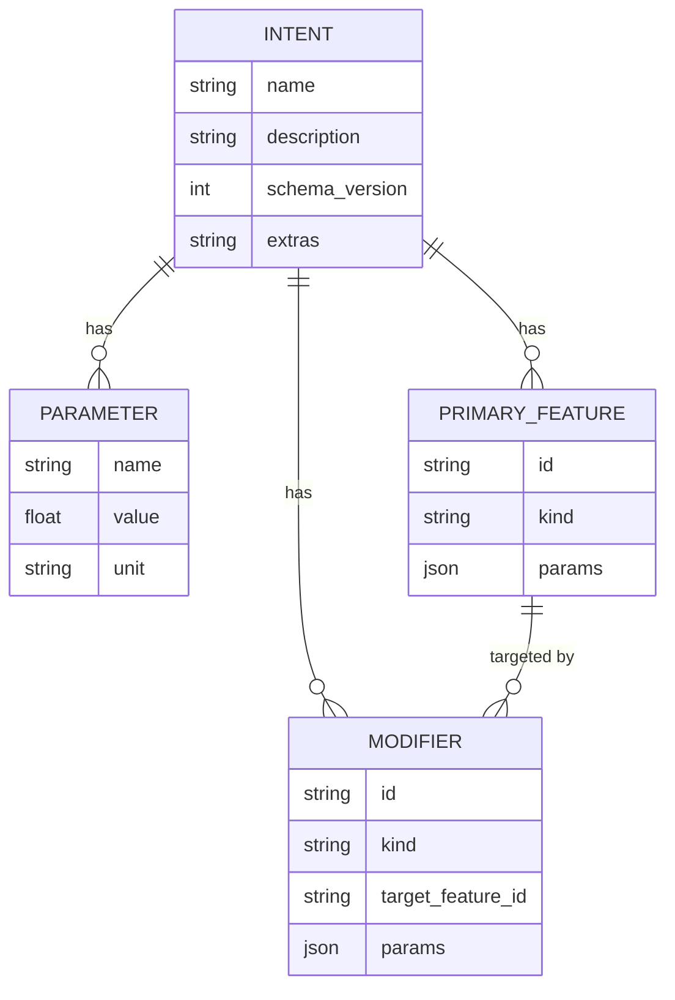

# 02 — Data model

> *Synthesized from `notes/inbox.md` (migrated vault 02-intent-schema.md) +
> `01-requirements.md` on 2026-05-16. Update via `/pm-architecture`.*

The `Intent` is the load-bearing concept in the whole system. The LLM does
**not** emit CAD code directly — it emits a typed `Intent`. Adapters then
translate `Intent` into backend-specific code (build123d, v0.1 NX Open).

The Intent schema is also the v0 functional bar (requirement F4): the
build123d adapter must compile all 6 PrimaryKinds and all 5 ModifierKinds.

## Why it exists

- **Validation before execution.** Pydantic catches a large fraction of
  hallucinations (impossible units, missing required fields, malformed
  primitives) before any geometry is built.
- **Multi-backend from one generation.** The same `Intent` compiles to
  build123d in v0 and to NX Open in v0.1 with no second LLM call.
- **A regression corpus that survives library churn.** `Intent` is a stable
  shape we own. build123d's API may move; the regression fixtures don't.
- **A natural caching unit.** Same `Intent`, deterministic adapter,
  identical output (NFR N3 + N7).

See [ADR 0001 — Intent as the pivot](./adr/0001-intent-as-pivot.md).

## Entity-relationship diagram



`Intent` is a tree, not a graph: `Modifier.target_feature_id` is the only
cross-reference, and it must resolve to an existing `PrimaryFeature.id`.
The validator enforces this.

## Entity definitions

### Intent (aggregate root)

- **Purpose.** The full structured description of a single part.
- **Fields.**
  - `name: str` — short, used to slugify the run directory.
  - `description: str` — free-form, helpful for traceability.
  - `schema_version: int = 1` — forward-only, bumped on additions.
  - `parameters: list[Parameter]` — named dimensions referenced by features.
  - `features: list[PrimaryFeature]` — geometric primitives, applied in order.
  - `modifiers: list[Modifier]` — operations on features, applied in order.
  - `extras: str | None` — escape hatch for raw backend code appended after
    adapter output. Pressure-valve for things the schema cannot express.
- **Invariants.**
  - All `PrimaryFeature.id` values are unique.
  - All `Modifier.id` values are unique.
  - Every `Modifier.target` (if non-null) resolves to a known feature id.
- **Owned by.** `maquette.intent` module.

### Parameter (value object)

- **Purpose.** A named dimensioned scalar.
- **Fields.** `name`, `value: float`, `unit: "mm" | "cm" | "m" | "in"`.
- **Invariants.** Units are an enum. `name` must be valid Python identifier
  (so it can be referenced in `extras` if needed).
- **Owned by.** `Intent` aggregate (no independent lifecycle).

### PrimaryFeature (entity)

- **Purpose.** A top-level geometric primitive.
- **Fields.** `id: str`, `kind: PrimaryKind`, `params: dict[str, float | str]`.
- **Invariants.** `id` is stable across an Intent's lifetime (modifiers
  reference it by id, not by index). `kind` is one of the 6 enum values
  below. `params` must satisfy the per-kind contract below.
- **Owned by.** `Intent` aggregate.

### Modifier (entity)

- **Purpose.** An operation applied to a `PrimaryFeature` (or to the whole
  Intent if `target` is null).
- **Fields.** `id: str`, `kind: ModifierKind`, `target: str | None`,
  `params: dict[str, float | str]`.
- **Invariants.** `id` is stable. `target`, if non-null, resolves to a
  known feature id. `kind` is one of the 5 enum values below. `params`
  must satisfy the per-kind contract below.
- **Owned by.** `Intent` aggregate.

## Enums

```python
Unit          = Literal["mm", "cm", "m", "in"]
PrimaryKind   = Literal["box", "cylinder", "sphere",
                        "extrude", "revolve", "loft"]
ModifierKind  = Literal["hole", "fillet", "chamfer", "shell", "pattern"]
```

## Per-kind parameter contracts (v0 — F4 bar)

These are the only shapes the v0 build123d adapter is guaranteed to
translate cleanly. **All 11 kinds are required to work in v0** per
requirement F4. The planner system prompt lists these; the worker fails
fast via `AdapterRefusal` on anything else (and falls back to `extras`
if the planner used the escape hatch).

### Primary features

| `kind` | Required params | Optional params | Notes |
|---|---|---|---|
| `box` | `length`, `width`, `height` (mm by default) | `centered: bool` | Axis-aligned, origin at min-corner unless `centered=true`. |
| `cylinder` | `radius`, `height` | `axis: "x" \| "y" \| "z"` | Axis defaults to `z`. |
| `sphere` | `radius` | — | Centred at origin. |
| `extrude` | `profile`, `distance` | `direction: "+x" \| "-x" \| …` | `profile` is a named sketch from `parameters` (extension point). |
| `revolve` | `profile`, `axis`, `angle_deg` | — | `angle_deg` defaults to 360. |
| `loft` | `sections: [profile…]` | — | Two or more profiles, in order. |

### Modifiers

| `kind` | Required params | Notes |
|---|---|---|
| `hole` | `diameter`, `depth` or `through: true` | Position on `target` feature: `face` + 2D offset, or a referenced point. |
| `fillet` | `radius` | Targets edges of `target` feature. Edge selection is left coarse in v0. |
| `chamfer` | `distance` | Same as `fillet` but a chamfer. |
| `shell` | `thickness`, `open_face` | Hollow the `target` feature, leaving `open_face` open. |
| `pattern` | `count`, `spacing`, `axis` | Linear pattern of `target` feature. |

v0 intentionally does **not** model: sketches as first-class entities,
fillets/chamfers with explicit edge selection, assemblies, mates, or
constraints. Anything in those buckets is `extras`-land for now.

## Pydantic skeleton (v0)

```python
# src/maquette/intent.py
from __future__ import annotations

from typing import Literal
from pydantic import BaseModel, Field, model_validator

Unit         = Literal["mm", "cm", "m", "in"]
PrimaryKind  = Literal["box", "cylinder", "sphere",
                       "extrude", "revolve", "loft"]
ModifierKind = Literal["hole", "fillet", "chamfer", "shell", "pattern"]


class Parameter(BaseModel):
    name: str
    value: float
    unit: Unit


class PrimaryFeature(BaseModel):
    id: str = Field(..., description="Stable id; modifiers target by id")
    kind: PrimaryKind
    params: dict[str, float | str]


class Modifier(BaseModel):
    id: str
    kind: ModifierKind
    target: str | None = Field(
        default=None,
        description="PrimaryFeature.id this modifier applies to, if applicable",
    )
    params: dict[str, float | str]


class Intent(BaseModel):
    name: str
    description: str
    schema_version: int = 1
    parameters: list[Parameter] = Field(default_factory=list)
    features: list[PrimaryFeature]
    modifiers: list[Modifier] = Field(default_factory=list)
    extras: str | None = Field(
        default=None,
        description="Escape hatch: raw backend code appended after adapter output",
    )

    @model_validator(mode="after")
    def validate_references(self) -> "Intent":
        feature_ids = {f.id for f in self.features}
        for m in self.modifiers:
            if m.target is not None and m.target not in feature_ids:
                raise ValueError(
                    f"modifier {m.id!r} targets unknown feature {m.target!r}"
                )
        if len({f.id for f in self.features}) != len(self.features):
            raise ValueError("duplicate feature ids")
        if len({m.id for m in self.modifiers}) != len(self.modifiers):
            raise ValueError("duplicate modifier ids")
        return self
```

## Validation rules (layered)

Validation happens in this order; each layer assumes the previous passed.

1. **Pydantic** — types, units, required fields, enum membership.
2. **Cross-reference** — `Modifier.target` resolves to an existing feature
   (`@model_validator` above).
3. **Per-kind contract** — required params per the tables above.
   Implemented in `intent_validation.validate_kind_contracts(intent)`
   (split from `intent.py` per decision B3, to keep `intent.py` purely
   declarative) and called by the Loop after the planner returns.
4. **Adapter feasibility** — the adapter is allowed to refuse an `Intent`
   it can't compile (e.g., an `extras`-only intent it doesn't understand).
   Refusal is a structured `AdapterRefusal` with `where=<feature|modifier>:<kind>`,
   not a crash.

## Example — the v0 cube-with-hole reference

```json
{
  "name": "cube_with_hole",
  "description": "50 mm cube with a 20 mm hole through the centre, drilled along Z.",
  "schema_version": 1,
  "parameters": [
    { "name": "size",      "value": 50, "unit": "mm" },
    { "name": "hole_diam", "value": 20, "unit": "mm" }
  ],
  "features": [
    {
      "id": "body",
      "kind": "box",
      "params": { "length": 50, "width": 50, "height": 50, "centered": "true" }
    }
  ],
  "modifiers": [
    {
      "id": "drill",
      "kind": "hole",
      "target": "body",
      "params": { "diameter": 20, "through": "true", "axis": "z" }
    }
  ],
  "extras": null
}
```

## Schema evolution policy

- **Additions** to `PrimaryKind` / `ModifierKind` are minor: bump
  `schema_version` by 1, support old payloads via defaults.
- **Removal or rename** of a field is major: write an ADR and a migration
  helper. Old `examples/` payloads must remain readable.
- The `extras` field is **forever**. It is the relief valve that lets
  the schema stay small.
- Each schema version increment requires:
  - Updated planner system prompt (advertising new kinds/params).
  - Adapter implementations OR `AdapterRefusal` paths for new kinds.
  - Fixture pair (Intent JSON + emitted source) per adapter.
  - Update this doc's per-kind contract tables.
