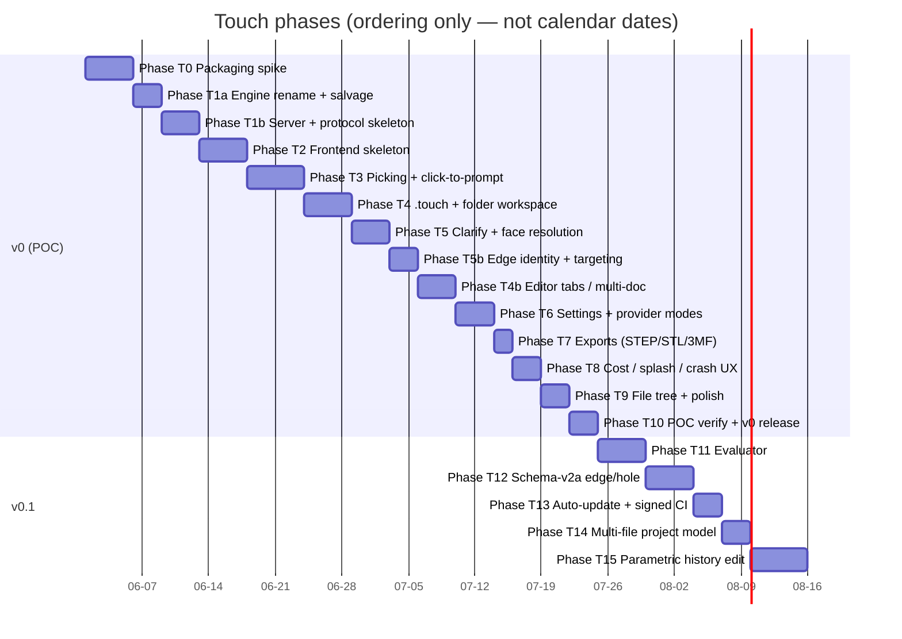

# 03 — Roadmap

> *Re-baselined 2026-05-29 for **Touch** (the Maquette pivot). Maquette's
> prior roadmap (phase-0 … phase-10) is superseded. Maquette phase docs
> + reports stay in `docs/phases/phase-0.md … phase-3.5-report.md` as
> shipped history. Touch phases live alongside as `phase-T0.md` …
> `phase-T15.md`. Update via `/pm-roadmap`.*

Touch's roadmap is shaped by the three locked decisions from the
architecture pass:

- The **packaging spike is phase 0** — Electron + a PyInstaller'd
  Python sidecar with OCP native libs into a working Windows `.exe` is
  the single highest-risk unknown. It must be proved on a clean Windows
  VM **before** any feature work ([ADR-0009](./adr/0009-desktop-shell-electron-sidecar.md)).
- **Engine reuse:** the Maquette pipeline (planner, adapter, intent,
  intent_validation, pricing, config) ports into `src/touch_backend/`
  rather than being rewritten.
- **Append-only v0:** parametric history editing is deferred (it
  reopens the topological-naming problem); v0 is a clean linear flow.

Two committed milestones: **v0** (the POC: model the mini-PC enclosure
via click+prompt and ship a `.exe` a friend can install), **v0.1** (the
features that round out the POC into a real tool — interactive
evaluator + schema-v2a + signed releases + multi-file projects +
parametric editing). v0.2+ is sketched but explicitly not committed.

Phases are numbered with a `T` prefix to avoid collision with the
Maquette phase docs already in `docs/phases/` (Maquette: `phase-0` …
`phase-3.5`; Touch: `phase-T0` … `phase-T15`).

## Milestone & phase overview

Gantt is ordering only — no calendar dates committed.

## Phases — v0 (POC: ship Touch to a friend who installs an `.exe`)

### Phase T0 — Packaging spike (load-bearing risk; ADR-0009)

- **Goal:** Prove Electron + a PyInstaller'd Python sidecar with OCP
  native libs packages into a Windows `.exe` that installs and runs on
  a fresh non-technical Windows VM — *before* any feature work.
- **Min:** A `Touch-spike-0.1.0.exe` installs on a clean Windows VM,
  launches the sidecar, the Electron renderer connects to it over
  WebSocket, the sidecar emits a known-good face-id'd mesh (hardcoded
  cube), three.js renders it, hovering a face highlights it locally. **No
  LLM, no real planner, no `.touch` save.**
- **Max:** Also builds via GitHub Actions on a tag push (early F27
  validation); a smoke check launches the `.exe` headlessly and asserts
  the WS handshake; identical bare-frontend served as a browser tab on
  the dev box (proving N5/N6 across both modes from day one).
- **Exit criterion:** the Min above holds, *or* the spike is filed as
  a `/pm-blocker` and the desktop shell pivots to Tauri (the documented
  ADR-0009 escape hatch).
- **Delivers (foundational, not full):** F1, F2 (skeleton), F4, F5
  (minimal), F19, F20, F28; demonstrates N4 / N5 / N6.
- **Plan:** [phase-T0.md](phases/phase-T0.md) *(stub — fill via `/pm-phase-plan`)*

### Phase T1a — Engine rename + salvage + dev infra

- **Goal:** Rename `src/maquette/` → `src/touch_backend/`; carry over the
  Maquette pipeline modules (planner, intent, intent_validation, adapter,
  pricing, config) so they pass their existing tests under the new
  namespace; SOPS-encrypt the dev `.env`; default the dev `out_root` to
  `/srv/touch/`. No new modules, no new behaviour — just the move.
- **Min:** Renamed package builds; the salvaged modules pass their
  existing pytest suite under `touch_backend.*`; `ruff check` /
  `ruff format --check` / `pyright` green; `lint-imports` updated with
  the new dependency rules and green; SOPS round-trip works (`sops -d` →
  working `.env`); `out_root` default is `/srv/touch/` on the dev host;
  the old `src/maquette/` tree is removed.
- **Max:** Also: a CHANGELOG / migration note; CI workflow updated for
  the new package name; the existing `examples/` regenerated under the
  new entry point.
- **Exit criterion:** CI green on the renamed package end-to-end; SOPS
  `secrets.env.sops.yaml` checked into the repo and decrypts to a
  working dev env; the existing Maquette feature parity holds under the
  new namespace (the existing `maquette design` smoke tests pass as
  `touch_backend.cli design` or equivalent).
- **Delivers:** F24 (engine resurrected under `touch_backend`), F29
  (SOPS), F30 (`/srv/touch/`).
- **Plan:** [phase-T1a.md](phases/phase-T1a.md)

### Phase T1b — Server + protocol skeleton + new modules

- **Goal:** Stand up the new Touch backend skeleton on top of the
  salvaged engine: WebSocket `server`, `session`, `document` (in-memory
  shape — load/save lands in T4), `llm_client` Protocol + both impls
  stubbed, `tessellate` with per-face IDs, `keychain_bridge`. Define
  `protocol/schema.json` + codegen for TS + pydantic.
- **Min:** `python -m touch_backend` starts the WS server; a fake-client
  integration test sends a `plan` message (mocked LLM) and receives a
  structured op + a tessellated mesh carrying per-face IDs;
  `protocol/schema.json` exists with TS + pydantic codegen working;
  `AnthropicAPIClient` + `ClaudeCodeClient` both load behind the
  `LLMClient` Protocol (smoke test only — real-call exercise lands in
  T6).
- **Max:** Also: the adapter refactored for the new `Operation` /
  `Selection` / `FinderPredicate` schema (extending Maquette's `Intent`);
  contract tests exercise both protocol directions (FE→BE and BE→FE
  frames) against the generated types.
- **Exit criterion:** a contract test sends `plan` with a mocked LLM
  and receives a structured op + a tessellated face-id'd mesh;
  `lint-imports` + `pyright` green; both LLM client impls smoke-load.
- **Delivers:** F19, F20, F21, F22, F31 (Protocol shape — concrete
  provider exercise lands in T6).
- **Plan:** [phase-T1b.md](phases/phase-T1b.md)

### Phase T2 — Frontend skeleton

- **Goal:** Stand up the Vite + React + TypeScript frontend with the
  three.js viewport, NX camera, transport layer, and the layout shell.
  Not yet interactive beyond camera control.
- **Min:** `web/` builds via Vite; opening it in a browser tab shows
  three panels (file-tree placeholder left, viewport centre, settings
  menu); the viewport renders a static mesh sent by the backend; NX-style
  camera controls work; `web/transport` connects to `ws://localhost:<port>`;
  `web/protocol-types` is generated from `protocol/schema.json`.
- **Max:** Also: hot-reload polished; basic styling matches a VS-Code-
  lite look (dark theme, the three-panel layout).
- **Exit criterion:** in a browser tab in dev → connect to BE → camera
  orbits a backend-served mesh.
- **Delivers:** F2, F3 (FE side); the FE half of F19, N1, N5, N6.
- **Plan:** [phase-T2.md](phases/phase-T2.md)

### Phase T3 — Picking + click-to-prompt

- **Goal:** The first end-to-end click→prompt→geometry round-trip. The
  first time the user can actually drive Touch.
- **Min:** FE picking (raycaster + face-id lookup → instant local
  highlight, N1); selection store; prompt panel opens on click; submit
  sends `{selection, point, prompt}` to BE; planner returns an op (no
  clarification yet); BE executes + re-tessellates; mesh delta back;
  viewport updates. The op is held in memory (history persistence comes
  in T4).
- **Max:** Also: distinct hover vs click highlight styles; spatial click
  point displayed in the prompt panel for transparency; a manually-typed
  prompt without a selection (BE accepts a `None` selection for the
  initial primary feature on a base plane).
- **Exit criterion:** in a browser tab, click a face of a backend-built
  cube, type "add a 5 mm chamfer here", see the chamfered cube within
  the N2 latency budget.
- **Delivers:** F4, F5, F6, F8 (in-memory append), F20, F22; first
  end-to-end demonstration of N1.
- **Plan:** [phase-T3.md](phases/phase-T3.md)

### Phase T4 — Operation history + `.touch` document + folder workspace

> *Re-scoped 2026-06-01 (blocker `2026-06-01-folder-workspace-explorer`): the
> single-doc persistence shipped, then the explorer was widened to a VS-Code
> folder workspace. Backend owns the filesystem; FE owns the interaction
> (ADR-0010). One part open at a time — editor tabs are T4b.*

- **Goal:** The document *is* the operation history; persist parts in a
  VS-Code-style **folder workspace**, with undo/redo from history.
- **Min:** `.touch` save/load + undo/redo (done); **File → Open Folder** →
  Explorer mirrors the folder **1:1** (backend-owned tree, ADR-0010);
  create/open/rename `.touch` parts; menu bar (File/Edit/View/Help) + activity
  rail (Explorer real; Search/Git/Extensions stubbed). One part open at a time.
- **Max:** Hand-rolled-tree polish; content-addressed rebuild cache; viewport
  feedback per undo step.
- **Exit criterion:** Open Folder → create a cube + chamfer part → it appears in
  the Explorer 1:1 → refresh → reopen → identical model; undo→empty→redo.
- **Delivers:** F8, F9, F10, F18, F32, F33, F34, F23, N7, N8, N13.
- **Plan:** [phase-T4.md](phases/phase-T4.md)

### Phase T5 — Conversational clarification + robust face resolution

> *Re-scoped 2026-06-02: widened from clarification-only to also fix the
> face-selection brittleness surfaced live in T4 (ADR-0011). Edge targeting
> split out to T5b. Sequenced before T4b — usable single-part editing matters
> more than juggling multiple parts.*

- **Goal:** When the planner can't answer cleanly, it asks; and a clicked
  face resolves to **exactly** the face the user clicked, deterministically.
- **Min:** (clarify) Planner returns either an `Operation` or a
  `ClarifyingQuestion`; FE renders the question; user reply resumes
  planning with extended conversation context; max-N-turns guard (config);
  the op records the conversation in `Operation.conversation`. (resolution)
  Tiered face resolution (ADR-0011) — captured `entity_id_at_capture` first,
  geometric finder fallback, clarify only on genuine ambiguity; the
  `entity_id_at_capture` rename + `.touch` migration; edge/corner-adjacent
  and off-surface clicks no longer fail with "ambiguous"/"no face".
- **Max:** A "show me what you'd do" preview turn (planner describes the op
  before commit); small per-turn cost surfaced inline.
- **Exit criterion:** an ambiguous prompt ("hole here") triggers the planner
  to ask ("what diameter?") → reply → op applies, conversation recorded; AND
  clicking any face (incl. near an edge/corner) then chamfering resolves to
  that face with no finder error.
- **Delivers:** F7, F22, F36.
- **Plan:** [phase-T5.md](phases/phase-T5.md)

### Phase T5b — Edge identity + edge targeting

- **Goal:** Select a single **edge** and chamfer/fillet exactly that edge,
  not the whole face's edge loop.
- **Min:** The mesh frame carries per-edge ids (`edge_tag_per_segment`, F20
  end-to-end); FE edge picking (raycast a wireframe segment → edge id); an
  **edge resolver** in `finder` (same tiered model as faces, ADR-0011);
  `operation_adapter` applies edge-scoped ops to the resolved single edge.
- **Max:** Edge hover affordance/highlight parity with faces; multi-edge
  selection for a batched chamfer.
- **Exit criterion:** click one edge of a box → chamfer → only that edge is
  chamfered (not the loop); face selection still applies face-scoped ops.
- **Delivers:** F20 (edge channel), F37.
- **Plan:** [phase-T5b.md](phases/phase-T5b.md)

### Phase T4b — Editor tabs / multi-document model

- **Goal:** Keep multiple parts open and switch between them via editor tabs
  (the multi-doc slice of T14 + open-decision #5, pulled forward).
- **Min:** Several parts open at once; an editor-tab strip; switching tabs swaps
  the viewport (rebuild cache keeps it instant); per-part undo/redo + dirty
  (state was made multi-doc-ready in T4); close-tab with an unsaved guard.
- **Max:** Drag-reorder tabs; recent-parts; split view.
- **Exit criterion:** open ≥2 parts; switch tabs (each shows its own model +
  undo history); close one — the others intact.
- **Delivers:** F35; the multi-document foundation.
- **Plan:** [phase-T4b.md](phases/phase-T4b.md)

### Phase T6 — Settings + dual provider modes (F31)

- **Goal:** The user can paste an API key OR pick Claude Code; the
  credential is secured properly per N9.
- **Min:** Settings panel; provider-mode picker (Anthropic API / Claude
  Code); API-key paste → OS keychain via `keyring` (no plaintext on
  disk); Claude Code mode auto-detects local Claude Code install + auth
  status and hides the option when unavailable; the active `LLMClient`
  is selected per Settings at session start.
- **Max:** Also: a "test connection" button per mode; cost-per-mode
  preview before committing; "clear key" wipes the keychain entry.
- **Exit criterion:** change provider in Settings → next prompt routes
  through the chosen client; an API-key set+clear cycle leaves no
  plaintext on disk (filesystem grep + git-history scan clean).
- **Delivers:** F13, F31, N9.
- **Plan:** [phase-T6.md](phases/phase-T6.md)

### Phase T7 — Exports (STEP / STL / 3MF)

- **Goal:** Ship the part to other tools.
- **Min:** STEP export from the current solid (opens cleanly in FreeCAD);
  STL export (opens in a standard slicer).
- **Max:** Also: 3MF export; per-export options (tolerance, units).
- **Exit criterion:** model a cube → File → Export STEP → opens in
  FreeCAD identical to the on-screen model.
- **Delivers:** F11, F12.
- **Plan:** [phase-T7.md](phases/phase-T7.md)

### Phase T8 — Cost indicator + cold-start splash + crash recovery

- **Goal:** Production-grade lifecycle UX. The app handles its own boots
  and crashes with grace.
- **Min:** Cold-start splash until backend `ready` (F15); session cost
  indicator from `pricing` (F14); Electron main `shell/sidecar` spawns
  + supervises + restarts the Python sidecar on unexpected exit (F16);
  FE `transport` reconnects and issues `rebuild(history)`; toast: "engine
  restarted, work restored"; cancel button completes for in-flight
  prompts (F17 done end-to-end).
- **Max:** Also: per-LLM-call token breakdown view; sidecar log surface
  in dev only (off in prod).
- **Exit criterion:** chaos test: kill the sidecar mid-session → app
  recovers in < 10 s with a single toast and identical model; running
  cost displayed in the UI matches the sum of per-prompt costs.
- **Delivers:** F14, F15, F16, F17, N8 (now fully realised).
- **Plan:** [phase-T8.md](phases/phase-T8.md)

### Phase T9 — File/project tree + polish

- **Goal:** VS-Code-like file/project tree; tightened error UX; small
  polish for the v0 ship.
- **Min:** `file-tree` shows `.touch` files in the project root, with
  open / new / rename; structured-error toasts for any BE error (no
  Python traceback ever visible to the user); the cancel + clarification
  threads from T5 are polished; menu polish (File, Edit, Export, …).
- **Max:** Also: drag-to-reorder in the tree; recent-projects menu;
  keyboard shortcuts for common ops.
- **Exit criterion:** open a folder with several `.touch` files; navigate
  and edit one; a forced BE error renders a friendly toast (verified
  on each of the F13/F22 failure paths).
- **Delivers:** F18, F21 (verified end-to-end).
- **Plan:** [phase-T9.md](phases/phase-T9.md)

### Phase T10 — POC verification + v0 release

- **Goal:** Touch v0 is shipped. The mini-PC enclosure flow works inside
  the app on a fresh Windows VM; an engineer-friend installs the `.exe`
  and completes the flow with their own credentials.
- **Min:** Run the full mini-PC flow (empty → click plane → "40×40×25
  box" → click top → "hollow with 30×30×15 box" → click face → "USB slot
  here") inside the `.exe` on a fresh Windows VM; STEP export opens in
  FreeCAD and visually matches; a friend installs the `.exe`, sets up
  credentials (API key or Claude Code), and completes the flow; latency
  + cost measured per step; `phase-T10-report.md` captures the run.
- **Max:** Also: a GitHub Actions release build (F27 promoted), full
  release notes + a CHANGELOG entry; (optional) a short video
  walkthrough on the README.
- **Exit criterion:** the v0 success criterion in `00-vision.md` holds —
  the mini-PC enclosure is modelled by touching, inside the app, on a
  clean install; **Touch v0 is shipped.**
- **Delivers:** F1, F25, F26, F28; cross-cutting verification of all v0
  F/N-IDs.
- **Plan:** [phase-T10.md](phases/phase-T10.md)

## Phases — v0.1 (after the POC ships)

Detailed planning happens at `/pm-phase-plan` time, post-v0. Goals + min/
max sketched here for sequencing only.

### Phase T11 — Evaluator
- **Goal:** A vision-LLM critique of the live geometry vs the prompt +
  selection catches silent semantic failure interactively (Maquette's
  planned phase-4 idea, rebuilt for an interactive app).
- **Min:** `agent/evaluator.py` calling a vision LLM with the streamed
  renders + the prompt; surfaces a "this might not match" warning in
  the prompt panel with a one-click rerun.
- **Max:** Optional auto-refine that proposes a corrective op.
- **Exit:** on a representative corpus, the evaluator catches ≥ 70 % of
  injected silent-semantic mismatches; precision ≥ 80 %.

### Phase T12 — Schema-v2a: edge selection + oriented hole placement
- **Goal:** First-class edge selection (chamfer/fillet a *named* edge)
  and oriented hole placement (face + axis). Reduces reliance on
  finders for the harder cases (Maquette's planned phase-4.5,
  rebuilt for Touch's interactive model).
- **Min:** `Operation` schema gains edge-selection + face+axis hole
  params; adapter compiles them; finders still cover the fallback.
- **Max:** UI affordances for picking an edge in three.js (currently a
  facet-pick proxy); per-pick gizmo previews.
- **Exit:** "chamfer the top edge of the cylinder", "a hole through
  this side of the box" produce correct geometry first try, without
  ambiguity-triggered clarification.

### Phase T13 — Auto-update + signed CI build
- **Goal:** Promote F27 to **must**. GitHub Actions tags-and-uploads;
  the `.exe` is code-signed; the app checks for updates and notifies.
- **Min:** Tagged push → signed `Touch-vX.Y.Z-setup.exe` on the
  Release page; auto-update notification in-app on launch.
- **Max:** Background download + apply-on-restart.
- **Exit:** a friend's running install detects + applies a new release
  without re-downloading manually.

### Phase T14 — Multi-file project model
> *The folder workspace + multiple open parts moved earlier (T4 + T4b,
> 2026-06-01). T14 now covers what remains: cross-file references /
> assemblies and project-level settings — largely v0.2.*
- **Goal:** A "project" is a folder of related `.touch` files (preludes
  assemblies). The tree handles many files; cross-file references are
  v0.2 work.
- **Min:** Multi-file open in tree; per-file undo state isolated;
  recent-project history.
- **Max:** Project-level settings file (`.touch-project.json`);
  per-project provider override.
- **Exit:** open 5+ `.touch` files in one project; edit each; saves
  remain isolated and correct.

### Phase T15 — Parametric history editing
- **Goal:** Re-open op N, change its parameters, replay forward.
  Reopens the topological-naming problem in full force; depends on the
  evaluator (T11) catching post-replay mismatches and on schema-v2a
  (T12) reducing finder fragility.
- **Min:** UI for picking an op in the history → editing its params →
  replaying; an "op N no longer resolves" failure mode that prompts the
  user (not silently re-anchored).
- **Max:** Parameter resliders (the Maquette phase-9 idea: tweak a
  number, see the model rebuild instantly, zero LLM calls).
- **Exit:** for a representative subset of v0 ops, parametric editing
  works without selection breakage; a stress-test mismatched-finder
  case is handled with a clear user-driven re-pick UX.

## Phases — v0.2 (sketched, uncommitted)

- A **hosted / browser** version of Touch — the FE already runs in a
  browser; deployment + auth + multi-user storage are the new pieces.
- **Compute services** (FEA / multibody / dynamics / control /
  optimization) as separate Python services exchanging STEP/mesh with
  Touch's editor — does NOT change the editor↔engine coupling.
- Conversational *multi-prompt session* refinement before commit (Maquette's
  planned phase-8 idea, now mostly subsumed by the live click-converse
  loop but a "what-if" mode could earn its place).

## Later, maybe

Explicit non-roadmap items. Worth thinking about, not worth committing.

- **NX Open adapter** — was Maquette's planned phase-5. Explicit
  non-goal for Touch unless a paying NX shop ever wants it. The
  emit-only pattern still works architecturally; just not earning its
  place against the rest of the roadmap.
- **Mobile / tablet client** — touchscreen interaction is interesting
  for a "touch"-named tool, but a mobile FE is a separate product.
- **Multi-user real-time collaboration** — Onshape's pitch, not
  Touch's. Would be a whole architecture overlay.
- **Web-only deployment without a desktop install** — the FE supports
  it, but it would change Touch's "single-user, your own key" privacy
  story.

## Open decisions

Decisions to revisit as phases progress; outcomes become ADRs.

1. **Frontend UI framework** — defaulted to React + TypeScript + Vite
   (architecture deferred-decisions #1). Promote to ADR if Svelte/Solid
   ever becomes serious.
2. **Custom binary mesh frame vs glTF/GLB** — defaulted to custom
   (architecture deferred-decisions #2). Promote to ADR if we ever need
   third-party tools on the wire or want glTF interchange.
3. **WS authentication.** v0 binds to `127.0.0.1` only. The moment a
   hosted/web version is on the table (v0.2), auth becomes an ADR.
4. **Operation-history granularity.** Today: one op per click+prompt.
   Clustering into "transactions" (for cleaner undo) is deferred until
   UX demands it.
5. **Multi-doc sessions** vs one-doc-at-a-time. v0 picks one-doc per
   session; T14 reopens this if multi-file projects need it.
6. **Sidecar process model on dev (Linux).** Manual launch is fine for
   a solo dev; could become a `systemd --user` unit if it earns its
   place.
7. **`extras` relief valve on `Operation`** — Maquette had it as the
   compound-shape escape hatch. Touch deliberately does *not* include
   it on the v0 `Operation` schema (finders + clarification + schema-v2a
   should cover the hard cases). If real prompts surface gaps the
   schema can't express, revisit in T12 or as a /pm-blocker.

## Repo hygiene (carried forward, non-negotiable)

- Code license: MIT (continued from Maquette).
- **No `NXOpen` imports** in `src/touch_backend/` (CI grep guard).
- `secrets.env.sops.yaml` is the committable artefact for the dev
  `.env`; plaintext `.env` is gitignored and CI rejects it.
- `output/` and the user's `~/.config/touch/` are gitignored.
- `examples/` (when introduced) contains only hand-curated `.touch`
  files with no timing/cost artefacts.
