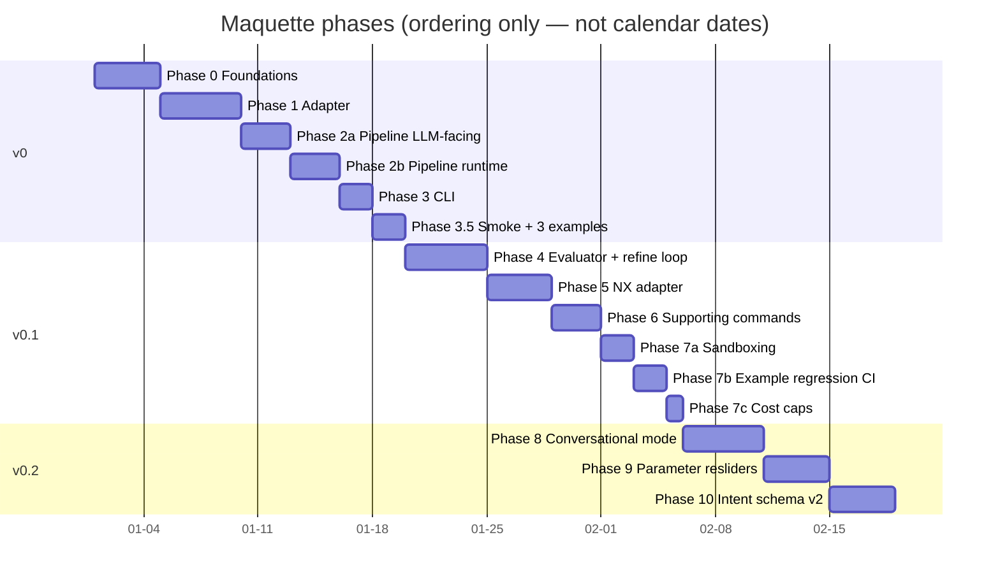

# 03 — Roadmap

> *Synthesized from `notes/inbox.md` (migrated vault 06-roadmap.md) +
> `00-vision.md` + `01-requirements.md` + `02-architecture.md` on
> 2026-05-16. Update via `/pm-roadmap`.*

Three committed milestones: **v0** (single-shot, build123d-only),
**v0.1** (loop + NX + supporting commands + sandboxing), **v0.2**
(conversational + parameter resliders + schema v2). Anything past v0.2
is "Later, maybe" — explicitly not committed.

Each milestone is broken into phases. Phases are numbered monotonically
across the whole project (`phase-0` … `phase-N`), never reset per
milestone. Suffixed IDs (`phase-2a`, `phase-2b`, `phase-3.5`,
`phase-7a`/`b`/`c`) are used when a phase is split during planning so
that prior cross-references remain stable. Only one phase is
`in_progress` at a time.

## Milestone & phase overview

The gantt is for *ordering* only. No calendar dates committed.

## Phases — v0

### Phase 0 — Foundations
- **Goal:** Project scaffolded; the domain model (`intent` + `intent_validation`), pricing table, and config layer exist and are tested; CI runs on every push.
- **Min:** `pyproject.toml` with pinned deps (`build123d`, `anthropic`, `pydantic`, `pyvista`, `typer`, `python-dotenv`); `src/maquette/intent.py` (full schema), `intent_validation.py`, `pricing.py` (with the verified Anthropic prices from ADR 0003), `config.py`; tests for `intent` + `intent_validation`; `LICENSE` (MIT — per decision G3); `.github/workflows/ci.yml` running ruff + pytest + import-linter + the `^(import\|from) NXOpen` grep guard (N4) on every push.
- **Max:** Pre-commit hooks for secret-scan + the NX-import grep guard (local-side reinforcement of the CI rule); `README.md` skeleton; `.env.example`; `examples/` folder structure stubbed.
- **Exit criterion:** `pytest` passes (≥20 tests across `intent` + `intent_validation`); `ruff check` + `ruff format --check` pass; `import-linter` reports zero violations; `pricing.price("claude-opus-4-7", Tokens(...))` returns a non-zero float.
- **Plan:** [phase-0.md](phases/phase-0.md) *(not yet drafted — run `/pm-phase-plan`)*

### Phase 1 — Adapter
- **Goal:** The build123d adapter compiles all 11 Intent kinds to runnable code; one round-trip works end-to-end.
- **Min:** `adapters/__init__.py` with `Adapter` Protocol + `AdapterRefusal`; `adapters/build123d_target.py` with `emit(Intent) → str` covering all 6 PrimaryKinds and all 5 ModifierKinds; 11 snapshot fixtures (one per kind, `intent.json` + expected `code.py`); round-trip test for the cube-with-hole reference (emit → subprocess → STEP > 0 bytes).
- **Max:** Round-trip tests for all 3 v0 reference prompts (cube w/ hole, cylinder w/ chamfer, L-bracket w/ holes); determinism test (emit twice, diff empty) per kind; mypy / pyright clean on the Adapter Protocol conformance.
- **Exit criterion:** Snapshot tests pass for all 11 kinds; round-trip test produces a valid STEP that opens in FreeCAD for the cube-with-hole; `grep -rE "^(import NXOpen|from NXOpen)" src/` returns nothing.
- **Plan:** `phases/phase-1.md` *(not yet drafted — run `/pm-phase-plan` when phase-0 is `done`)*

### Phase 2a — Pipeline (LLM-facing half)
- **Goal:** Prompt → validated Intent + sanity warnings, with the Worker shim ready to call the adapter.
- **Min:** `agent/planner.py` with `plan(client, prompt) → PlanResult`, including Anthropic prompt caching, JSON extraction, retry-on-schema-fail; `prompts/planner.system.md` with the Intent schema + few-shot examples; `agent/sanity.py` with `check(prompt, intent) → SanityResult` (regex extraction + comparison, ±1%/±0.5 mm tolerance per ADR 0002); `agent/worker.py`.
- **Max:** Per-LLM-call duration instrumentation surfaces in `PlanResult`; sanity-check false-positive cases (`"centred"` handling) covered by unit tests; few-shot examples committed for all 3 v0 reference prompts.
- **Exit criterion:** `plan(client, "a 50 mm cube with a 20 mm hole through the centre")` returns a valid `Intent`; `sanity.check(prompt, intent)` returns `ok=True` for the cube reference; `worker.emit_code(intent)` produces non-empty build123d source. Component tests pass with a mocked Anthropic client.
- **Plan:** `phases/phase-2a.md` *(not yet drafted)*

### Phase 2b — Pipeline (runtime + orchestration half)
- **Goal:** Worker code runs in a sandboxed subprocess, STEP gets captured, renders get produced, and the Loop ties everything together with `trace.jsonl` + `status.json`.
- **Min:** `agent/executor.py` with subprocess + 30 s timeout + STEP capture + `error.json` on crash; `render/orthographic.py` with PyVista headless (3 PNGs); `agent/loop.py` with the state machine (`PROMPT_RECEIVED → PLANNING → CODE_EMITTING → EXECUTING → DONE_OK | *_FAILED`), `trace.jsonl` writer (per-step events with token counts), `status.json` writer (final state including `cost_usd_estimate` via `pricing.py`).
- **Max:** Integration test that runs the full pipeline end-to-end with a mocked LLM and asserts artefact set; per-step duration instrumentation in `trace.jsonl`; SIGKILL test (infinite-loop generated code → killed within timeout + 2 s grace per N9).
- **Exit criterion:** Loop's `run("a 50 mm cube with a 20 mm hole through the centre")` produces a complete `output/<run-id>/` folder (`prompt.txt`, `intent.json`, `code.py`, `part.step`, `renders/{front,side,top}.png`, `trace.jsonl`, `status.json`) when called from a Python REPL with a real `ANTHROPIC_API_KEY`. All component-level tests pass.
- **Plan:** `phases/phase-2b.md` *(not yet drafted)*

### Phase 3 — CLI
- **Goal:** `maquette design "..."` is the only public entry point and behaves per requirements F1, F11–F14.
- **Min:** `cli.py` with the `design` subcommand + 5 CLI flags (`--out`, `--max-iter`, `--exec-timeout`, `--model`, `-q`/`-v`); exit code mapping per F13 (0/1/2/10/11/12/13); the CLI prints the run dir path on every exit (F12); `README.md` with install + usage examples.
- **Max:** `--help` text covers every flag; argument validation tests via Typer's test client; verbose mode prints per-LLM-call tokens.
- **Exit criterion:** `maquette design "..."` invocation from a fresh shell produces a run folder, returns the correct exit code on success and on each documented failure path, and prints the run directory.
- **Plan:** `phases/phase-3.md` *(not yet drafted)*

### Phase 3.5 — Smoke + 3 reference examples (v0 ships at the end of this phase)
- **Goal:** v0 success criterion verified — all three reference prompts succeed end-to-end on a clean clone, manually checked in FreeCAD.
- **Min:** Manual verification of the 3 v0 reference prompts (cube w/ hole, cylinder w/ chamfer, L-bracket w/ holes) producing FreeCAD-openable STEPs that visually match the descriptions; latency + cost measured per run; results captured in the phase report.
- **Max:** Smoke test in CI gated on a real `ANTHROPIC_API_KEY` env var (runs all 3 reference prompts); latency p95 measurement script (10× runs per prompt); cost-per-run assertion via `status.json.cost_usd_estimate`.
- **Exit criterion:** v0 success criterion (vision § Success criteria) holds — all three reference prompts produce a STEP that opens in FreeCAD and visually matches the description, each within 20 s wall-clock and < $0.10 in API cost on a clean clone with only `ANTHROPIC_API_KEY` set. **v0 is shipped.**
- **Plan:** `phases/phase-3.5.md` *(not yet drafted)*

## Phases — v0.1

(Detailed planning happens at `/pm-phase-plan` time, post-v0. Goals + min/max sketched here for sequencing.)

### Phase 4 — Evaluator + refinement loop
- **Goal:** R7 (silent semantic failure) is properly mitigated — a vision LLM catches geometric mismatch and the loop refines automatically. (Ordered first in v0.1 per decision C2: R7 is the highest-impact addition.)
- **Min:** `agent/evaluator.py` with `evaluate(client, prompt, intent, render_paths) → Critique`; refinement state in `agent/loop.py` (REFINING ↔ EXECUTING); `critiques.jsonl` per run; `--max-iter` default flipped to 3; isometric render added (`renders/iso.png`); exit code 14 wired for evaluator-fail-budget-exhausted.
- **Max:** Termination policy fully wired (max-iter, token budget, unrecoverable error counts); `examples/` regression corpus reaches ≥10 hand-curated good sessions.
- **Exit criterion:** On the 10-prompt v0.1 corpus, ≥8 produce an evaluator-passing STEP within `max_iterations=3` and < $0.50 / prompt. (Tightened from the original 7/10 per push-back B2.)

### Phase 5 — NX adapter
- **Goal:** Emit a runnable NX Open journal alongside the build123d code, preserving feature-tree fidelity.
- **Min:** `adapters/nx_open_target.py` with `emit(Intent) → str` for all 11 kinds (or `AdapterRefusal` if NX-Open lacks a clean equivalent); 11 snapshot fixtures; CLI flags `--no-nx`, `--only-nx`; CI grep guard on `import NXOpen` in `src/` (already in Phase 0; this phase re-verifies it survives nx_open_target.py landing).
- **Max:** Manual verification of the 3 v0 reference prompts running cleanly inside Siemens NX (Part Navigator shows features).
- **Exit criterion:** Adapter Protocol conformance verified by mypy; snapshot tests pass for all 11 kinds; v0 reference prompts produce a `part_nx.py` that the user runs successfully inside NX for at least the cube-with-hole reference.

### Phase 6 — Supporting commands
- **Goal:** `maquette inspect`, `maquette list`, `maquette replay` work; cost/latency observable from the CLI.
- **Min:** `maquette inspect <run-id>` prints status + cost; `maquette list` prints reverse-chronological run summaries; `maquette replay <run-id>` re-runs worker+executor on a previous `intent.json` and produces byte-identical `code.py` (verifies N7).
- **Max:** `maquette list --filter status=fail` etc. for triage; pretty-printed colour output; tab-completion script.
- **Exit criterion:** All three commands work; replay produces byte-identical code.py for at least one previously-saved Intent; manual triage of a failed run via `inspect` works end-to-end.

### Phase 7a — Sandboxing
- **Goal:** Generated build123d code can't escape the subprocess to do harm.
- **Min:** Import guard on generated build123d code (rejects `os.system`, `subprocess`, `socket`, `urllib`, `os.remove`, raw `open()` outside the run dir); guard runs in the executor before subprocess spawn; rejection surfaces as a new `error.json` with a specific reason.
- **Max:** Containerised execution mode (Docker) gated behind a config flag for users who want stronger isolation; `--no-sanity` flag for false-positive escape on the F6 dimension check.
- **Exit criterion:** Sandbox test (intentionally-malicious generated code) is rejected before subprocess spawn with a clear `error.json`; the executor never executes guarded code.

### Phase 7b — Example-level regression CI
- **Goal:** Adapter drift at the *full-prompt level* is caught in CI, not just at the per-kind snapshot level.

  v0 has snapshot tests per kind (N3, 11 fixtures) — those catch drift in *how a single kind emits*. v0.1 Phase 7b adds the next layer up: each committed example (`examples/<run-id>/`) is replayed end-to-end and the result is diffed against committed artefacts. The two are complementary, not duplicates — per-kind catches micro-drift in adapter logic; per-example catches drift that emerges only in combinations.
- **Min:** `examples/` corpus has ≥10 committed runs (the same set as the Phase 4 corpus); regression CI re-emits code from each `examples/*/intent.json` and diffs against committed `code.py`; failures block merge.
- **Max:** Visual-regression component too — the corpus includes the 3 orthographic PNGs and CI runs a perceptual diff (allowing small anti-aliasing tolerance per the architecture's reproducibility note).
- **Exit criterion:** Regression CI runs on every push, completes in < 60 s, and passes on the full `examples/` corpus.

### Phase 7c — Cost caps
- **Goal:** Cost overruns are flagged loudly enough that they don't surprise the user, with an opt-in hard cap available.
- **Min:** Configurable warning threshold (default $0.10) — exceeding it logs a `COST_WARNING` to `trace.jsonl` and adds an entry to `status.json.warnings[]`; CLI flag `--max-cost USD` enforces a hard cap that aborts the run with a specific exit code if exceeded mid-generation.
- **Max:** Per-session budget (across multiple runs in a `maquette converse` session — v0.2-coupled); cost dashboard via `maquette list --format=cost`.
- **Exit criterion:** A run that crosses the warning threshold surfaces the warning in `status.json`; a run launched with `--max-cost 0.05` aborts cleanly when the threshold is hit; both behaviours covered by tests with a mocked LLM that reports inflated token counts.

## Phases — v0.2

### Phase 8 — Conversational mode
- **Goal:** Multi-turn refinement before commit; revised Intents accumulate without restarting.
- **Min:** `maquette converse "..."` command; session JSON file format; user can re-open and continue a session; revised Intents stored as `intent.v2.json` etc. in the session.
- **Max:** A REPL-style interface (vs flat command); session resume on stdin; cumulative cost reporting per session.
- **Exit criterion:** A user can run `maquette converse "make a bracket"`, see renders, say `"make the hole 25 mm"`, and get an updated Intent + renders without re-running the planner from scratch.

### Phase 9 — Parameter resliders + tweak command
- **Goal:** Iterating dimensions costs zero LLM calls.
- **Min:** `maquette tweak <run-id> --param hole_diam=25` mutates `intent.parameters`, re-emits code, re-executes; `trace.jsonl` for the new run contains zero LLM-call entries.
- **Max:** A web-style param panel (HTML, no JS framework) as a v0.2 follow-up if there's a reason.
- **Exit criterion:** A v0 cube-with-hole run can be tweaked three times to adjust dimensions; verified zero tokens in all three resulting `trace.jsonl` files.

### Phase 10 — Intent schema v2
- **Goal:** The schema absorbs the most common `extras` use-cases from v0 / v0.1 runs.
- **Min:** Analysis of `extras` usage across the regression corpus; schema-v2 spec; pydantic schema bumped to `schema_version: 2`; migration helper for v1 → v2 payloads; old `examples/` payloads remain readable.
- **Max:** First-class sketches as entities; edge selection for fillet/chamfer; whatever else the corpus shows is hot.
- **Exit criterion:** ≥80% of prior `extras` usage replaced by first-class schema; migration tested on all `examples/`.

## Later, maybe

Explicit non-roadmap items. Worth thinking about, not worth committing to.

- **FreeCAD adapter** — parallel to NX, also free. Same emit-only pattern. Bonus: if NX adapter (phase 4) proves brittle, FreeCAD is the natural fallback (per PR-FAQ biggest-risk mitigation).
- **Assembly support** — multi-part Intents, mate inference. Big scope, may not be worth it given the system's "fast first-draft" positioning.
- **Vision input** — sketch in → Intent out. A different system, really; could share the schema.
- **Constraint solving** — GCS or similar. Adjacent to assemblies.
- **Web UI** — only with a reason. Possibly if anyone else picks the project up.
- **Model batching / async loop** — if a user generates 50 variants overnight, this becomes relevant.

## Open decisions

Decisions to revisit as phases progress; outcomes become ADRs.

1. **Intent strictness vs flexibility.** Lean strict; `extras` is the relief valve. Re-evaluate after 20 real v0 runs.
2. **LLM provider abstraction.** Single-provider (Claude) for v0. Add a thin adapter interface only when a second provider is actually in scope. (See vision § Non-goals + ADR 0003's "explicitly traded away.")
3. **Sandboxing strategy.** Subprocess + 30 s timeout for v0. Phase 7 adds import guards. Containerised execution lands as an ADR if those prove insufficient.
4. **Prompt versioning.** Single SHA-256 of `prompts/` contents (ADR 0003). If selective cache invalidation becomes painful, file an ADR for per-file hashes.
5. **NX adapter feature coverage breadth.** Start with the same primitives the build123d adapter supports (the 11 v0 kinds). Expanding the NX surface beyond the Intent schema is an explicit non-goal.

## License & repo hygiene (carried forward, non-negotiable)

- Code license: MIT or Apache-2.0 (pick before first public commit).
- **Never** commit a recorded NX journal from a licensed session. The NX adapter writes code from scratch against public API docs.
- API keys via `.env`, never in prompts or examples.
- `output/` always gitignored; `examples/` contains only hand-curated runs with no timing / cost artefacts.
- CI guard: no `NXOpen` import in `src/` (all milestones).
