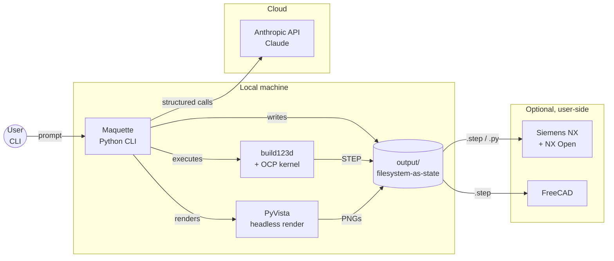
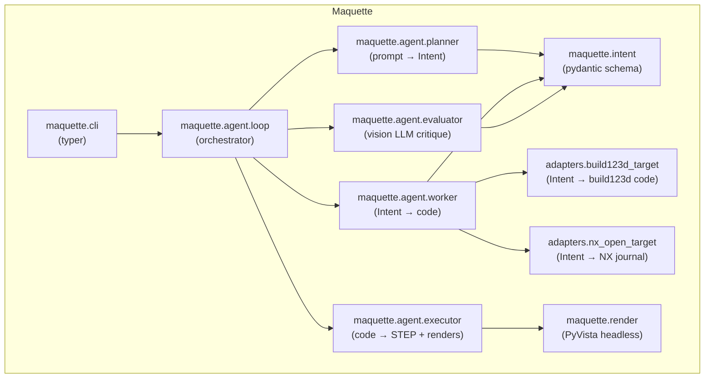
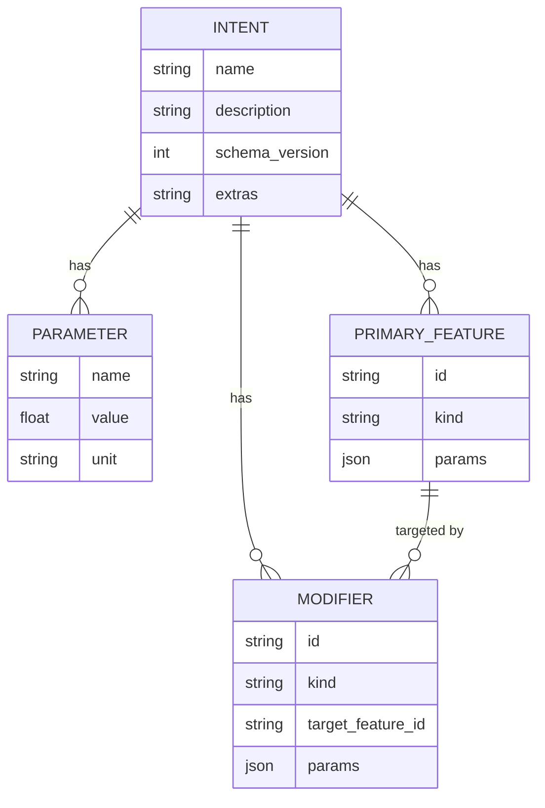
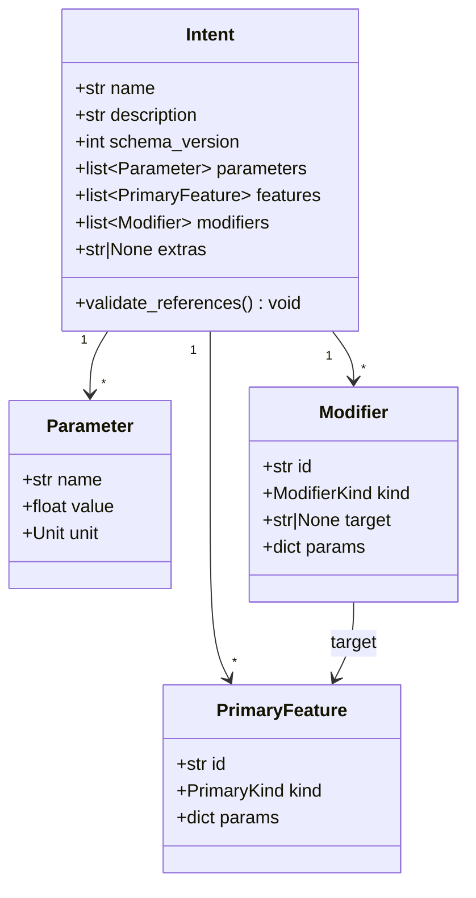
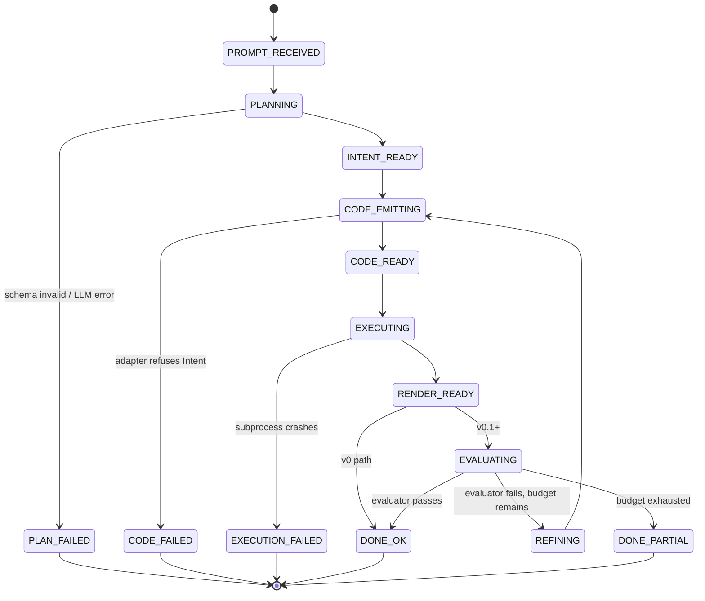
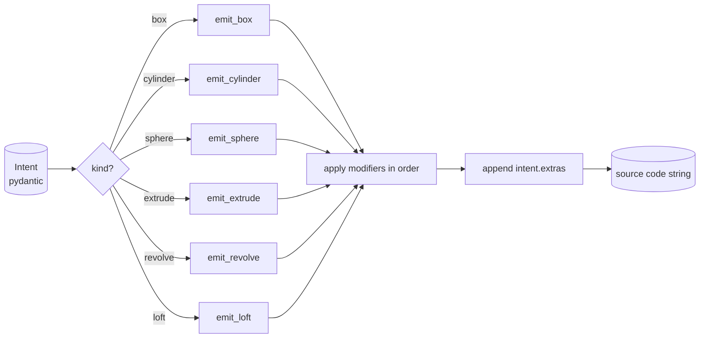
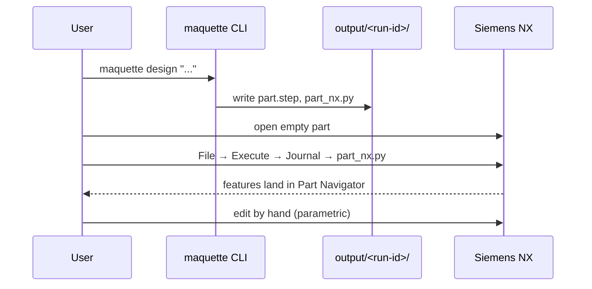
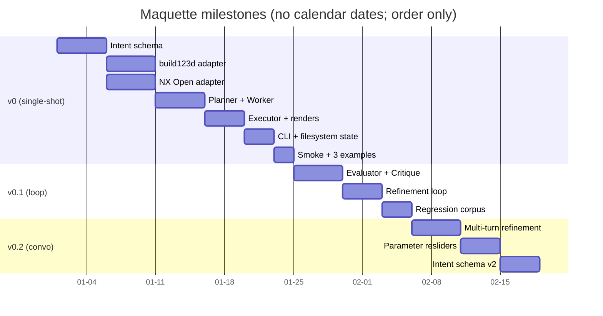

# Notes — Inbox

Unsorted brain dump. Default destination for any thought that doesn't
have an obvious home yet. Append freely; categorize later (or never —
skills will read from here regardless).

Convention: use `## YYYY-MM-DD — short title` section headers for new dumps.

Sections can be marked absorbed once a skill has folded them into a
formal doc: append `> absorbed into <doc> @ <date>` under the section.

---


---

## ↪ Migrated from vault @ 2026-05-16

Original Maquette design prose, copied verbatim from
`~/projects/vault_theonepiece/Projects/Maquette/`. Seeds the
notes-in / docs-out synthesis. Originals in the vault are NOT modified.

---

### ↪ From: Projects/Maquette/00-vision.md

> absorbed into docs/00-vision.md and docs/00-pr-faq.md @ 2026-05-16
> (with revisions per /pm-vision answers — see docs/notes/decisions.md
> entry for that date; notably NX moved from v0 to v0.1, success
> criterion tightened to three prompts, strategic-fit map trimmed to 3 rows)

# 00 — Vision

> *A maquette is the rough preliminary model an artist makes before sculpting
> the final piece. The AI hands you the maquette; you finish the real thing.*

## The problem

Going from a design intent in someone's head to an editable CAD model is slow.
The current path is:

- Open CAD (FreeCAD, Onshape, Fusion, NX, SolidWorks).
- Hand-author sketches, extrusions, holes, fillets.
- Tweak parameters by clicking through a feature tree.
- Repeat for every revision, every variant, every "what if it were 20% bigger".

For first-draft geometry — early concept work, parametric variants, jigs and
fixtures, brackets, mounts, enclosures — most of that authoring is mechanical
translation of a sentence ("a 50 mm cube with a 20 mm hole through the centre")
into a feature tree. The shape is trivially describable; the act of typing it
into a CAD GUI is not.

LLMs are good at constrained code generation. CAD has scriptable backends.
Bridging the two should be a small, focused tool — not a re-invention of CAD.

## The dream

Describe a part in natural language. Get back:

1. **An editable parametric solid** in a free, open backend (build123d).
2. **A STEP file** for handoff to any other CAD tool.
3. **An optional NX Open journal** — replay the construction in Siemens NX and
   the features land in the Part Navigator, fully parametric.
4. **Three rendered views + an evaluator critique** so the user can decide
   whether to ship, refine, or rewrite the prompt.

Then open the result in a real CAD tool and finish the engineering by hand.

The system never claims to be the CAD tool. It hands the user a maquette and
gets out of the way.

## Scope (for v0)

### In scope — v0
- A Python package + CLI: `maquette design "..."`.
- An LLM **Planner** that converts a prompt to a strict `Intent` (pydantic).
- An LLM **Worker** that converts `Intent` to build123d code.
- A subprocess **Executor** that runs the code headless, exports STEP, and
  renders three orthographic PNGs via PyVista.
- A **build123d adapter** (default, in-repo, free).
- An **NX Open adapter** that *emits* a `.py` journal — zero NX imports in repo.
- Filesystem-as-state: every generation is a folder under `output/` with
  `intent.json`, `code.py`, `renders/`, the STEP file, and the NX journal.

### In scope — v0.1 (next)
- Vision-based **Evaluator** + refinement loop (worker / evaluator / refiner).
- Isometric render in addition to the three orthographic views.
- An `examples/` regression corpus (hand-curated good sessions).

### In scope — v0.2 (later)
- Conversational mode (multi-turn refinement before commit).
- Parameter sliders post-generation (regenerate with tweaked dims, no LLM
  round-trip).
- Expansion of the `Intent` schema based on what `extras` is being used for
  most often in practice.

### Out of scope (for now, possibly forever)
- Replacing CAD. The system is a first-draft generator. Engineering judgment
  stays human.
- **Assemblies.** Single parts only in v0.
- **Mesh-only output** (STL/3MF as primary). STEP / B-rep only — meshes are a
  dead end for editable CAD.
- **Web UI.** CLI first. A web frontend can come later if there's a reason.
- **Recorded NX journals from licensed sessions.** The NX adapter is written
  against the public NX Open API only; no licensed-session artefacts in the
  repo, ever.

## Non-goals — explicit

- **Not a constraint solver.** No mate inference, no assembly-level constraints
  in v0. Single parts only.
- **Not a feature recogniser.** The system generates from intent, it does not
  reverse-engineer geometry into intent.
- **Not multi-provider abstracted on day one.** Default to Claude; abstract the
  client so swapping is cheap, but don't build a provider-agnostic layer
  upfront. Premature abstraction.
- **Not a chatbot.** v0 is one-shot. Conversational refinement is v0.2.

## Audience

- **Primary:** the author. Personal tooling for fast first-draft geometry,
  especially for parts where the description-to-feature-tree translation is
  the bottleneck (brackets, mounts, enclosures, fixtures).
- **Secondary:** other engineers who already use free CAD (FreeCAD, build123d
  users) and want a prompt-to-part on-ramp.
- **Tertiary:** NX seat owners who want a fast scratchpad outside the NX GUI,
  with output that lands cleanly back in NX as a real feature tree.

## ABB-relevance map

This is primarily a personal tool, not interview cosplay. But the design
deliberately exercises skills relevant to the ABB Robotics Senior .NET role
and to applied-AI systems work in general:

| Skill / theme | How Maquette exercises it |
|---|---|
| Agentic systems with bounded autonomy | Planner / Worker / Executor / Evaluator loop with a strict structured intermediate |
| Structured outputs / schema-driven LLM use | `Intent` (pydantic) as the pivot; no free-form CAD code from the LLM |
| Code generation for licensed / closed APIs | NX Open adapter emits a `.py` journal against the public API, with zero in-repo coupling to the licensed tool |
| In-house simulation / digital twins (loose parallel) | The executor runs generated code in a sandboxed subprocess and renders the result, closing the loop on "did this actually build" |
| Multi-target deployment from one source | One `Intent` → build123d code + NX journal — same brain, two backends |
| Repo hygiene around licensed tooling | Hard rule: nothing in the repo imports or depends on NX; the licensed-tool integration is purely emitted code |

The system is genuine personal work driven by the dream above. The skill
alignment is real and worth being explicit about.

---

### ↪ From: Projects/Maquette/01-architecture.md

> absorbed into docs/02-architecture.md (C4 levels, Layered responsibilities,
> Tech stack, Repo layout, Cross-cutting concerns) and docs/01-requirements.md
> (N1–N10 NFR table) @ 2026-05-16.
>
> *Known divergences vs current formal docs (revised post-migration):*
> *(a) The vault NFR section quotes a 30 s p95 latency target; current*
> *[01-requirements.md](../01-requirements.md) N1 is **20 s p95** for v0*
> *— tightened because NX emission was deferred to v0.1 (push-back B1).*
> *(b) The vault frames NX as v0 scope in places; current scope places*
> *NX in v0.1 — see [03-roadmap.md](../03-roadmap.md).*
> Then fully absorbed: C4 diagrams, layered responsibilities, tech stack, repo
> layout, cross-cutting concerns, decisions deferred → docs/02-architecture.md
> @ 2026-05-16 (with revisions: v0 path simplified by NX-to-v0.1; new sanity
> component added per F6; repo layout updated with sanity.py, pricing.py,
> config.py modules).


# 01 — Architecture

## High-level picture (C4 — System Context)



Maquette is a single Python package with a CLI entry point. Everything around
it is either user-side tooling (NX, FreeCAD) or a remote model API. The repo
has no server, no DB, no message broker — the filesystem is the state machine.

## C4 — Container view (inside Maquette)



Hard rule: **`maquette.intent` has zero outbound dependencies on agents,
adapters, or rendering.** Agents and adapters depend on intent. Rendering and
adapters depend on nothing except the standard library plus their respective
external libraries. No reverse arrows.

## Layered responsibilities

| Layer | What it owns | What it does NOT do |
|---|---|---|
| `intent` | Pydantic schema, validation rules, JSON (de)serialisation | LLM calls, code emission, geometry |
| `agent.planner` | Prompt → `Intent` via structured-output LLM call | Code generation, evaluation |
| `agent.worker` | `Intent` → backend code via adapter | LLM evaluation, execution |
| `agent.executor` | Subprocess execution, STEP export, render bundle | LLM calls, schema decisions |
| `agent.evaluator` | Vision-LLM critique of renders vs. prompt + Intent | Code emission |
| `agent.loop` | Orchestration: planner → worker → executor → evaluator → refine | Any domain logic |
| `adapters.build123d_target` | `Intent` → build123d Python source | Execution, rendering |
| `adapters.nx_open_target` | `Intent` → NX Open Python journal | Anything that imports `NXOpen` |
| `render` | Headless PyVista render of a STEP/mesh into PNGs | LLM, code emission |
| `cli` | Typer commands, argument parsing, glue | Domain logic |

## Tech stack

| Concern | Choice | Why |
|---|---|---|
| Language | Python 3.11+ | build123d, PyVista, anthropic SDK all native here |
| CAD kernel (default) | build123d (OCP / OpenCascade) | Free, headless, scriptable, real B-rep, STEP export native |
| CAD kernel (target) | Siemens NX via NX Open | Optional handoff; emit-only — repo never imports NXOpen |
| Schema / validation | pydantic v2 | Strict structured outputs from LLM, first-class JSON |
| LLM client | `anthropic` Python SDK | Claude is the default — strong at constrained code gen and structured outputs |
| Rendering | PyVista (headless) | Mature wrapper over VTK; can load STEP via OCP and render off-screen |
| CLI | Typer | Minimal boilerplate, type-hint driven |
| Packaging | `pyproject.toml`, uv or pip | Standard modern Python packaging |
| Tests | pytest | Standard |
| Linting / formatting | ruff + ruff format | Single tool, fast |

See [adr/0001-intent-as-pivot.md](./adr/0001-intent-as-pivot.md) for the core
architectural decision.

## Repo layout (planned)

```
maquette/
├── README.md
├── ARCHITECTURE.md            # links to this docs folder
├── pyproject.toml
├── .env.example               # ANTHROPIC_API_KEY
├── src/maquette/
│   ├── __init__.py
│   ├── intent.py              # pydantic schema (see 02-intent-schema.md)
│   ├── agent/
│   │   ├── __init__.py
│   │   ├── planner.py
│   │   ├── worker.py
│   │   ├── executor.py
│   │   ├── evaluator.py
│   │   └── loop.py
│   ├── adapters/
│   │   ├── __init__.py
│   │   ├── build123d_target.py
│   │   └── nx_open_target.py
│   ├── render/
│   │   ├── __init__.py
│   │   └── orthographic.py
│   └── cli.py
├── prompts/                   # versioned system prompts + few-shots
│   ├── planner.system.md
│   ├── worker.system.md
│   └── evaluator.system.md
├── examples/                  # known-good sessions, regression cases
├── output/                    # generated artifacts (gitignored)
└── tests/
    ├── test_intent.py
    ├── test_adapters_build123d.py
    ├── test_adapters_nx.py
    └── test_loop_smoke.py
```

## Non-functional requirements

| NFR | Target | How we get there |
|---|---|---|
| Single-shot latency (prompt → STEP) | < 30 s p95 on a simple part | One LLM call for Planner, one for Worker; cached few-shots; deterministic executor |
| LLM cost per generation | < $0.10 on a simple part | Prompt caching on system prompts + few-shots; minimal `Intent` schema |
| Determinism of execution | Same `Intent` → same STEP, byte-for-byte if backend allows | Adapter emits sorted, normalised code; build123d is deterministic |
| Repo hygiene around NX | Zero NX imports anywhere in `src/` | CI guard: grep for `import NXOpen` in `src/` and fail |
| Headless on a server | Runs on a box without a display | PyVista off-screen; build123d is already headless |
| Graceful failure | Executor crash produces a structured error in the run folder, not a stack trace into the user's face | Capture stderr, write `error.json` next to the run |

## Cross-cutting concerns

- **Configuration:** `.env` + env vars. `ANTHROPIC_API_KEY` is the only required
  secret. Never logged, never committed.
- **Logging:** structured JSON to stderr; one line per agent step. Run folder
  also gets a `trace.jsonl` with the full LLM call trail.
- **State:** filesystem-as-state. No DB. Each `output/<run-id>/` folder is the
  complete record of a run and can be re-played or diffed.
- **Sandboxing:** Executor runs generated code in a subprocess with a CPU /
  wall-time limit. v0 trusts the LLM not to emit `os.system("rm -rf …")`;
  hardening is on the v0.1+ list.
- **Reproducibility:** `intent.json` + the system prompt version is enough to
  reproduce a run. Commit the prompt versions; tag releases when prompts change.

## Decisions deferred

- **Provider abstraction.** Single-provider (Claude) for v0. Abstract the client
  behind a thin interface so a future swap is cheap; do not build a generic
  provider layer until there's a second provider in scope.
- **Conversational refinement vs one-shot.** v0 is one-shot. v0.2 adds a
  multi-turn refinement mode — open whether it's a REPL, a transcript file, or
  a watched prompt file.
- **NX adapter feature coverage.** Start with the same primitives the
  build123d adapter supports. Expanding the NX surface beyond the intent
  schema is explicitly a non-goal — the schema is the bottleneck, not the
  adapter.
- **Sandboxing strategy.** Subprocess + resource limits for v0. Containerised
  execution (Docker) is on the v0.1+ list if anything ever goes wrong here.

---

### ↪ From: Projects/Maquette/02-intent-schema.md

> absorbed into docs/02-data-model.md @ 2026-05-16 (ERD, entity definitions,
> per-kind contracts, pydantic skeleton, schema evolution rules). Also seeded
> docs/02-classes.md § Intent module class diagram and § Aggregates/entities.


# 02 — Intent schema (the domain model)

The `Intent` is the load-bearing concept in the whole system. The LLM does
**not** emit CAD code directly — it emits a typed `Intent`. Adapters then
translate `Intent` into backend-specific code (build123d, NX Open, …).

This file defines the schema, its invariants, and the rules that govern its
evolution.

## Why it exists

- **Validation before execution.** Pydantic catches a large fraction of
  hallucinations (impossible units, missing required fields, malformed
  primitives) before any geometry is built.
- **Multi-backend from one generation.** The same `Intent` compiles to
  build123d and to NX Open with no second LLM call.
- **A regression corpus that survives library churn.** `Intent` is a stable
  shape we own. build123d's API may move; our regression cases don't.
- **A natural caching unit.** Same `Intent`, deterministic adapter, identical
  output.

## Design principles

1. **Keep it small.** Resist modelling all of CAD. Anything the schema can't
   express goes in `extras` as raw backend code (the pressure valve).
2. **Strict types and units.** Every dimensioned value carries a unit.
3. **No backend leakage.** Nothing in `Intent` references build123d or NX
   types. The schema is pure design language.
4. **Stable IDs.** Every feature has a stable `id` so modifiers can target it
   by reference, not by index.
5. **Forward-only schema evolution.** Additions OK; removals require a schema
   version bump.

## Entity-relationship diagram



`Intent` is a tree, not a graph: `Modifier.target_feature_id` is the only
cross-reference, and it must resolve to an existing `PrimaryFeature.id`. The
validator enforces this.

## Class diagram (logical)



## Pydantic skeleton (v0)

```python
# src/maquette/intent.py
from __future__ import annotations

from typing import Literal
from pydantic import BaseModel, Field, model_validator

Unit = Literal["mm", "cm", "m", "in"]

PrimaryKind = Literal[
    "box",
    "cylinder",
    "sphere",
    "extrude",
    "revolve",
    "loft",
]

ModifierKind = Literal[
    "hole",
    "fillet",
    "chamfer",
    "shell",
    "pattern",
]


class Parameter(BaseModel):
    name: str
    value: float
    unit: Unit


class PrimaryFeature(BaseModel):
    id: str = Field(..., description="Stable id for cross-reference by modifiers")
    kind: PrimaryKind
    params: dict[str, float | str]


class Modifier(BaseModel):
    id: str
    kind: ModifierKind
    target: str | None = Field(
        default=None,
        description="PrimaryFeature.id this modifier applies to, if applicable",
    )
    params: dict[str, float | str]


class Intent(BaseModel):
    name: str
    description: str
    schema_version: int = 1
    parameters: list[Parameter] = Field(default_factory=list)
    features: list[PrimaryFeature]
    modifiers: list[Modifier] = Field(default_factory=list)
    extras: str | None = Field(
        default=None,
        description="Escape hatch: raw backend code appended after adapter output",
    )

    @model_validator(mode="after")
    def validate_references(self) -> "Intent":
        feature_ids = {f.id for f in self.features}
        for m in self.modifiers:
            if m.target is not None and m.target not in feature_ids:
                raise ValueError(
                    f"modifier {m.id!r} targets unknown feature {m.target!r}"
                )
        if len({f.id for f in self.features}) != len(self.features):
            raise ValueError("duplicate feature ids")
        if len({m.id for m in self.modifiers}) != len(self.modifiers):
            raise ValueError("duplicate modifier ids")
        return self
```

## Per-kind parameter contracts (v0)

These are the only shapes the v0 adapters guarantee to translate cleanly. The
planner system prompt lists these; the worker fails fast on anything else
(and falls back to `extras` if the planner used the escape hatch).

| `kind` | Required params | Optional params | Notes |
|---|---|---|---|
| `box` | `length`, `width`, `height` (all mm by default) | `centered: bool` | Axis-aligned, origin at min-corner unless `centered=true`. |
| `cylinder` | `radius`, `height` | `axis: "x"\|"y"\|"z"` | Axis defaults to `z`. |
| `sphere` | `radius` | — | Centred at origin. |
| `extrude` | `profile`, `distance` | `direction: "+x"\|"-x"\|…` | `profile` is a named sketch from `parameters` (extension point). |
| `revolve` | `profile`, `axis`, `angle_deg` | — | `angle_deg` defaults to 360. |
| `loft` | `sections: [profile…]` | — | Two or more profiles, in order. |

| Modifier `kind` | Required params | Notes |
|---|---|---|
| `hole` | `diameter`, `depth` or `through: true` | Position on `target` feature: `face` + 2D offset, or a referenced point. |
| `fillet` | `radius` | Targets edges of `target` feature. Edge selection is left coarse in v0. |
| `chamfer` | `distance` | Same. |
| `shell` | `thickness`, `open_face` | Hollow the `target` feature, leaving `open_face` open. |
| `pattern` | `count`, `spacing`, `axis` | Linear pattern of `target` feature. |

v0 intentionally does not model: sketches as first-class entities, fillets/chamfers
with explicit edge selection, assemblies, mates, or constraints. Anything in
those buckets is `extras`-land for now.

## Example — a 50 mm cube with a 20 mm hole through the centre

```json
{
  "name": "cube_with_hole",
  "description": "50 mm cube with a 20 mm hole through the centre, drilled along Z.",
  "schema_version": 1,
  "parameters": [
    { "name": "size",      "value": 50, "unit": "mm" },
    { "name": "hole_diam", "value": 20, "unit": "mm" }
  ],
  "features": [
    {
      "id": "body",
      "kind": "box",
      "params": { "length": 50, "width": 50, "height": 50, "centered": "true" }
    }
  ],
  "modifiers": [
    {
      "id": "drill",
      "kind": "hole",
      "target": "body",
      "params": { "diameter": 20, "through": "true", "axis": "z" }
    }
  ],
  "extras": null
}
```

## Schema evolution rules

- Additions to `PrimaryKind` / `ModifierKind` are minor: bump `schema_version`
  by 1, support old payloads via defaults.
- Removal or rename of a field is a major change: write an ADR and a migration
  helper. Old `examples/` payloads stay readable.
- The `extras` field is forever. It is the relief valve that lets the schema
  stay small.

## Validation layers (in order)

1. **Pydantic** — types, units, required fields, enum membership.
2. **Cross-reference** — `Modifier.target` resolves to an existing feature.
3. **Per-kind contract** — required params per the table above. Implemented in
   a `validate_kind_contracts()` step after Pydantic.
4. **Adapter feasibility** — the adapter is allowed to refuse an `Intent` it
   can't compile (e.g., a v0 NX adapter declines a `loft` if NX support lands
   later than build123d). Refusal is a structured error, not a crash.

---

### ↪ From: Projects/Maquette/03-agent-loop.md

> absorbed into docs/01-requirements.md (R1–R6 failure-mode taxonomy)
> and docs/02-architecture.md (C4 component view, sequence diagrams,
> state machine, code stubs, termination policy, cross-cutting concerns)
> and docs/02-classes.md (Loop, RunConfig, ExecutionResult classes)
> @ 2026-05-16.


# 03 — Agent loop

The generation loop is the heart of the system. Four roles, one orchestrator,
one strict structured intermediate (`Intent`) between them.

## The four roles

1. **Planner** — natural language prompt → `Intent`. Strict structured output;
   the LLM is asked to emit JSON conforming to the Intent schema.
2. **Worker** — `Intent` → backend code (build123d for v0). Done via the
   `adapters.build123d_target` module; the worker's job is to call the adapter
   and to produce any `extras` blob the schema couldn't express.
3. **Executor** — runs the worker's Python in a subprocess, exports STEP,
   renders three orthographic PNGs (and an isometric in v0.1).
4. **Evaluator** — vision LLM. Inputs: original prompt, current Intent,
   renders. Output: pass / fail + a structured critique. **v0.1 onward.**

The **Loop** orchestrator wires them together and owns iteration, budget, and
termination.

## v0 vs v0.1

| Aspect | v0 | v0.1 |
|---|---|---|
| Roles active | Planner, Worker, Executor | + Evaluator, + Refiner pass on Worker |
| Iteration | Single-shot | Up to N refinement iterations |
| Termination | After executor success/failure | Evaluator pass / N iterations / budget |
| Output | `intent.json`, `code.py`, STEP, renders | + `critiques.jsonl`, iteration history |

v0 ships single-shot. The loop diagrams below cover v0.1; for v0, ignore the
evaluator/refiner branches.

## Sequence diagram (v0.1 — full loop)

```mermaid
sequenceDiagram
    autonumber
    actor User
    participant CLI as maquette.cli
    participant Loop as agent.loop
    participant Planner
    participant Worker
    participant Adapter as adapters.build123d_target
    participant Executor
    participant Sub as subprocess (build123d)
    participant Render as render.orthographic
    participant Evaluator
    participant FS as output/<run-id>/

    User->>CLI: maquette design "..."
    CLI->>Loop: run(prompt)
    Loop->>FS: mkdir, write prompt.txt
    Loop->>Planner: prompt → Intent
    Planner-->>Loop: Intent (validated)
    Loop->>FS: write intent.json
    loop until pass or budget exhausted
        Loop->>Worker: Intent → code
        Worker->>Adapter: emit(Intent)
        Adapter-->>Worker: build123d source
        Worker-->>Loop: code.py
        Loop->>FS: write code.py
        Loop->>Executor: run(code.py)
        Executor->>Sub: spawn(python code.py)
        Sub-->>Executor: STEP file or error
        Executor->>Render: orthographic(STEP)
        Render-->>Executor: 3 PNGs
        Executor-->>Loop: result
        Loop->>FS: write part.step, renders/*.png
        Loop->>Evaluator: critique(prompt, Intent, renders)
        Evaluator-->>Loop: pass | fail + critique
        alt pass
            Loop->>FS: write status.json {ok}
        else fail and budget remains
            Loop->>Planner: refine(Intent, critique)
            Planner-->>Loop: revised Intent
            Loop->>FS: append iteration
        end
    end
    Loop-->>CLI: result summary
    CLI-->>User: paths + status
```

## State machine (run lifecycle)



Every state transition is appended to `trace.jsonl` in the run folder with a
timestamp and the relevant artefact path. A run can be inspected after the
fact by reading the trace.

## Termination policy

The loop stops when **any** of the following holds:

- The evaluator returns `pass`.
- Iteration count reaches `max_iterations` (default: 3).
- Cumulative token budget exceeds `max_tokens` (default: 50k input + 20k
  output).
- An unrecoverable error occurs (planner couldn't produce a valid Intent
  after 2 retries; executor crashed; adapter refused twice for the same
  reason).

Budget and iteration limits are CLI flags; defaults are conservative.

## Key code stubs

### Planner — strict structured output

```python
# src/maquette/agent/planner.py
import json
from anthropic import Anthropic
from maquette.intent import Intent

PLANNER_SYSTEM = (Path(__file__).parents[2] / "prompts/planner.system.md").read_text()

def plan(client: Anthropic, prompt: str, model: str = "claude-opus-4-7") -> Intent:
    """Prompt → Intent (validated). Raises on schema failure."""
    resp = client.messages.create(
        model=model,
        max_tokens=2048,
        system=PLANNER_SYSTEM,
        messages=[{"role": "user", "content": prompt}],
        # tool-use mode with the Intent JSON schema is the strict path;
        # for v0 a plain "respond with only JSON" prompt is enough.
    )
    raw = _extract_json(resp)
    return Intent.model_validate(raw)
```

### Worker — adapter delegation

```python
# src/maquette/agent/worker.py
from maquette.intent import Intent
from maquette.adapters import build123d_target

def emit_code(intent: Intent) -> str:
    """Intent → build123d Python source. Pure function; no I/O."""
    return build123d_target.emit(intent)
```

### Executor — subprocess with bounded resources

```python
# src/maquette/agent/executor.py
import subprocess, sys, tempfile, json
from pathlib import Path

class ExecutionResult:
    step_path: Path | None
    renders: list[Path]
    error: str | None

def execute(code_path: Path, out_dir: Path, timeout_s: float = 30.0) -> ExecutionResult:
    """Run generated code in a subprocess, capture stdout/stderr, time-box it."""
    proc = subprocess.run(
        [sys.executable, str(code_path)],
        cwd=out_dir,
        capture_output=True,
        timeout=timeout_s,
        text=True,
    )
    # ...inspect proc.returncode, look for STEP file, run renderer, build result
```

### Evaluator — vision critique (v0.1+)

```python
# src/maquette/agent/evaluator.py
from typing import Literal
from pydantic import BaseModel

class Critique(BaseModel):
    verdict: Literal["pass", "fail"]
    summary: str
    issues: list[str]              # short, actionable
    suggested_intent_diff: dict | None  # optional structured suggestion

def evaluate(client, prompt: str, intent: Intent, render_paths: list[Path]) -> Critique:
    """Send renders + prompt + Intent to a vision-capable model; return Critique."""
    ...
```

### Loop — orchestration

```python
# src/maquette/agent/loop.py
from dataclasses import dataclass

@dataclass
class RunConfig:
    max_iterations: int = 3
    max_tokens_in: int = 50_000
    max_tokens_out: int = 20_000
    exec_timeout_s: float = 30.0

def run(prompt: str, out_root: Path, cfg: RunConfig) -> Path:
    run_dir = _new_run_dir(out_root)
    intent = planner.plan(client, prompt)
    _write(run_dir / "intent.json", intent.model_dump_json(indent=2))
    for i in range(cfg.max_iterations):
        code = worker.emit_code(intent)
        _write(run_dir / "code.py", code)
        result = executor.execute(run_dir / "code.py", run_dir, cfg.exec_timeout_s)
        if result.error and i + 1 < cfg.max_iterations:
            intent = planner.refine(client, intent, result.error)
            continue
        # v0: break here. v0.1: hand to evaluator, possibly refine.
        break
    return run_dir
```

## Failure-mode taxonomy

| Failure | Where | Recovery in v0 | Recovery in v0.1 |
|---|---|---|---|
| Planner emits invalid JSON | Planner | Retry once with a stricter user message; then fail. | Same. |
| Intent fails schema validation | Planner | Retry once with the validation error injected. | Same. |
| Adapter refuses Intent | Worker | Surface adapter error; fail. | Refine via planner with adapter's structured reason. |
| Subprocess crashes / no STEP produced | Executor | Surface stderr; fail. | Refine via planner with stderr included. |
| Subprocess times out | Executor | Fail. | Same; surface timeout reason. |
| Renderer fails | Executor | Keep STEP, mark renders missing, continue. | Same. |
| Evaluator says fail | Evaluator | n/a | Refine up to `max_iterations`. |

All failures land as `status.json` + an `error.json` in the run folder; the
CLI exits non-zero. No partial deletion — the run folder stays for diagnosis.

---

### ↪ From: Projects/Maquette/04-adapters.md

> absorbed into docs/02-architecture.md (Layered responsibilities,
> Dependency rules) and docs/02-classes.md (AdapterRefusal, Build123dTarget
> module-level functions, NX dependency-rule CI guard) @ 2026-05-16.


# 04 — Adapters

Adapters translate `Intent` into backend-specific code. v0 ships two:

- `adapters.build123d_target` — the default, runs in-repo, free.
- `adapters.nx_open_target` — emits a Siemens NX Open Python journal,
  imports nothing from `NXOpen`.

Both adapters obey the same contract.

## Adapter contract

```python
# adapters/__init__.py (logical interface, not a class hierarchy)

def emit(intent: Intent) -> str:
    """
    Translate Intent into target-specific source code.
    Pure function. No I/O, no LLM calls, deterministic.
    Raises AdapterRefusal(reason) for Intents this adapter can't compile.
    """
```

Rules common to all adapters:

1. **Pure functions.** No file writes, no network, no globals.
2. **Deterministic.** Same `Intent` → byte-identical output.
3. **Structured refusal.** When the adapter can't translate a feature, raise
   `AdapterRefusal` with a structured reason the planner can use to refine.
4. **Schema-bounded.** Only the kinds/params from
   [02-intent-schema.md](./02-intent-schema.md) are guaranteed to translate.
   `extras` is appended verbatim at the end.

## Adapter flow



The same flow applies to both adapters; only the per-kind emission differs.

## `build123d_target` — the default backend

build123d is a Python wrapper over OCP (OpenCascade). It is headless,
scriptable, and exports STEP natively. Geometry is constructed with a fluent
API (`with BuildPart() as bp:` blocks).

### Skeleton

```python
# src/maquette/adapters/build123d_target.py
from textwrap import dedent
from maquette.intent import Intent, PrimaryFeature, Modifier

class AdapterRefusal(Exception):
    def __init__(self, reason: str, *, where: str):
        super().__init__(reason)
        self.where = where  # e.g. "modifier:fillet"

def emit(intent: Intent) -> str:
    """Intent → build123d Python source."""
    parts = [_preamble(intent)]
    parts.append(_emit_features(intent))
    parts.append(_emit_modifiers(intent))
    if intent.extras:
        parts.append(_extras_block(intent.extras))
    parts.append(_export(intent))
    return "\n\n".join(parts)


def _preamble(intent: Intent) -> str:
    return dedent(f'''\
        """Generated by maquette from Intent: {intent.name!r}"""
        from build123d import *
        from pathlib import Path
    ''')


def _emit_features(intent: Intent) -> str:
    lines = ["with BuildPart() as part:"]
    for f in intent.features:
        lines.append(_indent(_emit_feature(f), 1))
    return "\n".join(lines)


def _emit_feature(f: PrimaryFeature) -> str:
    match f.kind:
        case "box":
            return _emit_box(f)
        case "cylinder":
            return _emit_cylinder(f)
        case "sphere":
            return _emit_sphere(f)
        case "extrude" | "revolve" | "loft":
            raise AdapterRefusal(
                f"{f.kind!r} not yet supported in v0 build123d adapter",
                where=f"feature:{f.kind}",
            )


def _emit_box(f: PrimaryFeature) -> str:
    p = f.params
    centered = str(p.get("centered", "false")).lower() == "true"
    return (
        f"# feature {f.id}: box\n"
        f"Box({p['length']}, {p['width']}, {p['height']}, "
        f"align=({_alignment(centered)}))"
    )

# ...similar for _emit_cylinder, _emit_sphere
# ...modifier emission lives in a parallel module
# ...export emits  Path('part.step').write_bytes(part.part.export_step())
```

### Determinism notes

- Iterate features and modifiers **in the order they appear** in the Intent —
  never sort, never reorder. The Intent IS the ordering.
- Floats are formatted via `repr()`, not `f"{x}"`, to keep precision stable.
- No `random`, no clock, no environment reads.

## `nx_open_target` — the NX Open adapter

This adapter emits a `.py` journal that runs inside Siemens NX. It does **not
import `NXOpen`** — anywhere in the repo. It only emits source text that
references `NXOpen` at the user's NX session.

### Hard rules (CI-enforced)

- `grep -r "^import NXOpen" src/` returns nothing.
- `grep -r "from NXOpen" src/` returns nothing.
- The adapter has unit tests that compare emitted strings to fixtures; it has
  no runtime tests requiring NX.

### What the emitted journal looks like

```python
# Emitted by adapters.nx_open_target — DO NOT EDIT BY HAND
import NXOpen
import NXOpen.Features

def main():
    session = NXOpen.Session.GetSession()
    work_part = session.Parts.Work

    # feature body: 50x50x50 box
    block_builder = work_part.Features.CreateBlockFeatureBuilder(NXOpen.Features.Feature.Null)
    block_builder.SetOriginAndLengths(
        NXOpen.Point3d(-25.0, -25.0, -25.0),
        "50", "50", "50",
    )
    block = block_builder.Commit()
    block_builder.Destroy()

    # modifier drill: through-hole D20 along Z
    # ...
    session.UpdateManager.DoUpdate(session.NewestVisibleUndoMark())

if __name__ == "__main__":
    main()
```

### Skeleton

```python
# src/maquette/adapters/nx_open_target.py
from maquette.intent import Intent

def emit(intent: Intent) -> str:
    parts = [_preamble(intent), "def main():", _indent(_session_setup(), 1)]
    for f in intent.features:
        parts.append(_indent(_emit_feature(f), 1))
    for m in intent.modifiers:
        parts.append(_indent(_emit_modifier(m, intent), 1))
    parts.append(_indent("session.UpdateManager.DoUpdate(session.NewestVisibleUndoMark())", 1))
    parts.append('\nif __name__ == "__main__":\n    main()\n')
    if intent.extras:
        # extras must be NX-flavoured if targeting NX; otherwise omitted
        parts.append(f"# --- intent.extras (NX-flavoured) ---\n{intent.extras}")
    return "\n".join(parts)
```

### NX handoff workflow (user-side)



Optional later upgrade (out of scope for the repo): a small NX journal that
watches `output/` and auto-runs the newest `*_nx.py`. That stays on the user's
machine — it's licensed-tool glue, not project code.

## Adapter selection

The worker chooses adapters based on a CLI flag and emits one or both:

| Flag | Emits |
|---|---|
| (default) | `code.py` (build123d) + `part_nx.py` (NX journal) |
| `--no-nx` | `code.py` only |
| `--only-nx` | `part_nx.py` only — still requires execution of build123d for the STEP if rendering is desired |

The executor only runs the build123d code. NX journals are never executed by
maquette — they exist for the user to run inside NX.

## Testing strategy

- **Snapshot tests.** Each adapter has a fixture corpus of `Intent` JSON →
  expected source string. Drift fails the test.
- **Round-trip tests (build123d only).** Emit code, run it in a subprocess,
  assert a STEP file is produced and is non-empty. Sized to run in CI in <1s.
- **No NX runtime tests.** The NX adapter is verified by snapshot only.

## Extension checklist (adding a new `kind`)

1. Add to `PrimaryKind` / `ModifierKind` in `intent.py`; bump `schema_version`.
2. Update the per-kind contract table in [02-intent-schema.md](./02-intent-schema.md).
3. Update the planner system prompt to advertise the new kind.
4. Implement `_emit_<kind>` in `build123d_target`.
5. Implement `_emit_<kind>` in `nx_open_target` *or* raise `AdapterRefusal`.
6. Add a fixture pair (Intent JSON + emitted source) per adapter.
7. Add an `examples/` regression case if the kind is common enough.

---

### ↪ From: Projects/Maquette/05-cli-and-io.md

> absorbed into docs/01-requirements.md (F1, F5, F8–F14, N2, N10) and
> docs/02-architecture.md § Cross-cutting concerns @ 2026-05-16.
>
> *Known divergence vs current formal docs: the vault § CLI surface*
> *lists `maquette inspect`, `maquette list`, `maquette replay` as v0*
> *commands; current [01-requirements.md](../01-requirements.md)*
> *§ "Deferred from v0" defers all three to v0.1.*
>
> v0-deferred items (maquette inspect/list/replay commands, --no-nx / --only-nx
> flags, exit code 14 for evaluator) recorded under "Deferred from v0" and will
> be re-absorbed when /pm-requirements runs against v0.1.


# 05 — CLI and I/O

The CLI is the only entry point in v0. There is no library API contract
beyond "import `maquette.agent.loop.run`". This file specifies the CLI
surface and the on-disk layout of generated artefacts.

## CLI surface (v0)

```
maquette design "<prompt>"
    [--out <path>]              # default: ./output
    [--no-nx]                   # skip NX journal emission
    [--only-nx]                 # skip build123d code emission
    [--max-iter N]              # default: 1 in v0, 3 in v0.1
    [--exec-timeout S]          # default: 30
    [--model <id>]              # default: claude-opus-4-7
    [-q | -v]                   # quiet / verbose

maquette replay <run-id>
    # re-run the worker + executor on a previous run's intent.json,
    # producing a fresh build. Useful after adapter bug fixes.

maquette inspect <run-id>
    # print summary of a run: prompt, intent, status, durations, costs.

maquette list
    # list recent runs with status and one-line summary.
```

Implementation uses Typer; one subcommand per file under `maquette/cli/` if
the file grows past ~150 lines.

### Exit codes

| Code | Meaning |
|---|---|
| 0 | Success — STEP produced and (v0.1+) evaluator passed |
| 1 | Generic failure |
| 2 | Bad CLI args |
| 10 | Planner failed (couldn't produce a valid Intent) |
| 11 | Adapter refused the Intent |
| 12 | Executor failed (subprocess crash / no STEP produced) |
| 13 | Executor timed out |
| 14 | Evaluator failed and budget exhausted (v0.1+, partial run still on disk) |

The CLI prints the run directory path on every exit, success or failure.

## Filesystem-as-state

Every generation lives in `output/<run-id>/`. The directory is the run; the
disk layout is the schema. No database.

```
output/
└── 2026-05-12T14-32-08__cube_with_hole/
    ├── prompt.txt                  # raw user prompt
    ├── intent.json                 # Intent (pydantic), pretty-printed
    ├── code.py                     # build123d source (worker output)
    ├── part_nx.py                  # NX Open journal (worker output)
    ├── part.step                   # STEP file (executor output)
    ├── renders/
    │   ├── front.png
    │   ├── side.png
    │   ├── top.png
    │   └── iso.png                 # v0.1+
    ├── trace.jsonl                 # per-step event log
    ├── critiques.jsonl             # v0.1+, one line per evaluator pass
    ├── status.json                 # final {ok|fail, code, duration, cost}
    └── error.json                  # only if failed; structured error details
```

### `run-id` format

`<UTC-ISO timestamp with `-` separators>__<intent.name slugified>`

Example: `2026-05-12T14-32-08__cube_with_hole`. Sortable, human-readable,
unique enough for a single user without coordination.

### `status.json` shape

```json
{
  "status": "ok",
  "exit_code": 0,
  "started_at": "2026-05-12T14:32:08Z",
  "finished_at": "2026-05-12T14:32:24Z",
  "duration_s": 16.0,
  "iterations": 1,
  "tokens": { "input": 1820, "output": 410 },
  "cost_usd_estimate": 0.04,
  "artefacts": {
    "intent": "intent.json",
    "code": "code.py",
    "step": "part.step",
    "nx_journal": "part_nx.py",
    "renders": ["renders/front.png", "renders/side.png", "renders/top.png"]
  }
}
```

### `trace.jsonl` shape

One JSON object per line, append-only, schema:

```json
{ "ts": "2026-05-12T14:32:08.012Z", "step": "PLANNING",       "status": "start" }
{ "ts": "2026-05-12T14:32:11.480Z", "step": "PLANNING",       "status": "end", "tokens_in": 1100, "tokens_out": 240 }
{ "ts": "2026-05-12T14:32:11.481Z", "step": "CODE_EMITTING",  "status": "start" }
{ "ts": "2026-05-12T14:32:11.484Z", "step": "CODE_EMITTING",  "status": "end" }
{ "ts": "2026-05-12T14:32:11.485Z", "step": "EXECUTING",      "status": "start" }
{ "ts": "2026-05-12T14:32:23.911Z", "step": "EXECUTING",      "status": "end", "exit_code": 0 }
```

`step` values are exactly the state names from
[03-agent-loop.md](./03-agent-loop.md). The trace is the canonical timeline
of a run.

## Configuration

| Source | Use |
|---|---|
| `.env` (gitignored) | `ANTHROPIC_API_KEY`. Loaded via `python-dotenv`. |
| `pyproject.toml` `[tool.maquette]` | Static defaults (model id, timeouts, output root). |
| CLI flags | Per-invocation overrides. |
| Env vars (`MAQUETTE_*`) | Override anything from pyproject. |

Precedence: CLI flag > env var > pyproject > built-in default. **Never read
secrets from anywhere except env / `.env`.**

## Logging

- **Console (stderr):** one human-readable line per state transition, colour
  if TTY. `-v` adds per-LLM-call summaries. `-q` suppresses everything except
  the final run path.
- **Run folder (`trace.jsonl`):** structured, complete, machine-readable.
- **No log files outside the run folder.** Each run is self-contained.

## Cost accounting

Every LLM call writes a line to `trace.jsonl` with `tokens_in` and
`tokens_out`. The orchestrator sums these on completion and writes
`cost_usd_estimate` into `status.json` using a hard-coded price table per
model id. Price table lives in `maquette/pricing.py`; updating it is a code
change, not a config one.

## Reproducibility

Given:

- `intent.json`
- `prompts/` at the version tagged in `status.json` (TODO: write
  `prompt_versions` into status) <!-- RESOLVED 2026-05-16: single
  SHA-256 of prompts/ contents, written to status.json.prompts_hash;
  see decisions.md /pm-architecture G3 + ADR-0003 § Decision -->
- The maquette code at the commit tagged in `status.json`

…a `maquette replay <run-id>` run produces the same `code.py` byte-for-byte
(adapters are deterministic) and the same STEP from build123d (kernel is
deterministic for a given version). Renders may differ in 1-pixel
anti-aliasing artefacts; that's acceptable.

## Examples corpus

`examples/` (not `output/`, which is gitignored) holds hand-curated reference
runs. Layout matches `output/<run-id>/` exactly, but:

- Only the inputs and final artefacts are committed (`prompt.txt`,
  `intent.json`, `code.py`, `part.step`, `renders/`).
- No `trace.jsonl` or `status.json` (they leak timing / cost).
- A top-level `examples/README.md` indexes them with one-line descriptions.

These double as the regression corpus: a CI job parses each `intent.json`,
re-emits code via the adapters, and diffs against the committed `code.py`.

## What is intentionally NOT in v0

- A web UI.
- A long-running daemon mode.
- Anything that watches a directory and reacts.
- A REST API.
- A "library mode" stable Python API beyond `agent.loop.run`.
- Multi-prompt batch mode.

If any of these become real needs, they get an ADR first.

---

### ↪ From: Projects/Maquette/06-roadmap.md

> absorbed into docs/00-vision.md (success criterion) and
> docs/03-roadmap.md (full milestone structure: v0 / v0.1 / v0.2 /
> Later-maybe / Open decisions / Repo hygiene) @ 2026-05-16.
>
> *Known divergence vs current formal docs: the vault § Milestones*
> *places the NX adapter and its `--no-nx` / `--only-nx` CLI flags in*
> *v0; current [03-roadmap.md](../03-roadmap.md) and*
> *[00-vision.md](../00-vision.md) place NX in v0.1 (per decision B1,*
> *see [decisions.md](decisions.md)).*
>
> (Roadmap edits made during /pm-roadmap drafting:
> revisions: NX moved v0→v0.1, sanity check added to v0, inspect/list/replay
> moved v0→v0.1, sandboxing deferred; v0.1 reordered to put Evaluator before
> NX per decision C2; Phase 2/3/7 split into 2a/2b/3.5/7a/7b/7c).

# 06 — Roadmap

Three milestones in scope: **v0**, **v0.1**, **v0.2**. Anything past that is
"Later, maybe" and not committed.

Each milestone has a tight deliverable, an explicit measurable success
criterion, and a non-goal list to fend off scope drift.

## Milestone overview



The Gantt is for *ordering*, not deadlines. Real dates go into a project
tracker if/when this leaves planning.

## v0 — "Single-shot prompt to part"

### Deliverable

A working `maquette design "..."` command that produces, on a clean clone:

- `output/<run-id>/intent.json`
- `output/<run-id>/code.py`
- `output/<run-id>/part_nx.py`
- `output/<run-id>/part.step` (non-empty, opens in FreeCAD / NX)
- `output/<run-id>/renders/{front,side,top}.png`
- `output/<run-id>/status.json` with `status: "ok"`

### In v0

| Piece | Spec |
|---|---|
| Intent schema | Minimal: ~10 fields, kinds and modifiers from [02-intent-schema.md](./02-intent-schema.md) |
| Planner | One LLM call, strict JSON output validated by pydantic |
| Worker | Pure call into `adapters.build123d_target.emit` |
| NX adapter | Emits `.py` against public NX Open API; covers same primitives as build123d adapter |
| Executor | Subprocess with 30s timeout, captures stderr |
| Renderer | Headless PyVista, three orthographic PNGs |
| CLI | `maquette design`, `maquette inspect`, `maquette list` |
| Tests | Snapshot tests per adapter; smoke test for the full loop with a cube |
| Examples | 3 hand-curated: cube w/ hole, cylinder w/ chamfer, simple bracket |

### Not in v0

- Evaluator / vision critique
- Refinement loop
- Conversational mode
- Web UI
- Parameter sliders
- Multi-part / assemblies
- FreeCAD adapter

### Success criterion

> Running `maquette design "a 50 mm cube with a 20 mm hole through the centre"`
> on a clean clone of the repo, with only `ANTHROPIC_API_KEY` set, produces a
> STEP file that opens in FreeCAD and shows a 50 mm cube with a 20 mm through
> hole, within 30 s wall-clock and < $0.10 in API cost.

If that works for the three v0 examples, v0 is done.

## v0.1 — "Add the loop"

### Deliverable

The same flow, but with an evaluator and a refinement pass. Up to 3
iterations.

### Adds

| Piece | Spec |
|---|---|
| Evaluator | Vision-capable model: input = prompt + intent + 3 renders + isometric; output = `Critique` (pass/fail + structured issues) |
| Refiner | Planner is re-called with the prior Intent + critique; produces a revised Intent |
| Render bundle | Adds an isometric view |
| Run trace | `critiques.jsonl` with one entry per evaluator pass |
| Regression corpus | ≥10 committed examples; CI re-emits code from each `intent.json` and diffs against the committed `code.py` |

### Success criterion

> On a set of 10 reference prompts (cube, cylinder, bracket, mount, washer,
> standoff, knob, end-cap, gusset, simple gear blank), at least 7 produce an
> evaluator-passing STEP within `max_iterations=3` and < $0.50 / prompt.

## v0.2 — "Conversational refinement and reslides"

### Deliverable

Two new modes built on the same core:

1. **Conversational mode** — multi-turn refinement before commit. The user
   sees renders, can say "make the hole 25 mm and add a chamfer on the top
   edge", and the system updates the Intent without starting from scratch.
2. **Parameter resliders** — given a committed Intent, regenerate the STEP
   with tweaked `parameters` values **without** an LLM call. Pure
   adapter + executor pass.

### Adds

| Piece | Spec |
|---|---|
| `maquette converse "..."` | REPL-ish: user prompt → renders → user follow-up → revised Intent. Backed by a session JSON file the user can resume. |
| `maquette tweak <run-id> --param hole_diam=25` | Bypasses the planner and worker entirely; mutates `intent.parameters`, re-emits code, re-executes. |
| Intent schema v2 | Driven by what `extras` is being used for most in v0 / v0.1. Probably: first-class sketches, edge-selection for fillet/chamfer. |

### Success criterion

> A user can take a v0 cube-with-hole, run `maquette tweak` three times to
> adjust dimensions, and never make an LLM call (verified by zero tokens in
> `trace.jsonl` for those runs).

## Later, maybe

Explicit non-roadmap items. Worth thinking about, not worth committing to:

- **FreeCAD adapter.** Parallel to NX, also free. Same emit-only pattern.
- **Assembly support.** Multi-part Intents, mate inference. Big scope, may
  not be worth it given the system's "fast first-draft" positioning.
- **Vision input.** Sketch in → Intent out. A different system, really, that
  could share the schema.
- **Constraint solving.** GCS or similar. Adjacent to assemblies.
- **Web UI.** Only with a reason. Probably never for personal use; possibly
  if anyone else picks it up.
- **Model batching / async loop.** If a user generates 50 variants overnight,
  this becomes relevant. Not before.

## Open decisions (tracked, not deferred)

These are decisions that should be revisited as v0 progresses; record
outcomes as ADRs.

1. **Intent strictness vs flexibility.** Lean strict; `extras` is the relief
   valve. Re-evaluate after 20 real runs.
2. **Single-shot vs loop in v0.** Ship single-shot. Measure failure rate.
   Move to v0.1 with data on what the loop needs to catch.
3. **LLM provider abstraction.** Single-provider (Claude) for v0. Add a thin
   adapter interface only when a second provider is actually in scope.
4. **Sandboxing.** Subprocess + timeout for v0. Containerised execution if
   anything goes wrong here (will be a 0002 ADR if so).
5. **Prompt versioning.** Tag `prompts/` directory with a version each time
   it changes; write the version into `status.json`. Open: separate versions
   per prompt file vs one rolled-up `prompts_version`.

## License & repo hygiene (carried forward, non-negotiable)

- Code license: MIT or Apache-2.0 (pick before first public commit).
- **Never** commit a recorded NX journal from a licensed session. The NX
  adapter writes code from scratch against public API docs.
- API keys via `.env`, never in prompts or examples.
- `output/` always gitignored; `examples/` contains only hand-curated runs
  with no timing / cost artefacts.
- CI guard: no `NXOpen` import in `src/`.


---

## 2026-05-29 — Major pivot: "Touch" (interactive CAD app)

> absorbed into docs/00-vision.md + docs/00-pr-faq.md @ 2026-05-29

> Captured verbatim-in-substance from the user mid-chat. This reshapes
> the vision; formalize via /pm-vision after alignment.

**Rename:** Maquette → **Touch**.

**What it is:** an open-source 3D CAD modeling app. Initially a POC
distributed as an `.exe` to give to engineer friends to use at work;
expand later.

**MVP / main UI:**
- A 3D editor workplane like other CAD software (center).
- To the LEFT, a file tree like VS Code's explorer — the user wants a
  clear file/project structure (matters more later for assemblies). The
  UI is broadly "VS Code, but for CAD instead of code."
- Camera/navigation: classic Siemens NX mouse controls in the 3D plane.

**Core interaction — "Touch":** the only thing you do is *touch*. Move
around the 3D plane (NX controls); **left-click any point/face/plane →
a prompt box appears → you prompt.** Clear instructions process directly
(no extra questions); unclear ones turn into a **conversation** asking
for details until clear.

**Why click-to-prompt (vs one-shot):**
- Gives **positional context** — where you clicked tells the system
  where the feature goes (e.g. place a hole based on the clicked face +
  the prompt).
- Lets the prompt become a **conversation** when something's unclear.
- Incremental, not a single fire-and-forget prompt.

**End-goal walkthrough (the concrete MVP target — a case for a
30×30×15 mini-PC):**
1. Empty editor. Left-click an orthogonal plane → prompt: "make a
   40×40×25 rectangle" → processes (clear) → creates the box.
2. Click the top of the box → "cut out the inside with a 30×30×15 box"
   → cuts it, leaving a shell.
3. Click the edges → make cutouts for the USBs etc.

**Other:** still Claude API; add a Settings field for the API key so
non-tech-savvy (but CAD-heavy) engineers can add their own key easily.

**User's conviction:** "I'm convinced this is the way." Acknowledges it
means building a bunch of standard-CAD-software machinery, but believes
the click-to-prompt + conversational + positional approach is right.

### 2026-05-29 — Architecture research conclusions (Touch FE/BE coupling)

> absorbed into docs/00-vision.md @ 2026-05-29 (architecture detail feeds /pm-architecture)

> From a deep-research pass (105 agents, 24/25 claims verified). Full
> report archived in the session task output. Feeds /pm-architecture.

**Verdict — Python is NOT the bottleneck.** The cited "20× slower" datum
(CadQuery, 2021) was a pure-Python tessellation loop copying mesh data
value-by-value across the C++→Python binding — not the OCCT mesher. Fixed
by native bulk-copy tessellation (`ocp_tessellate`/pythonocc), callable
from Python. Real bottlenecks: geometry transport volume, face-picking /
persistent-naming, LLM latency.

**Recommended architecture (settles A-vs-B):** local client-server.
Python build123d/OCP kernel server-side → native tessellate → stream
meshes-with-per-face-IDs over a binary **WebSocket** → **three.js** web
frontend. The SAME frontend runs as a browser tab in dev and wrapped in a
desktop shell + Python sidecar for the `.exe`. The "smart coupling" is a
network client-server, NOT in-process IPC — that's what gives browser-dev
+ .exe-dist from one frontend. This is "Path A" (Python kernel, full
build123d reuse) as a local service.

**Proven by:** ocp-vscode (Python OCP + ocp_tessellate + WebSocket →
three.js; runs as VS Code webview OR plain browser tab at 127.0.0.1:3939)
and Onshape (server kernel + streamed triangles over REST+WebSocket,
progressive refinement).

**Rejected:** Zoo/KittyCAD's server-GPU + H.264-video-over-WebRTC
(needs cloud GPUs, custom Rust engine, geometry never reaches client →
kills client-side picking; over-engineered for local single-user). Full
in-browser WASM kernel (~9 MB brotli cold start + forecloses Python-FEA).

**Picking (the hard part):** combine Onshape-style (kernel owns face
identity; carry per-face IDs in the streamed mesh; resolve/translate
server-side; no persistent client IDs) with replicad-style **finders**
(reference a face by re-derivable geometry — plane/normal/centroid/
surface-type — so selections survive edits without a persistent-naming
engine). MVP append-only history sidesteps the worst of it.

**Future FEA/multibody/control/numeric:** a separate Python compute
service exchanging STEP/mesh — does NOT change the near-term coupling.

**Open (architecture spikes, NOT verified by the research):**
- Desktop shell: Electron+Python-sidecar vs **Tauri+sidecar** (working
  reference example exists) vs Wails vs pywebview — bundle size /
  Python+OCCT native-dep bundling / startup not benchmarked.
- Geometry streaming format: glTF/GLB vs Draco vs meshopt vs raw
  typed-array binary WS frames — not benchmarked. + how to encode
  per-face IDs (per-vertex attr vs primitive groups vs separate map).
- End-to-end face-identity scheme (server stable-ID/translation vs
  geometric finders vs hybrid).
- First spike to de-risk: Electron/Tauri ⇄ Python round-trip + a
  face-id'd mesh rendered & picked in three.js, packaged to an .exe.
